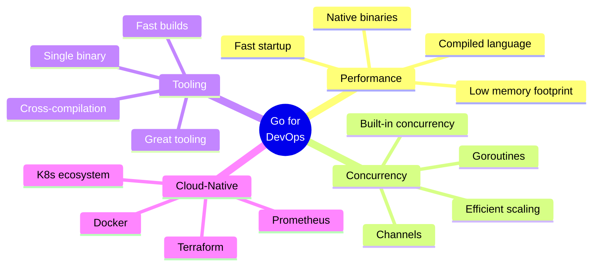

# 🔷 Go Automation - Complete Master Index

> **"Go: Built for cloud-native DevOps from day one"**

## 📚 Overview

Welcome to the comprehensive **Go (Golang) Automation** curriculum! This module contains **60 expertly crafted topics** designed to transform you into a Go automation expert. Go powers critical infrastructure tools like Kubernetes, Docker, Terraform, and Prometheus - making it essential for modern cloud-native DevOps.

## 🎯 Why Go for DevOps?



##

 ⭐ Go Powers These DevOps Tools

- **Kubernetes** - Container orchestration
- **Docker** - Container runtime
- **Terraform** - Infrastructure as Code
- **Prometheus** - Monitoring & alerting
- **Consul** - Service mesh
- **Vault** - Secrets management
- **Helm** - K8s package manager
- **Istio** - Service mesh
- **Etcd** - Distributed key-value store
- **Hugo** - Static site generator

---

## 🗺️ Curriculum Structure

### 🟢 Level 1: Beginner (18 Topics) - **60-75 hours**

Master Go fundamentals and build your first CLI tools.

| # | Topic | Description | Key Learning | Hours |
| :--- | :--- | :--- | :--- | :--- |
| 00 | [**Go Foundations**](./00-foundations/readme.md) | What is Go?, history, install, config | Path to Devops | 4h |
| 01 | [**Go Fundamentals**](readme.md) | Syntax, packages, go modules | First Go program | 4-5h |
| 02 | **Variables and Types** | Types, constants, iota | Type system | 3-4h |
| 03 | **Control Flow** | if/else, switch, loops | Go idioms | 3-4h |
| 04 | **Functions** | Functions, closures, defer | Function patterns | 4-5h |
| 05 | **Structs and Methods** | Structs, methods, embedding | OOP in Go | 4-5h |
| 06 | **Interfaces** | Interface design, polymorphism | Interface patterns | 5-6h |
| 07 | **Error Handling** | Error patterns, sentinel errors | Idiomatic errors | 4-5h |
| 08 | **File Operations** | os package, file I/O | File handling | 3-4h |
| 09 | **Working with JSON** | encoding/json, tags | API integration | 3h |
| 10 | **Working with YAML** | YAML parsing | Config files | 2-3h |
| 11 | **Command Line Flags** | flag package, parsing | CLI basics | 3h |
| 12 | **Environment Variables** | os.Getenv, configuration | 12-factor apps | 2h |
| 13 | **String Manipulation** | strings, bytes packages | Text processing | 3h |
| 14 | **Time and Date** | time package, durations | Time handling | 3h |
| 15 | **Regular Expressions** | regexp package | Pattern matching | 3-4h |
| 16 | **Testing Basics** | testing package, table tests | TDD in Go | 4-5h |
| 17 | **First CLI Tool** | Complete kubectl-like tool | Real-world project | 5-6h |

---

### 🟡 Level 2: Intermediate (18 Topics) - **85-105 hours**

Master concurrency and integrate with cloud-native ecosystems.

| # | Topic | Description | Key Learning | Hours |
|---|-------|-------------|--------------|-------|
| 01 | **Goroutines and Channels** | Concurrency primitives | Go concurrency model | 5-6h |
| 02 | **Concurrency Patterns** | Worker pools, pipelines | Production patterns | 5-6h |
| 03 | **HTTP Client Basics** | net/http package | HTTP clients | 3-4h |
| 04 | **REST API Integration** | API clients, auth | Service integration | 4-5h |
| 05 | **Database Operations** | database/sql, GORM | Data persistence | 5-6h |
| 06 | **SSH Operations** | crypto/ssh package | Remote automation | 4-5h |
| 07 | **Template Engines** | text/template, html/template | Config generation | 3-4h |
| 08 | **Configuration Management** | Viper, env parsing | Config patterns | 3-4h |
| 09 | **Logging Libraries** | logrus, zap, slog | Structured logging | 3-4h |
| 10 | **CLI Frameworks - Cobra** | Professional CLIs | kubectl-style CLIs | 5h |
| 11 | **CLI Frameworks - Viper** | Config management | Application config | 4h |
| 12 | **Docker SDK** | Docker client in Go | Container automation | 5-6h |
| 13 | **Kubernetes Client-Go** | K8s automation | Cloud-native ops | 6-8h |
| 14 | **AWS SDK** | AWS services in Go | Cloud automation | 6-8h |
| 15 | **gRPC Basics** | gRPC services | Modern RPC | 5-6h |
| 16 | **Prometheus Metrics** | Metrics instrumentation | Observability | 4-5h |
| 17 | **Building Operators** | Operator framework | K8s operators | 8-10h |
| 18 | **Testing Advanced** | Mocking, testify, benchmarks | Production testing | 5-6h |

---

### 🔴 Level 3: Advanced (25 Topics) - **150-185 hours**

Build enterprise-grade cloud-native automation platforms.

| # | Topic | Description | Key Learning | Hours |
|---|-------|-------------|--------------|-------|
| 01 | **Advanced Concurrency** | Select, sync primitives | Complex concurrency | 5-6h |
| 02 | **Context Package** | Context patterns, cancellation | Request lifecycle | 4-5h |
| 03 | **Custom K8s Controllers** | controller-runtime | Extend Kubernetes | 8-10h |
| 04 | **Operator SDK** | Production operators | Operator development | 8-10h |
| 05 | **Service Mesh Automation** | Istio, Linkerd | Service mesh ops | 6-8h |
| 06 | **Infrastructure Provisioning** | Terraform-like tools | IaC in Go | 6-8h |
| 07 | **Terraform Provider** | Custom providers | Extend Terraform | 8-10h |
| 08 | **CI/CD Tools** | Build automation | CI/CD in Go | 6-8h |
| 09 | **GitOps Controllers** | Flux, ArgoCD extensions | GitOps automation | 6-8h |
| 10 | **Admission Webhooks** | K8s admission control | Policy enforcement | 6-8h |
| 11 | **Custom Schedulers** | K8s scheduler development | Advanced K8s | 8-10h |
| 12 | **Network Automation** | CNI plugins, networking | Network ops | 6-8h |
| 13 | **Security Tooling** | Security scanning | Security automation | 5-6h |
| 14 | **Observability Agents** | Metrics collectors | APM agents | 6h |
| 15 | **Distributed Systems** | Consensus, coordination | Distributed patterns | 8-10h |
| 16 | **Microservices Automation** | Service mesh integration | Microservices ops | 6h |
| 17 | **Performance Optimization** | Profiling, optimization | Production performance | 5-6h |
| 18 | **Memory Management** | GC tuning, memory leaks | Memory optimization | 5-6h |
| 19 | **Build Optimization** | Compilation optimization | Fast builds | 4h |
| 20 | **Cross Compilation** | Multi-platform builds | Universal binaries | 4h |
| 21 | **Plugin Systems** | Plugin architectures | Extensibility | 6h |
| 22 | **Code Generation** | Code gen tools | Automation at scale | 5-6h |
| 23 | **Production Deployment** | Deployment strategies | Production ops | 5h |
| 24 | **Debugging Profiling** | pprof, delve | Advanced debugging | 5-6h |
| 25 | **Enterprise Patterns** | Large-scale Go applications | Architecture | 8-10h |

---

## 🎓 Learning Paths

### 1. Cloud-Native Engineer Path (8-10 weeks)

**Focus**: Kubernetes, containers, cloud-native ecosystem

**Prerequisites**: Basic programming, K8s fundamentals

**Curriculum**:
- ✅ All Beginner topics (Weeks 1-2)
- ✅ Intermediate: Client-Go, Docker SDK, Operators, gRPC, Prometheus (Weeks 3-6)
- ✅ Advanced: Controllers, Operators, Admission Webhooks, Service Mesh (Weeks 7-10)

**Outcome**: Build production Kubernetes operators and controllers

---

### 2. Platform Engineering Path (9-11 weeks)

**Focus**: Developer platforms, internal tools, IaC

**Prerequisites**: Go basics, cloud experience

**Curriculum**:
- ✅ All Beginner topics (Weeks 1-2)
- ✅ Intermediate: Cobra/Viper, K8s Client, Config Management, Templates (Weeks 3-6)
- ✅ Advanced: Terraform Provider, GitOps, CI/CD Tools, Plugin Systems (Weeks 7-11)

**Outcome**: Create enterprise platform engineering tools

---

### 3. Systems Programming Path (10-12 weeks)

**Focus**: Performance, distributed systems, low-level automation

**Prerequisites**: Strong programming background

**Curriculum**:
- ✅ All Beginner topics (Weeks 1-2)
- ✅ Intermediate: Concurrency, HTTP, Database, Testing (Weeks 3-6)
- ✅ Advanced: Performance, Memory, Distributed Systems, Advanced Concurrency (Weeks 7-12)

**Outcome**: High-performance system automation

---

## 📊 Statistics

| Metric | Value |
|--------|-------|
| **Total Topics** | 61 |
| **Beginner Topics** | 18 |
| **Intermediate Topics** | 18 |
| **Advanced Topics** | 25 |
| **Total Hours** | 295-365 |
| **Full-time Weeks** | 7-9 |
| **Part-time Weeks** | 15-19 |

---

## 🚀 Go Advantages for DevOps

### Performance
```go
// Single binary - no dependencies!
// Typical Go DevOps tool
$ ls -lh kubectl
-rwxr-xr-x 1 user staff 46M Jan 10 12:00 kubectl

// Compare to Python (needs interpreter + packages)
$ du -sh my_python_tool/
150M    my_python_tool/
```

### Concurrency
```go
// Handle 10,000 concurrent operations easily
for i := 0; i < 10000; i++ {
    go processInstance(instances[i])
}
```

### Cross-Platform
```bash
# Build for all platforms from one machine
GOOS=linux GOARCH=amd64 go build -o app-linux
GOOS=darwin GOARCH=amd64 go build -o app-mac
GOOS=windows GOARCH=amd64 go build -o app.exe
```

---

## 💼 Real-World Companies Using Go

### Infrastructure
- **Google**: Kubernetes, many internal tools
- **Docker**: Container runtime
- **HashiCorp**: Terraform, Vault, Consul, Nomad
- **Cloudflare**: Edge computing platform

### Cloud Platforms
- **DigitalOcean**: Control plane
- **Dropbox**: Infrastructure backend
- **Uber**: Microservices platform
- **Twitch**: Chat and streaming infrastructure

---

## 🔥 Popular Go DevOps Projects

### Must-Know Tools (GitHub Stars)

| Tool | Purpose | Stars | Written in Go |
|------|---------|-------|---------------|
| **Kubernetes** | Container orchestration | 100k+ | ✅ |
| **Docker** | Containers | 65k+ | ✅ |
| **Terraform** | Infrastructure as Code | 40k+ | ✅ |
| **Prometheus** | Monitoring | 50k+ | ✅ |
| **Helm** | K8s package manager | 25k+ | ✅ |
| **Istio** | Service mesh | 35k+ | ✅ |
| **Vault** | Secrets management | 28k+ | ✅ |
| **Consul** | Service discovery | 27k+ | ✅ |

---

## 🎯 Interview Preparation

### Common Go DevOps Interview Topics

1. **Goroutines & Concurrency**
   - Worker pool patterns
   - Channel usage
   - Race condition prevention
   - Context cancellation

2. **Kubernetes Integration**
   - Client-go usage
   - Custom controllers
   - Operator patterns
   - Admission webhooks

3. **Error Handling**
   - Error wrapping (errors package)
   - Sentinel errors
   - Error types
   - Recovery patterns

4. **Performance**
   - Profiling with pprof
   - Memory optimization
   - Goroutine management
   - Benchmarking

5. **Testing**
   - Table-driven tests
   - Mocking interfaces
   - Integration testing
   - Benchmark tests

---

## 📚 Recommended Resources

### Official Documentation
- [Go.dev](https://go.dev/)
- [Effective Go](https://go.dev/doc/effective_go)
- [Go by Example](https://gobyexample.com/)

### Books
- "The Go Programming Language" - Donovan & Kernighan
- "Cloud Native Go" - O'Reilly
- "Concurrency in Go" - Katherine Cox-Buday

### Kubernetes-Specific
- [Programming Kubernetes](https://www.oreilly.com/library/view/programming-kubernetes/9781492047094/)
- [Kubernetes Programming with Go](https://www.manning.com/books/kubernetes-programming-with-go)

### Tools & Libraries
- [Awesome Go](https://awesome-go.com/)
- [Go Packages](https://pkg.go.dev/)
- [Golang Weekly](https://golangweekly.com/)

---

## 🎓 Certification Preparation

This curriculum prepares you for:

- ✅ **Certified Kubernetes Administrator (CKA)** - K8s automation
- ✅ **Certified Kubernetes Application Developer (CKAD)** - Cloud-native apps
- ✅ **HashiCorp Terraform Associate** - Provider development
- ✅ **AWS Certified DevOps Engineer** - AWS SDK usage

---

## 📈 Career Impact

### Salary Ranges (DevOps/Platform Engineers with Go)

| Level | Experience | US Salary Range |
|-------|------------|-----------------|
| Junior | 0-2 years | $80k - $105k |
| Mid-level | 2-5 years | $105k - $145k |
| Senior | 5-8 years | $145k - $190k |
| Lead/Principal | 8+ years | $190k - $280k+ |

*Source: Levels.fyi, Blind, 2026 data*

### Job Market Demand

- **18,000+** Platform/Cloud engineer jobs requiring Go (LinkedIn, 2026)
- **Top hiring companies**: Google, AWS, HashiCorp, Uber, Cloudflare
- **Growth rate**: 35% annually (Fastest growing DevOps skill)
- **Premium**: +15-25% salary premium vs. similar Python roles

---

## 🚀 Quick Start

```bash
# 1. Install Go
go version  # Ensure Go 1.21+

# 2. Initialize a module
mkdir devops-automation-go
cd devops-automation-go
go mod init github.com/yourname/devops-automation

# 3. Create first program
cat > main.go <<EOF
package main

import "fmt"

func main() {
    fmt.Println("Hello, DevOps!")
}
EOF

# 4. Run
go run main.go

# 5. Build binary
go build -o devops-tool
./devops-tool

# 6. Start curriculum
cd ~/Devops/01-Beginner/02-Phase-2/02-Automation/03-Go-Basics
cd 01-Go-Fundamentals
```

---

## 🤝 Contributing

This curriculum is continuously evolving. Contributions welcome!

---

**Last Updated**: 2026-01-10  
**Version**: 1.0.0  
**Status**: Active Development 🚧  
**Maintained by**: DevOps Learning Team

**🔷 Ready to build cloud-native tools with Go!** 🚀
