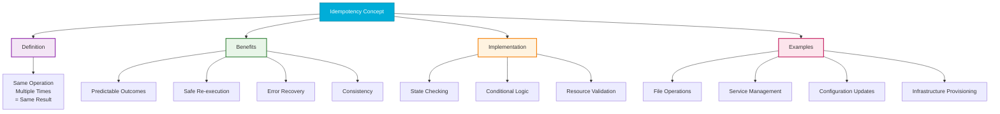
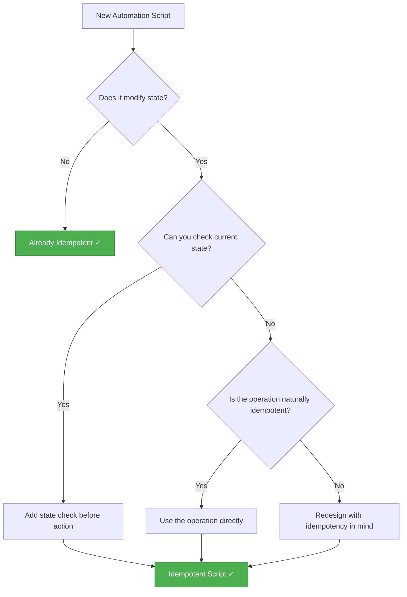

# Idempotency Concept Deep Dive

## Visual Overview



---

## Mathematical Definition

In mathematics, an idempotent operation is one where:

```
f(f(x)) = f(x)
```

In DevOps terms:
- **First run**: Changes system from State A to State B
- **Second run**: System is already in State B, no change
- **Nth run**: Still State B

---

## The Three Laws of Idempotent Automation

### 1. Check Before Acting

```bash
# Always verify current state before making changes
if [ ! -f "$FILE" ]; then
    create_file "$FILE"
fi
```

### 2. Describe Desired State, Not Actions

```yaml
# Bad: Action-based (not idempotent)
- run: install nginx

# Good: State-based (idempotent)
- package:
    name: nginx
    state: present
```

### 3. Make Operations Reversible and Repeatable

```python
# Each operation should be safe to run multiple times
def ensure_config(path, content):
    current = read_file_safe(path)
    if current != content:
        write_file(path, content)
        return True  # Changed
    return False  # No change needed
```

---

## Common Idempotency Anti-Patterns

### ❌ Anti-Pattern 1: Unconditional Append

```bash
# WRONG: Creates duplicates
echo "source ~/.custom" >> ~/.bashrc
```

### ❌ Anti-Pattern 2: Increment Without Check

```bash
# WRONG: Counter increases every run
COUNT=$(($(cat counter.txt) + 1))
echo $COUNT > counter.txt
```

### ❌ Anti-Pattern 3: Order-Dependent Operations

```bash
# WRONG: Fails on second run
create_user admin
add_to_group admin wheel  # Fails if already in group
```

---

## Idempotency Decision Tree



---

## Testing for Idempotency

```bash
#!/bin/bash
# Idempotency test template

# Run script first time
./my_script.sh
FIRST_STATE=$(capture_state)

# Run script second time
./my_script.sh
SECOND_STATE=$(capture_state)

# Compare states
if [ "$FIRST_STATE" = "$SECOND_STATE" ]; then
    echo "✓ Script is idempotent"
else
    echo "✗ Script is NOT idempotent"
    diff <(echo "$FIRST_STATE") <(echo "$SECOND_STATE")
fi
```

---

## Summary

| Principle | Implementation |
|-----------|----------------|
| **Check first** | `if [ ! -f file ]; then create; fi` |
| **Desired state** | `state: present` not `action: install` |
| **Graceful handling** | Use `-p`, `-f`, `--ignore-existing` flags |
| **Atomicity** | All-or-nothing changes |
| **Testability** | Run twice, compare results |

---

**Return to**: [Idempotency Overview](../readme.md)