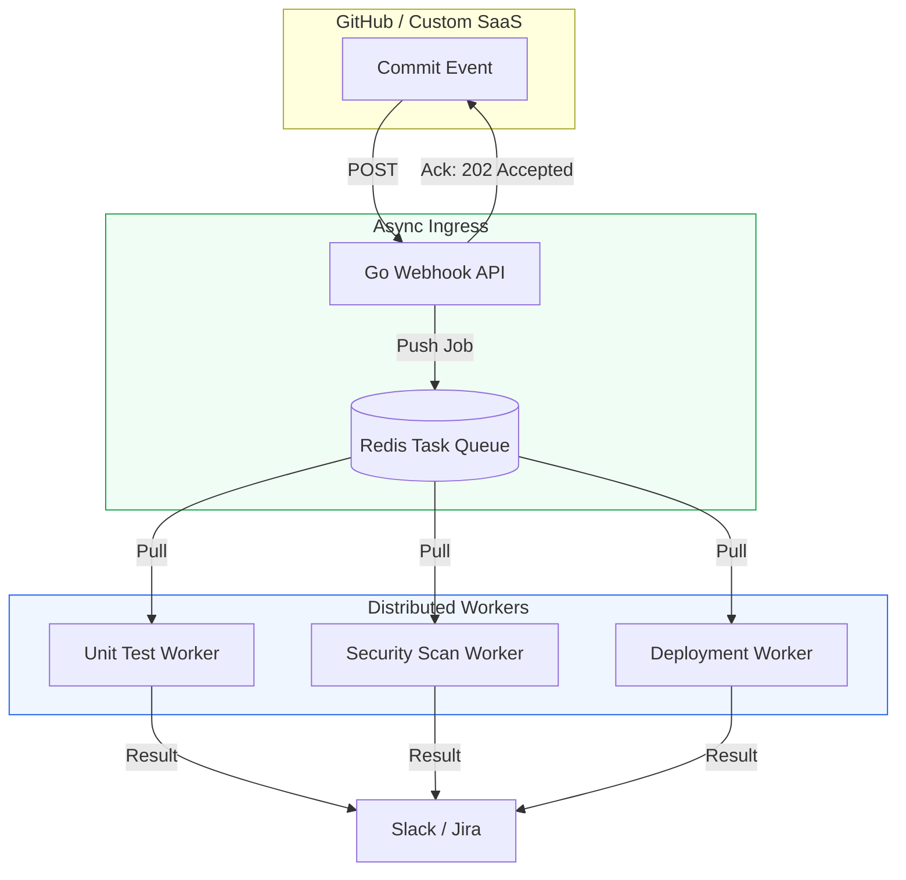

# 🚀 Level 03: Advanced Event-Driven Pipelines

> **"In enterprise DevOps, a single event shouldn't just trigger one script—it should trigger a cascade of autonomous services. We don't just 'catch' webhooks; we orchestrate them across distributed clusters."**



## 📚 Overview

At the enterprise level, we move away from "Synchronous" processing. A webhook endpoint should never perform a heavy task (like a build or a scan) directly. Instead, we use a **Fire and Forget** pattern. The endpoint receives the message, validates it, drops it into a **Message Bus (Redis/RabbitMQ/Sqs)**, and returns an immediate response. This allows the system to scale horizontally—you can add more "Workers" to handle the load without slowing down the initial response.

## 🎓 Learning Objectives

- ✅ Design **Asynchronous Architecture** for high-load event handling.
- ✅ Implement **Dead Letter Queues (DLQ)** to handle failed events.
- ✅ Build a **Go-based Ingress Service** for ultra-low latency.
- ✅ Understand **Fan-Out Patterns**: One webhook triggering multiple parallel pipelines.
- ✅ Implement **Observability**: Tracking an event ID from the webhook to the final deployment.

---

## 🏗️ Boilerplate: Go Async Webhook Worker

This service uses Go's speed and concurrency to handle incoming requests and hand them off to a background process.

**Filename**: `main.go`
```go
package main

import (
    "fmt"
    "net/http"
    "time"
)

func webhookHandler(w http.ResponseWriter, r *http.Request) {
    if r.Method != http.MethodPost {
        http.Error(w, "Method not allowed", http.StatusMethodNotAllowed)
        return
    }

    // 1. Immediately acknowledge the receipt
    // In production, you would drop this into a Redis Queue first
    w.WriteHeader(http.StatusAccepted)
    fmt.Fprintln(w, "Accepted")

    // 2. Fire and Forget: Process in a goroutine
    go func() {
        fmt.Println(">>> Starting heavy background process...")
        time.Sleep(5 * time.Second) // Simulate work
        fmt.Println(">>> Background process completed successfully.")
    }()
}

func main() {
    http.HandleFunc("/ingest", webhookHandler)
    fmt.Println("Advanced Event Ingress listening on :8080...")
    http.ListenAndServe(":8080", nil)
}
```

---

## 🚀 Professional Pattern: The "Dead Letter Queue" (DLQ)

What happens if your worker fails to process a webhook? Because the original sender is long gone (you already returned `202 Accepted`), you can't just throw an error.

**The Pro Standard**:
1. **The Retry**: If a worker fails, it attempts to process the job 3 times with **Exponential Backoff**.
2. **The DLQ**: If it fails all 3 times, the job is moved to a special queue called a **Dead Letter Queue**.
3. **The Audit**: An engineer (or an automated script) audits the DLQ once a day to fix the bug or manually re-run the failed events.
4. **The Outcome**: You never lose a mission-critical deployment event.

---

## ❓ Interview Preparation (Advanced)

1. **Q: Explain the 'Fan-Out' pattern in the context of webhooks.**
   *A: It's when a single incoming event triggers multiple independent processes simultaneously. For example, a GitHub push event triggers a Jenkins build, a Slack notification, and an update to a Jira ticket—all at the same time.*

2. **Q: Why is 'Graceful Shutdown' important for a webhook worker?**
   *A: If you stop a worker while it's processing a task pulled from a queue, you might lose that task forever. A graceful shutdown ensures the worker finishes its current job or puts it back in the queue before exiting.*

3. **Q: How do you handle 'Security at the Edge' for webhooks?**
   *A: Use an API Gateway or a Load Balancer to filter traffic based on IP whitelists (e.g., only allowing GitHub's known IP ranges) before the traffic even touches your application logic.*

---

Return to: **[Main Index](readme.md)** | **[Job Scheduling (Module 04)](readme.md)**
Node: Congratulations, you have mastered the reactive side of DevOps automation.
