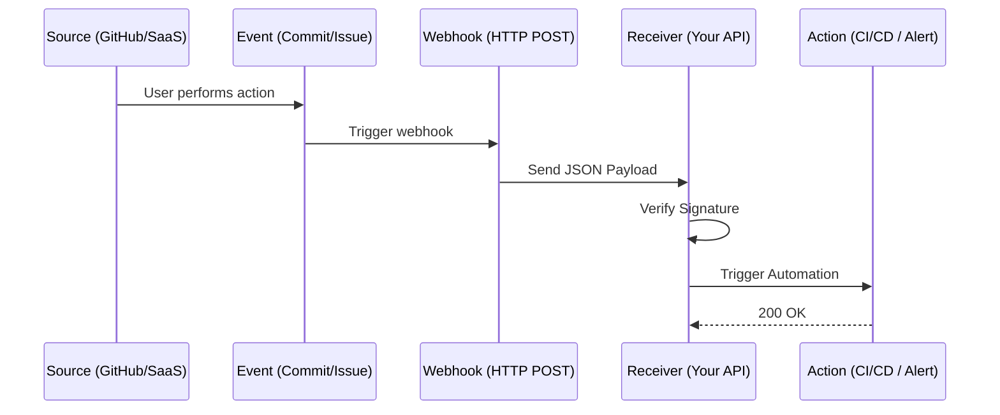

# ⚡ Module 05: Event-Driven Webhooks

> **"In a reactive world, polling is slow and expensive. Webhooks turn 'Are we there yet?' into 'I'll call you when it's done.' They are the nervous system of modern DevOps automation."**

## 📚 Overview

Modern DevOps relies on speed and efficiency. Instead of checking a server for changes every minute (Polling), **Webhooks** allow services to push notifications to your infrastructure the instant an event occurs. This "Event-Driven" approach reduces latency, saves resources, and enables immediate reaction to commits, deployment failures, or security alerts.

## 🎓 Learning Objectives

By the end of this module, you will:
- ✅ Understand the difference between **Push vs. Pull** architectures.
- ✅ Build a **Webhook Receiver** using Flask and Go.
- ✅ Implement **HMAC Signature Verification** to secure your endpoints.
- ✅ Manage **Idempotency** and **Retries** in event-driven systems.
- ✅ Design distributed event pipelines utilizing **Task Queues**.

---

## 📂 Module Structure

| Level | Topic | Description |
| :--- | :--- | :--- |
| **[01. Beginner](readme.md)** | **The Foundation** | Understanding HTTP POST, JSON Payloads, and simple receivers. |
### 🔒 Part 2: Security & Implementation (The Defense)
*Hardening public endpoints against malicious traffic.*

- **[01. Secret Signatures (HMAC)](./part-02-security-and-implementation/01-hmac-verification.md)**: Authenticating payloads.
| **[02. Intermediate](readme.md)** | **Security & Robustness** | HMAC signatures, API keys, and handling payload variance. |
### 🦅 Part 3: Event-Driven Architectures (The System)
| **[03. Advanced](readme.md)** | **Cloud Orchestration** | Async processing, Redis queues, and Kubernetes ingress. |

---

## 🏢 Reference Library
*Deep-dive documentation for at-a-glance problem solving.*

*   **[Webhook Architecture](./reference/webhook-architecture-ref.md)**: Push vs Pull, core components, and the "Acknowledge First" pattern.
*   **[Security & Verification](./reference/webhook-security-verification-ref.md)**: HMAC signatures, IP whitelisting, and replay prevention.
*   **[Event-Driven Patterns](./reference/event-driven-patterns-ref.md)**: Pub/Sub, Fan-out, and reactive infrastructure engineering.

---

## 🔍 Discovery Report: Real-World Examples in this Repo

Your repository already contains several advanced webhook implementations. Use these as reference benchmarks:

1. **Microservices Webhook Hub**: `03-Advanced/02-Phase-2/09-Microservices/Project/spring-petclinic-microservices/docker/webhook/`
2. **Jenkins Webhook Integration**: `02-Intermediate/02-Phase-2/03-CI-CD/CICD_Lessons/Sis_Lessons/Successfully/Webhook/spms_webhook_v2/`
3. **S3 Event Notifications**: `02-Intermediate/02-Phase-2/04-Cloud-Engineering/03-Storage-and-Databases/08-S03-Advanced/s3-event-notifications.md`
4. **SonarQube Quality Gates**: `02-Intermediate/02-Phase-2/03-CI-CD/04-Static-Code-Analysis-SonarQube/CI-CD-Integration/Jenkins/`

---

## 🚀 Professional Pattern: "The Secret Handshake" (HMAC)

A public webhook endpoint is a security risk. If an attacker knows your URL, they can trigger fake deployments.

**The Pro Standard**:

1. **The Hash**: The sender (e.g., GitHub) hashes the payload with a secret key using HMAC-SHA256 and sends it in an HTTP header (e.g., `X-Hub-Signature`).
2. **The Verification**: Your receiver calculates the hash locally using the same secret and the raw payload.
3. **The Logic**: If the hashes don't match, **Reject the Request**.
4. **The Outcome**: You ensure the data hasn't been tampered with and truly came from a trusted source.

---

## 🏗️ Real-World DevOps Story: The "Thundering Herd"

**The Crisis**: An e-commerce company set up a webhook that triggered a heavy image-optimization script every time a product was updated. During a bulk upload of 10,000 products, the system received 10,000 webhooks in 30 seconds.
**The Result**: The server's CPU hit 100%, and the database crashed under the weight of 10,000 simultaneous optimization tasks.
**The Solution**: They moved from **Synchronous** to **Asynchronous**. The webhook receiver now simply adds a task to a **Redis Queue** and returns an immediate `202 Accepted`. A fleet of background workers then processes the queue at a sustainable pace.
**Lesson**: Webhooks should be lightweight. Always offload heavy processing to an async worker.

---

Proceed to: **[01. Beginner Webhook Basics](readme.md)** →
Node: Start your journey into event-driven architecture.
