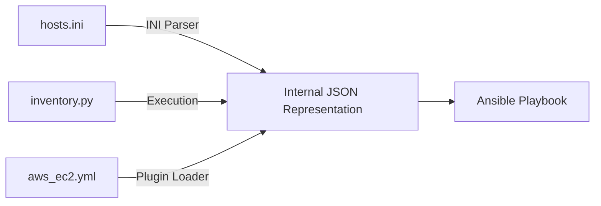
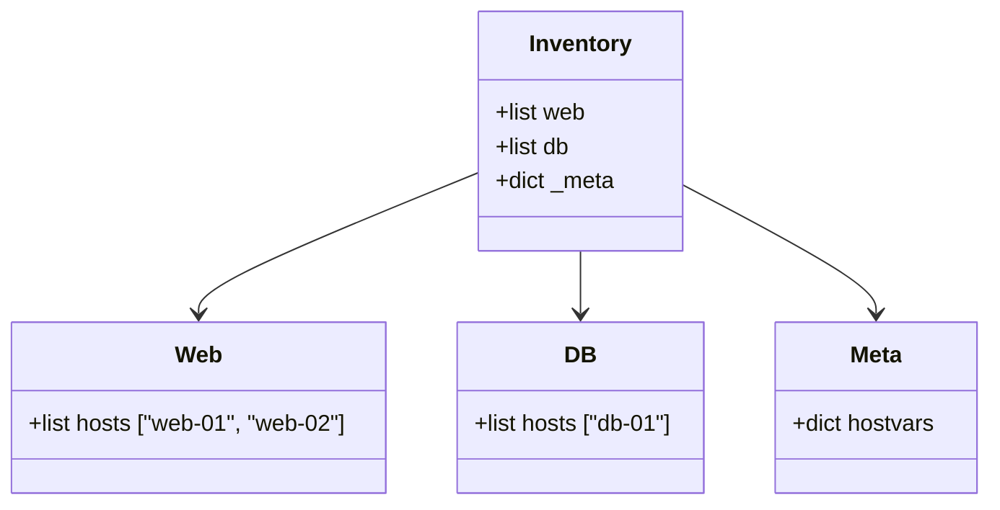

# 🟢 Level 1: Static vs. Dynamic Basics

## 📖 Introduction

Before you can write a dynamic inventory plugin, you must understand the **Data Structure** that Ansible expects. Whether you use a text file, a Python script, or a Cloud Plugin, Ansible ultimately converts everything into a specific **JSON format**.

Everything is JSON under the hood.

### The Parsing Pipeline



---

## 🧐 The Anatomy of Inventory JSON

If you run `ansible-inventory --list`, you will see the raw truth. It is not just a list of IPs.

### The Structure

```json
{
    "group_name": {
        "hosts": ["host1", "host2"],
        "vars": {
            "common_var": "value"
        },
        "children": ["subgroup1"]
    },
    "_meta": {
        "hostvars": {
            "host1": { "ip": "10.0.0.1", "os": "ubuntu" },
            "host2": { "ip": "10.0.0.2", "os": "centos" }
        }
    }
}
```

### 🗝️ The Critical Concept: `_meta`

**This is the secret to performance.**

-   **Without `_meta`**: Ansible sees a list of hosts. To find out specifically "who" host1 is (IP, variables), it might try to call the inventory script again with `--host host1`. If you have 100 hosts, that's 101 script executions! 🐢
-   **With `_meta`**: The inventory source says, "Here is the list of groups, AND here are all the variables for every host right now." Ansible runs the script **once**. ⚡

---

## ⚔️ Static (INI) vs. Dynamic (JSON)

| Feature | `hosts.ini` | JSON Output |
| :--- | :--- | :--- |
| **Readability** | High (Human friendly) | Low (Machine friendly) |
| **Scalability** | Poor (Manual edits) | Excellent (Generated API) |
| **Grouping** | `[group]` headers | Nested Objects |
| **Variables** | Inline `key=value` | `hostvars` dictionary |

### Visual Comparison

#### The Static View

```ini
[web]
web-01 ansible_host=10.0.0.1
web-02 ansible_host=10.0.0.2

[db]
db-01 ansible_host=10.0.0.5 alert_level=high
```

#### The Dynamic View (Internal)



---

## 🚀 Hands-On Lab: The Conversion

Let's prove that Ansible views them the same way.

### Step 1: Create a Static Inventory

Create a file named `static_hosts.ini`:

```ini
[frontend]
loadbalancer01

[backend]
app01
app02

[all:vars]
environment=production
```

### Step 2: Convert to JSON

Use the `ansible-inventory` command to "compile" this into the JSON format Ansible uses internally.

```bash
ansible-inventory -i static_hosts.ini --list
```

**Expected Output:**
Notice how it automatically created the JSON structure? This is what dynamic scripts *must* output manually.

### Step 3: Visualize the Graph

If the JSON is too hard to read, use the graph view.

```bash
ansible-inventory -i static_hosts.ini --graph
```

**Output:**

```text
@all:
  |--@backend:
  |  |--app01
  |  |--app02
  |--@frontend:
  |  |--loadbalancer01
  |--@ungrouped:
```

---

## ❓ Knowledge Check

1. **Q: Why do we prefer passing `_meta` in dynamic scripts?**
   - **A:** To prevent the "N+1" problem where Ansible has to query the script separately for every single host's variables. It greatly improves performance.

2. **Q: Can I use both static and dynamic inventory at the same time?**
   - **A:** Yes! You can pass a directory to `-i`. Ansible will parse `hosts.ini` files AND execute any scripts/plugins it finds, merging the result.

---

**Next Step**: [Level 2: Plugin-Based Inventory Management](../../part-02-dynamic-plugins/01-plugin-based-inventory-management/) 🟡
