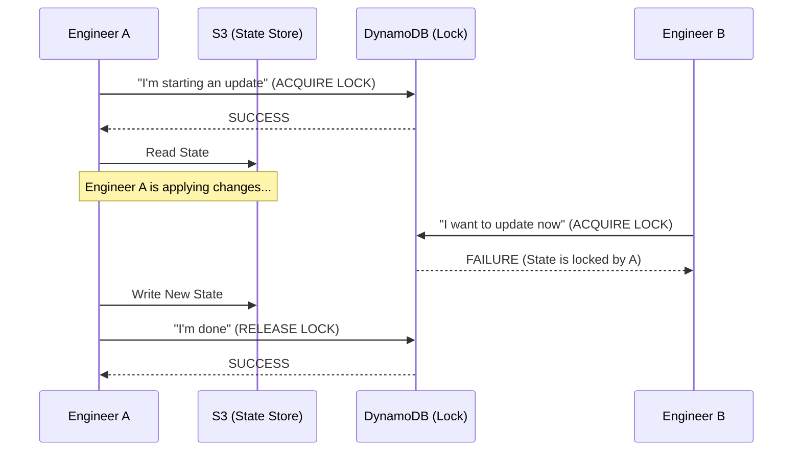

# 🔴 Part 3: Advanced Workflows & State Resilience

## 📖 Overview

In an enterprise "DevOps" world, we don't work alone. This level covers the tools and techniques required for **Collaborative Infrastructure**: how to prevent people from overwriting each other's work and how to fix mistakes without "nuking" the environment.

---

## 🔒 State Locking: Collaboration Security

If two engineers run `terraform apply` at the exact same time, the state file can become corrupted. **Locking** prevents this.

### The Locking Flow (AWS S3 + DynamoDB)


---

## 🏗️ Refactoring: The `moved` Block

One of the most powerful features in modern Terraform (v1.1+).  
Previously, renaming a resource in code meant a **Delete + Recreate** cycle. 

Using a `moved` block, you tell Terraform: "I renamed the resource in code, but **do not delete it** in the cloud. Just update your internal records."

### Code Example:
```hcl
# The resource used to be called 'web_server'
# Now it is part of a cluster map
moved {
  from = aws_instance.web_server
  to   = aws_instance.cluster["web-01"]
}
```

---

## 🌵 DRY with Terragrunt (Multi-Account Management)

As you scale to 50+ AWS accounts, managing `backend` and `provider` blocks in every folder becomes a nightmare. **Terragrunt** acts as a thin wrapper to keep your configurations DRY.

### The Power of Inheritance
1.  Define the **Remote State** once in `root.hcl`.
2.  All sub-folders (`vpc/`, `rds/`, `eks/`) automatically inherit that state location.
3.  Change the S3 bucket name in **one** place, and it updates everywhere.

---

## 🛠️ State Disaster Recovery

### 1. `terraform import`
Use this when you have a resource manually created in the AWS console that you now want to manage with Terraform.
```bash
terraform import aws_instance.manual_one i-0123456789abcdef0
```

### 2. `terraform state mv`
The manual CLI version of the `moved` block. Use this for quick one-off fixes.
```bash
terraform state mv aws_iam_user.bob aws_iam_user.robert
```

---

## 🚀 Hands-On Lab: The State Lock Simulation

In this lab, you will intentionally try to break a lock.

### Step 1: Initialize the Backend
Create a `backend.tf` pointing to an S3 bucket and DynamoDB table.

### Step 2: Simulate a Long Apply
Start a `terraform apply` but **do not** type "yes" yet. Just leave it hanging.

### Step 3: Attempt a Second Run
Open a new terminal window and try running `terraform plan`. 
**Observe:** You should receive a "Error: Error acquiring the state lock" message.

---

## 🎓 Career Readiness

**Interview Question:** "What do you do if your DynamoDB lock gets stuck because a CI/CD job crashed?"

**Strong Answer:** "First, I would verify that the process that held the lock is definitely dead. I would then use the `terraform force-unlock <LOCK_ID>` command, where the Lock ID is provided in the error message. This should be a last resort to prevent state corruption."

---

**Next Step**: Congratulations! You've mastered Terraform Patterns. 🏆
Return to the [Automation Index](../../readme.md) to explore other modules. 
