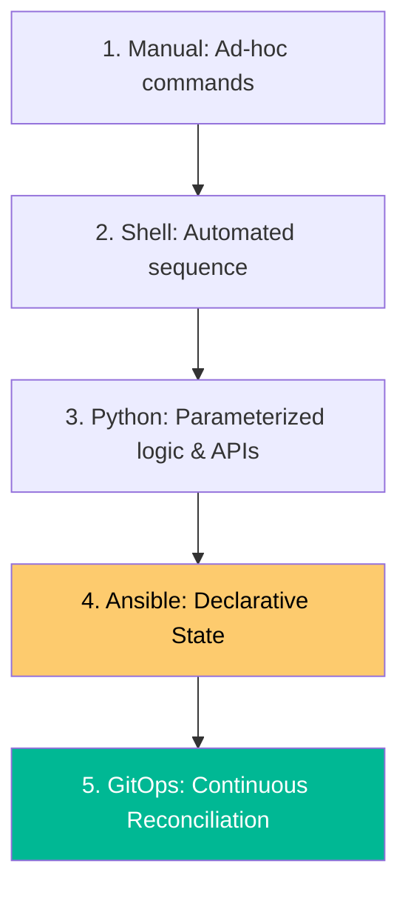

# Automation Strategy & Scripting Reference

**Doc Version:** 1.0.0
**Role:** Automation Engineer / Systems Lead
**Scope:** Automation Laws, Scripting Best Practices, and Tool Selection

---

## 1. The Three Laws of Automation

Before writing a single line of code, evaluate the task using these principles:

1.  **If you do it twice, script it.** (Efficiency)
2.  **If a machine can fail it, a machine should monitor it.** (Reliability)
3.  **Automation must be as versionable as the code it deploys.** (Auditability)

---

## 2. Scripting Best Practices (The "Gold Standard")

### A. Bash Strict Mode
Always start every Bash script with these settings to ensure it fails fast and predictably:
```bash
#!/bin/bash
set -euo pipefail
IFS=$'\n\t'
```
- `-e`: Exit immediately if a command fails.
- `-u`: Exit if an unset variable is used.
- `-o pipefail`: Ensure errors in pipes are caught.

### B. Idempotency
A script is **Idempotent** if running it multiple times has the same effect as running it once.
- **Example**: Use `mkdir -p` instead of `mkdir`. Use `rm -f` instead of `rm`.
- **Reason**: Prevents "Script already ran" errors and accidental data destruction during retries.

### C. Logging and Debugging
- Use meaningful exit codes (0 for success, non-zero for specific errors).
- Print timestamped logs to `stderr` for errors and `stdout` for information.
- Provide a `--debug` flag that enables `set -x` for troubleshooting.

---

## 3. Language Selection Guide

| Task | Recommended Tool | Why? |
| :--- | :--- | :--- |
| **Simple File Ops** | Shell (Bash/Zsh) | Native, no dependencies, fast. |
| **Cloud/API Logic** | Python (Boto3) | Rich libraries, readable, easy to test. |
| **System Tools** | Go | Single binary, concurrent, high performance. |
| **Config Management** | Ansible | Declarative, agentless, handles drift. |

---

## 4. Visualizing the Automation Hierarchy



---

## 5. Security Governance

- **No Hardcoded Secrets**: Use environment variables or a Secret Manager (Vault, AWS Secrets Manager).
- **Least Privilege**: Service accounts running automation should only have the permissions necessary for the task.
- **Linters**: Use tools like `shellcheck` for Bash and `pylint/flake8` for Python to catch logic errors before they run.

---

## 6. Enterprise Pattern: The "Wrapper" Strategy

Instead of complex logic inside a CI/CD pipeline (e.g., GitHub Actions YAML), put the logic into a standalone script in the repository.

- **Pipeline YAML**: Executes `scripts/deploy.sh`.
- **Benefit**: Developers can run `scripts/deploy.sh` locally to debug, ensuring the environment doesn't become a "Black Box" that only works in the clouds.

> **Enterprise Pattern**: Implement **Command Idempotency**. Every script that performs a mutation (creating a user, deleting a file, modifying a database) must first check if the change has already been made. If the desired state is already present, the script should exit gracefully with code 0.
