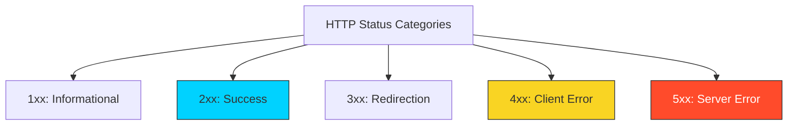

# 🛑 Part 1.3: Status Codes & Error Handling

> **"A good API tells you what happened. A great API tells you why it happened and exactly how to fix it."**

## 📖 Overview

HTTP Status Codes are the "Body Language" of the web. As a DevOps engineer, these codes are your primary diagnostic tool. When a Kubernetes Pod is stuck in `CrashLoopBackOff` or a Load Balancer is returning errors, the Status Code is your first and most vital clue.

---

## 🏗️ The Status Code Taxonomy

How the internet categorizes Success and Failure.



### 1. 2xx: Success (The Happy Path)

- **200 OK**: General success.
- **201 Created**: Resource established (Common for `POST`).
- **204 No Content**: Success, but no data to return (Common for `DELETE`).

### 2. 4xx: Client Error (Your Problem)

- **400 Bad Request**: Malformed JSON or syntax errors.
- **401 Unauthorized**: I don't know who you are (Auth missing).
- **403 Forbidden**: I know who you are, but you aren't allowed here (Permission denied).
- **404 Not Found**: The resource doesn't exist.
- **429 Too Many Requests**: You hit a **Rate Limit**.

### 3. 5xx: Server Error (My Problem)

- **500 Internal Server Error**: The code crashed.
- **502 Bad Gateway**: Proxy can't talk to the backend.
- **503 Service Unavailable**: Overloaded or maintenance.
- **504 Gateway Timeout**: The backend took too long to speak.

---

## 🚀 Professional Patterns: DevOps Diagnostics

### Pattern A: The 429 "Retry-After"

Many APIs return a `Retry-After: <seconds>` header with 429s. Professional automation scripts must parse this and implement **Exponential Backoff** rather than hammering the server.

### Pattern B: The 502 vs 504 Triage

- **502 (Bad Gateway)**: Usually implies a network or configuration disconnect (Nginx -> App Server).
- **504 (Gateway Timeout)**: Usually implies a performance bottleneck (Slow SQL query or high CPU).

### Pattern C: Descriptive Error Payloads

Never send a blank 400. Send a helpful JSON body:

```json
{
  "code": "validation_failed",
  "detail": "Field 'memory_limit' must be an integer.",
  "request_id": "8c22d-11e2",
  "docs": "https://api.docs.io/errors/v01"
}
```

---

## 🎓 Career Readiness

**Interview Question:** "What is the primary difference between a 401 and 403 status code?"

**Strong Answer:** "401 (Unauthorized) is about **Authentication**; the client hasn't provided credentials or the ones they provided are invalid. 403 (Forbidden) is about **Authorization**; the client is authenticated and verified, but the server is refusing to allow the action because the user lacks the specific permissions or roles required for that resource."

---

**Next Step**: [Part 2: API Security & Authentication](../../part-02-api-security-and-auth/01-authentication-and-security/) 🚀
