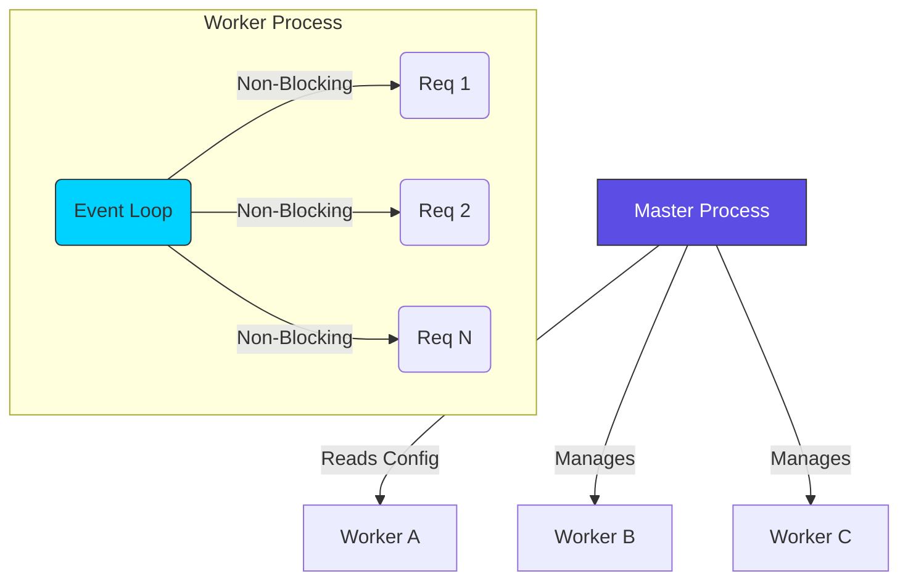

# 🏗️ Part 1: Architecture & foundations

> **"To master Nginx, you must first understand its 'Heart.' It doesn't work like traditional software; it's a precisely tuned engine designed for concurrency."**

## 📖 Overview

This module covers the fundamental mechanics of Nginx. We move from the theoretical "Event Loop" architecture to the practical application of the **Reverse Proxy**—the most critical pattern in modern cloud engineering.

---

## 🏗️ The Architecture of Scalability

Nginx uses a **Master-Worker** process model.

- **Master Process**: Handles configuration files and manages worker processes.

- **Worker Processes**: Perform the actual request handling. They are single-threaded but use an event loop to handle thousands of concurrent connections.

---

## 🎯 Learning Objectives

By the end of this part, you will:

- ✅ **Understand** the difference between Process-based (Apache) and Event-based (Nginx) architectures.
- ✅ **Install** and verify Nginx on Linux systems.
- ✅ **Navigate** the `nginx.conf` structure (Main, Events, HTTP, Server, Location).
- ✅ **Implement** a functional Reverse Proxy to shield backend applications.
- ✅ **Master** the `proxy_pass` directive and its nuances with trailing slashes.

---

## 🗺️ Included Modules

1. **[01-Architecture & Installation](./01-architecture-and-installation/readme.md)**: Learning the event-driven model and getting our hands dirty with the first installation.
2. **[02-Reverse Proxy Basics](./02-reverse-proxy-basics/readme.md)**: Turning Nginx into a shield. Understanding how to forward traffic and manage headers.

---

## 🚀 Professional Pattern: The "Dry Run"

In a production environment, you **never** restart Nginx without testing your configuration first. A single missing semicolon can crash your edge service and take down your entire company's traffic.

**The DevOps Workflow:**
1. Edit config in `sites-available`.
2. Link to `sites-enabled`.
3. **`sudo nginx -t`** (The Syntax Test).
4. If successful: **`sudo systemctl reload nginx`**.

---

## 🎓 Career Readiness

**Interview Question:** "What happens to active client connections when you run `nginx -s reload`?"

**Strong Answer:** "Nginx handles reloads gracefully. The Master process starts new worker processes with the updated configuration. Simultaneously, it sends a signal to the old worker processes to stop accepting new connections and finish processing their current requests. Once the old workers have finished their tasks, they shut down. This ensures zero downtime for the users during configuration changes."

---

**Next Step**: Dive into **[01-Architecture & Installation](./01-architecture-and-installation/readme.md)** 🚀
