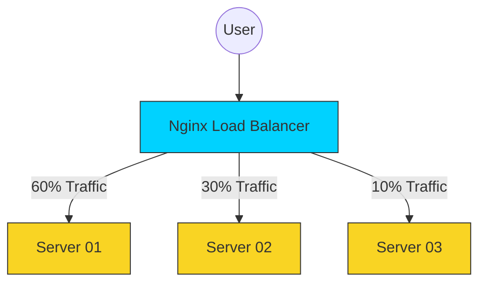

# ⚖️ Module 01: Load Balancing Strategies

> **"One server is a single point of failure. Ten servers is an army. Nginx is the commander that ensures no soldier is overwhelmed."**



## 📚 Overview

Load Balancing is the process of distributing network traffic across multiple servers. This ensures no single server bears too much demand, improving **Availability** and **Scalability**.

If one server goes down, Nginx stops sending traffic to it automatically, providing "Self-Healing" capabilities to your infrastructure.

## 🎓 Learning Objectives

- ✅ Configure an **Upstream** block.
- ✅ Master the 4 main **Load Balancing Methods**.
- ✅ Implement **Passive Health Checks**.
- ✅ Leverage **Weights** to favor stronger servers.

---

## 🏗️ The Upstream Configuration

To balance traffic, you first define a "pool" of servers using the `upstream` block:

```nginx
upstream my_backend_pool {
    # Default is Round Robin
    server 10.0.0.1:8080 weight=3; # Powerful Server
    server 10.0.0.2:8080;          # Normal Server
    server 10.0.0.3:8080 backup;   # Only used if others fail
}

server {
    listen 80;
    location / {
        proxy_pass http://my_backend_pool;
    }
}
```

---

## 🛠️ Comparison of Methods

| Method | Syntax | Best Use Case |
| :--- | :--- | :--- |
| **Round Robin** | Default | Equal servers, simple apps. |
| **Least Connections** | `least_conn;` | Requests take varying amounts of time to process. |
| **IP Hash** | `ip_hash;` | When you need the same user to stick to the same server (Sessions). |
| **Random** | `random;` | Massive clusters where simple rotation creates patterns. |

---

## 🚀 Performance Patterns: The "Failover" Guard

Nginx can automatically detect when a server is struggling:

```nginx
upstream my_pool {
    # If a server fails 3 times in 30 seconds, mark it as 'Down'
    server app-01:8000 max_fails=3 fail_timeout=30s;
    server app-02:8000 max_fails=3 fail_timeout=30s;
}
```

---

## 🏆 Real-World DevOps Story: The Session Shuffle

**The Scenario**: A gaming site launched using **Round Robin** load balancing. Users were randomly logged out while browsing.

**The Discovery**: The site stored login sessions in the server's local RAM. When a user moved from Server 01 to Server 02, Server 02 didn't know who they were and kicked them out.

**The Fix**: The SRE team switched to **IP Hash**. Now, every user "sticks" to the same server for the duration of their visit.

**The Lesson**: Your load balancing strategy must match your application's **State** logic. If your app is not "Stateless," you need "Sticky Sessions."

---

## ❓ Interview Preparation

1. **Q: What is an 'Upstream' in Nginx?**
   *A: An upstream is a named group of servers that Nginx can proxy requests to. It separates the "Pool" of backends from the "Proxy" logic.*

2. **Q: How does 'Weight' affect load balancing?**
   *A: Weight allows you to influence the distribution. A server with `weight=3` will receive 3 times more traffic than a server with the default `weight=1`. Useful when hardware is mismatched.*

3. **Q: What happens if all servers in an upstream block fail?**
   *A: Nginx will return a **502 Bad Gateway** or **503 Service Unavailable** to the client.*

4. **Q: When should you use 'Least Connections' over 'Round Robin'?**
   *A: Use it when individual requests are unequal. For example, some requests might be "Download a 1GB file" while others are "Check notifications." Least connections keeps the load even.*

5. **Q: What is a 'Passive Health Check'?**
   *A: It's when Nginx watches the traffic *normally*. If a connection fails or times out, it notes the failure. This is different from an "Active Health Check" where Nginx sends special "Are you alive?" pings.*

---

## 🔗 Next Steps

The traffic is flowing perfectly. Now let's make it secure.

Proceed to: **[02-Performance Optimization](../02-performance-optimization/readme.md)** →

---

[Back to Part 2 Overview](../readme.md) | [Back to Home](../../readme.md)
