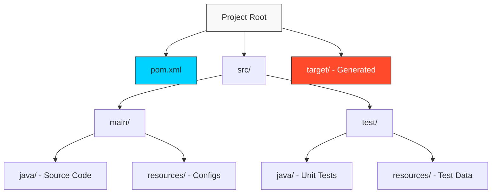

# 📂 Module 02: Maven Project Structure

> **"Consistency is the antidote to confusion. The Standard Directory Layout is the common language that allows any developer or tool to understand your project instantly."**



## 📚 Overview
Maven popularized the concept of **"Convention over Configuration."** Instead of spending hours writing scripts to tell the compiler where your files are, you simply put your files in the directories Maven expects.

This predictability is what allows CI/CD pipelines to build thousands of different projects using the exact same set of commands.

## 🎓 Learning Objectives
- ✅ Master the **Standard Directory Layout**.
- ✅ Differentiate between `src/main` and `src/test`.
- ✅ Understand the lifecycle of the `target/` directory.
- ✅ Explore **Multi-Module Project** organization.
- ✅ Learn how to navigate complex enterprise source trees.

---

## 🏗️ The Standard Directory Layout

Maven expects a specific hierarchy. If you follow this, your `pom.xml` stays lean and clean.

| Directory | Content Type | Purpose |
| :--- | :--- | :--- |
| `src/main/java` | Java Code | The actual application logic. |
| `src/main/resources` | Config/XML/Properties | Files that need to be on the classpath. |
| `src/main/webapp` | HTML/JS/CSS | (For WAR projects) The web root. |
| `src/test/java` | Test Code | JUnit/TestNG classes (Not included in final JAR). |
| `src/test/resources` | Test Data | Config files used only during testing. |
| `target/` | Binaries/JARs | The output folder. **Never** commit this to Git! |

---

## 🚀 Enterprise Pattern: Multi-Module Projects

In real-world DevOps, we rarely build a single JAR. We build systems. A parent project contains multiple sub-modules (e.g., `core`, `api`, `ui`).

```bash
my-enterprise-app/
├── pom.xml (The Parent)
├── auth-service/
│   └── pom.xml
├── payment-service/
│   └── pom.xml
└── common-utils/
    └── pom.xml
```

**The Power**: Running `mvn clean install` in the parent directory automatically builds all sub-modules in the correct order based on their dependencies.

---

## 🏆 Real-World DevOps Story: The Git Commit Tragedy

**The Scenario**: A new intern committed the entire `target/` directory to GitHub. Suddenly, the repository size jumped from 5MB to 2GB, and the CI/CD pipeline started failing with "Disk Space" errors.
**The Discovery**: The `target/` directory contains every compiled `.class` file and the final `.jar`. These are binary files that change every time you build, making Git track thousands of useless versions.
**The Fix**: The SRE team had to use a "Git Filter-Repo" tool to scrub the history and immediately established a strict `.gitignore` policy.
**The Lesson**: The separation between **Source (`src/`)** and **Output (`target/`)** is sacred. Never mix them.

---

## ❓ Interview Preparation

1. **Q: Why is it important to follow the Maven Standard Directory Layout?**
   *A: It reduces the configuration needed in the `pom.xml` and ensures that any developer or tool (like Jenkins or Sonarqube) can work with the project without manual configuration.*

2. **Q: What goes into `src/main/resources`?**
   *A: Any file that isn't Java code but needs to be packaged into the final JAR, such as database configuration files (`application.properties`), XML mappings, or log configurations.*

3. **Q: Should the `target` folder be checked into source control?**
   *A: **No.** The `target` folder contains generated artifacts. Committing it leads to repo bloat and potential binary conflicts. It should always be in your `.gitignore`.*

4. **Q: How does a multi-module project determine the build order?**
   *A: Maven analyzes the dependency graph between modules. If Module A depends on Module B, Maven will automatically build Module B first.*

5. **Q: What is the purpose of the `src/test` directory?**
   *A: It isolates test logic from production logic. Maven ensures that code in `src/test` is compiled and run during the test phase but is NEVER packaged into the final production JAR/WAR.*

---

## 🔗 Next Steps

The folders are ready. Now let's look at the brain that controls them.

Proceed to: **[03-POM-Configuration](../03-pom-configuration/readme.md)** →