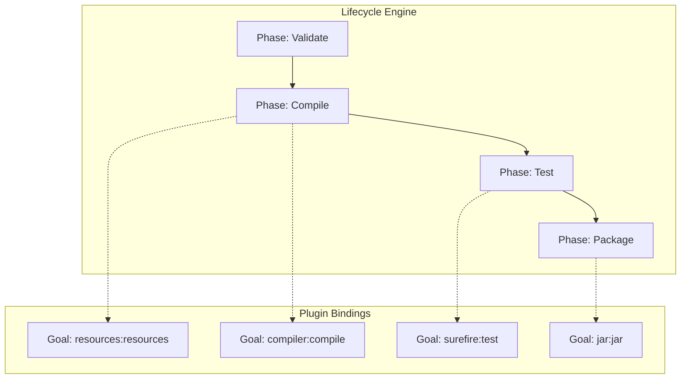

# Maven Lifecycle & Internal Architecture Reference

**Doc Version:** 1.0.0
**Role:** Senior Build Engineer
**Scope:** Deep Dive into Maven's Execution Model

---

## 1. The Core Philosophy: Convention Over Configuration

Unlike Ant (procedural) or Gradle (scriptable), Maven is **declarative**. You describe *what* your project is (via the POM), and Maven's internal architecture decides *how* to build it based on conventions.

### The Object Model (POM)
The Project Object Model (`pom.xml`) is the manifest. At runtime, Maven parses this into a POJO (Plain Old Java Object) graph containing:
- **GAV**: GroupId, ArtifactId, Version (The coordinate system)
- **Dependencies**: The directed acyclic graph of libraries.
- **Build Configurations**: Plugin bindings.

---

## 2. The Build Lifecycle Engine

Maven does not just "run scripts". It executes a state machine. There are three standard lifecycles: `default`, `clean`, and `site`.

### The `default` Lifecycle State Machine
When you run `mvn install`, Maven sequentially executes every phase *leading up to* `install`.

1.  **validate**: Check project is correct.
2.  **compile**: Compile source code.
3.  **test**: Run tests (junit/testng).
4.  **package**: Bundle compiled code (JAR/WAR).
5.  **verify**: Integration tests checks.
6.  **install**: Install to Local Repository (`~/.m2/repository`).
7.  **deploy**: Upload to Remote Repository (Nexus/Artifactory).

**Architecture Note:** You cannot execute "just" the `package` phase without `compile` and `test` running first. This guarantees state consistency.

---

## 3. Plugin Architecture & Goals

Maven is essentially a plugin execution framework. The lifecycle phases are abstract; **Plugins** do the actual work.

- **Phase**: A step in the lifecycle (e.g., `compile`).
- **Plugin**: A collection of code (e.g., `maven-compiler-plugin`).
- **Goal**: A specific task within a plugin (e.g., `compile`).

**Binding Mechanism:**
`Phase -> Plugin:Goal`

*Example:* The `compile` phase is bound by default to `maven-compiler-plugin:compile`.

### Custom Bindings (Enterprise Pattern)
In enterprise builds, we often bind extra goals:
- Bind `jacoco:prepare-agent` to `test` phase for coverage.
- Bind `flatten:flatten` to `process-resources` for CI-friendly versions.

---

## 4. The Reactor (Multi-Module Architecture)

The **Reactor** is the engine that collects all modules, sorts them by dependency graph, and executes them in order.

### Topological Sorting
If Module A depends on Module B, the Reactor *must* build B first.
- **Failure Graph:** If the Build fails at Module B, the Reactor has options:
    - `-rf :Module-B`: Resume from failure.
    - `-fae`: Fail at end (continue building independent modules).

---

## 5. Visualizing the Flow

> **Enterprise Note:** Understanding internal bindings is critical when fixing "it works on my machine" issues. Often, a globally configured plugin in a parent POM is injecting logic (like Checkstyle or Enforcer) that fails the build in CI.
