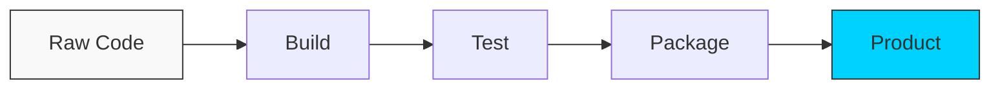

# 🟢 Part 1: Principles & Fundamentals

> **"You cannot automate what you do not understand. Before we build the pipeline, we must understand the flow."**

## 📖 Overview

In this part, we strip away the tools and focus on the **Concepts**. What actually IS a pipeline? Why do we distinguish between Delivery and Deployment? Understanding these core principles is what separates a "Yaml Engineer" from a true "DevOps Engineer."

## Core Concept: The Controller & The Agent
**[REFERENCE: CI Architecture Components](../reference/ci-architecture-components-ref.md)**

Understanding the **Event Loop** is critical:
1.  **Event**: Git Push.
2.  **Controller**: Receives via Webhook, finds a worker.
3.  **Agent**: "Checkout Code" -> "Run Scripts" -> "Report Status".

> See **[CI-Architecture-Components-Ref.md](../reference/ci-architecture-components-ref.md)** for the deep dive on Webhooks vs Polling.

---

## 🏗️ The Pipeline Mindset

A pipeline is just a factory line for code.

---
## 🎯 Learning Objectives

By the end of this part, you will:
- ✅ Define the **CI/CD Lifecycle**.
- ✅ Understand the **"Fail Fast"** philosophy.
- ✅ Master the vocabulary: **Artifacts**, **Stages**, **Jobs**, and **Steps**.
- ✅ Learn why **Git** is the single source of truth.

---

## 🗺️ Included Modules

1. **[01-CI-CD-Foundations](./01-ci-cd-foundations/readme.md)**: The core definitions and standard practices.

---

## 🎓 Career Readiness

**Interview Question:** "What is the most important characteristic of a good CI pipeline?"

**Strong Answer:** "**Speed and Reliability.** A pipeline must be fast enough that developers don't hesitate to run it, and reliable enough that a 'Green Build' genuinely gives them confidence to deploy. If a pipeline is flaky or slow, people stop using it, and the culture collapses."

---

**Next Step**: Start with **[01-CI-CD-Foundations](./01-ci-cd-foundations/readme.md)** 🚀
