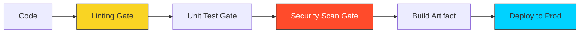

# 🔴 Part 3: Advanced Workflows (Ops)

> **"A pipeline that just builds code is a toy. A pipeline that secures, tests, validates, and deploys code is a product."**

## 📖 Overview

In this final part, we turn our simple build scripts into robust enterprise pipelines. We integrate **Quality Gates** to block bad code, add **Security Scans** to catch vulnerabilities, and finally set up **Continuous Deployment** to ship our artifacts to the world.

---

## 🛡️ The Defense in Depth Pipeline

---

## 🎯 Learning Objectives

By the end of this part, you will:

- ✅ Implement **Linting** (pylint/eslint) as a required pass criteria.
- ✅ Add **SAST** (Static Application Security Testing) tools like SonarQube or CodeQL.
- ✅ Manage **Artifacts** (Uploading/Downloading between jobs).
- ✅ Script **Continuous Deployment** to a staging environment.
- ✅ Handle **Secrets** securely during deployment.

---

## 🗺️ Included Modules

1. **[01-Security-and-Quality-Gates](./01-security-and-quality-gates/readme.md)**: Blocking bad code before it merges. Linting, Testing, and Scanning.
2. **[02-Continuous-Deployment](./02-continuous-deployment/readme.md)**: The final mile. Automated release strategies.

---

## 🎓 Career Readiness

**Interview Question:** "How do you handle a failed deployment in a CD pipeline?"

**Strong Answer:** "The pipeline should support **Automated Rollback**. If the 'Smoke Tests' run after deployment fail, the pipeline should immediately revert the environment to the previous known-good artifact version and alert the team. We should never leave the production environment in a broken state for a human to fix manually."

---

**Next Step**: Secure your code in **[01-Security-and-Quality-Gates](./01-security-and-quality-gates/readme.md)** 🚀
