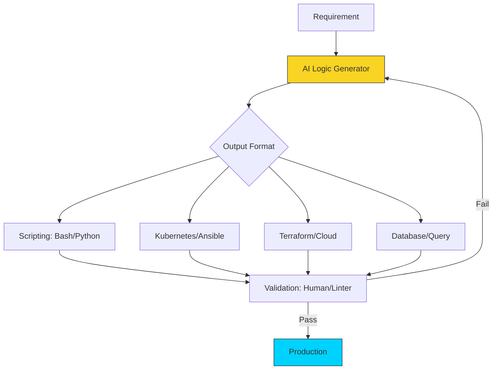

# 🏗️ Module 03: Automating Code & IaC

> **"Code is a liability; automation is an asset. Use AI to build the assets that manage the liabilities."**

## 📚 Overview

The most direct "ROI" of Prompt Engineering for a DevOps engineer is the generation of code and configuration. In this module, we learn how to use AI to build complex Bash scripts, Python automation tools, and Infrastructure as Code (IaC) in Terraform and Kubernetes. We also cover the critical practice of **Validation & Verification**.

## 🎓 Learning Objectives

- ✅ Generate **POSIX-compliant Bash scripts** with robust error handling.
- ✅ Create **Python DevOps tools** using `boto3`, `requests`, and `click`.
- ✅ Build **Terraform Modules** and Kubernetes manifests.
- ✅ Use AI to **Translate** logic from one language to another.
- ✅ Implement **Modular Prompts** for large-scale IaC projects.

---

## 🚀 The Three Pillars of Auto-Generation

### 1. Scripting (The Glue)
Use AI to write the "boring" scripts that move files, rotate logs, and check health.
- **Master Prompt**: *"Write a Python script to scan an S3 bucket for files older than 30 days and move them to Glacier. Use the boto3 library and include logging."*

### 2. Configuration (The Blueprint)
Generate thousands of lines of YAML for Kubernetes or Ansible in seconds.
- **Master Prompt**: *"Generate a Kubernetes Deployment and Service for a React app. Use a LoadBalancer, 3 replicas, and include resource limits (256Mi CPU, 512Mi RAM)."*

### 3. Translation (The Bridge)

Convert legacy code into modern standards.
- **Master Prompt**: *"Act as a conversion expert. Port this legacy 500-line Bash script into a modern, typed Go program."*

---

## 🏎️ Efficiency Hack: The "Boilerplate First" Strategy
Don't ask AI to write the whole project at once. Ask for the **Boilerplate** first (the structure), then populate the logic in smaller segments. This prevents the AI from losing focus and ensures each module is tested independently.

---

## 🏆 Real-World DevOps Story: The 1,000 Line Terraform Win

**The Scenario**: A company needed to migrate their entire networking stack to a new AWS region. This required writing 1,000+ lines of Terraform for VPCs, Subnets, Route Tables, and NAT Gateways.
**The Crisis**: The manual estimation for this task was **one week** of focused engineering time.
**The Fix**: The Lead DevOps Engineer used a **"Template + Matrix"** prompt strategy. They created a master prompt with the architecture requirements and used AI to generate the repeated modules (subnets, tags, security rules) in the correct HCL format.
**The Result**: The code was generated and verified in **4 hours**.
**The Lesson**: AI handles **repetition** better than humans. Use it for the volume, and use humans for the verification.

---

## ❓ Interview Preparation

1. **Q: How do you ensure an AI-generated Bash script is 'Safe' to run?**
   *A: 1) Run it through a linter like `ShellCheck`. 2) Read it line-by-line to ensure no `rm -rf /` or unintended deletions exist. 3) Test it in a non-production environment with dummy data.*

2. **Q: Why is 'Markdown Code Blocks' essential when asking AI for IaC?**
   *A: It ensures the output is properly formatted and easy to copy. More importantly, asking the AI to "Provide only the code in a markdown block" prevents it from mixing conversational text with the configuration logic.*

3. **Q: Can AI help with 'Database Migrations'?**
   *A: Yes. You can provide the current SQL schema and the desired changes, and ask the AI to generate the `ALTER TABLE` statements and the rollback script.*

4. **Q: What is the risk of asking AI to generate Terraform for a production environment?**
   *A: Small typos in HCL (like a missing `destroy_on_update` or an incorrect CIDR block) can cause catastrophic infrastructure loss. AI-generated IaC must ALWAYS be run with `terraform plan` first to inspect exactly what will happen.*

5. **Q: How can you use AI to 'Optimize' an existing Kubernetes manifest?**
   *A: Paste the manifest and prompt: "Analyze this K8s deployment for cost and performance. Suggest resource request/limit adjustments and explain why."*

---

## 🔗 Next Steps

The code is generated. Now let's learn how to fix it when it fails.

Proceed to: **[Module 04: Troubleshooting & Debugging](../04-debugging-with-ai/readme.md)** →
