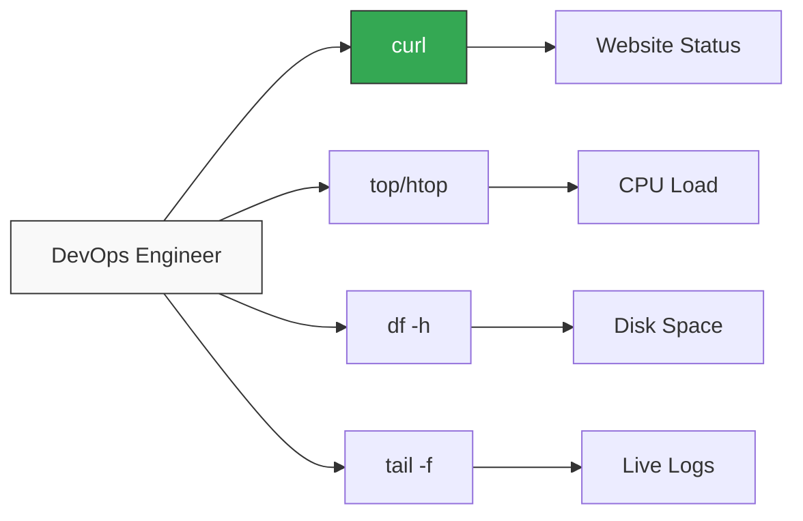

# 🟡 Part 2: Active Monitoring

> **"A dashboard is nice, but a command line gives you the truth."**

## 📖 Overview

In this part, we leave the theory and start checking systems. We learn how to perform "Manual Health Checks"—the first line of defense when you log into a server that is acting up.

---

## 🛠️ The Toolkit

---

## 🎯 Learning Objectives

- ✅ Check HTTP endpoints with `curl`.
- ✅ Monitor processes with `top`.
- ✅ Find disk space issues with `df`.
- ✅ Watch logs in real-time with `tail`.

---

## 🗺️ Included Modules

1. **[02-Manual-Health-Checks](./02-manual-health-checks/readme.md)**: The essential CLI commands for diagnostics.

---

**Next Step**: Get hands-on in **[02-Manual-Health-Checks](./02-manual-health-checks/readme.md)** 🚀
