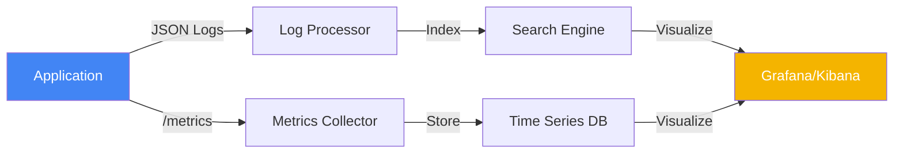

# 🔭 Observability Fundamentals (Beginner)

> **"If it's not monitored, it doesn't exist. If it's not observable, it cannot be debugged."**

## 📚 Overview

Observability is the ability to measure the internal states of a system by examining its outputs. In this module, we move beyond simple "is it running?" checks and into understanding system health through data. We explore the **MELT** framework and hands-on tools for manual diagnostics.

## Core Concept: Symptom-Based Alerting
**[REFERENCE: Monitoring Strategies](reference/monitoring-strategies-ref.md)**

Don't page on CPU usage. Page on User Pain.
- **RED Method**: Rate, Errors, Duration (For Services).
- **USE Method**: Utilization, Saturation, Errors (For Hardware).
- **High Cardinality**: The database killer. Never put a UserID in a Metric label.

> See **[Observability-Architecture-Ref.md](reference/observability-architecture-ref.md)** for the architectural breakdown of Signals (Metrics vs Logs).

## 🎯 Learning Objectives

- ✅ Understand the **MELT** framework (Metrics, Events, Logs, Traces).
- ✅ Differentiate between **Monitoring** (Passive) and **Observability** (Active).
- ✅ Perform manual system health checks using simple terminal tools.
- ✅ Understand the importance of structured logging.

---

## 🗺️ Curriculum Structure

| Part | Topic | Description |
| :--- | :--- | :--- |
| **[🟢 Part 1](./part-01-the-signals/)** | **The Signals** | Understanding Concepts: Metrics, Logs, Traces. |
| **[🟡 Part 2](./part-02-active-monitoring/)** | **Active Ops** | Hands-on Health Checks and Diagnostics. |

---

## 🏗️ Visual: The Observability Data Pipeline

## 📋 Professional Pattern: The "Health Endpoint"

Always implement a `/health` or `/ready` endpoint in your services. This allows load balancers and container orchestrators to know if your app is alive without needing complex probes.

---

**Next Step**: Start with **[Part 1: The Signals](./part-01-the-signals/readme.md)** 🚀
