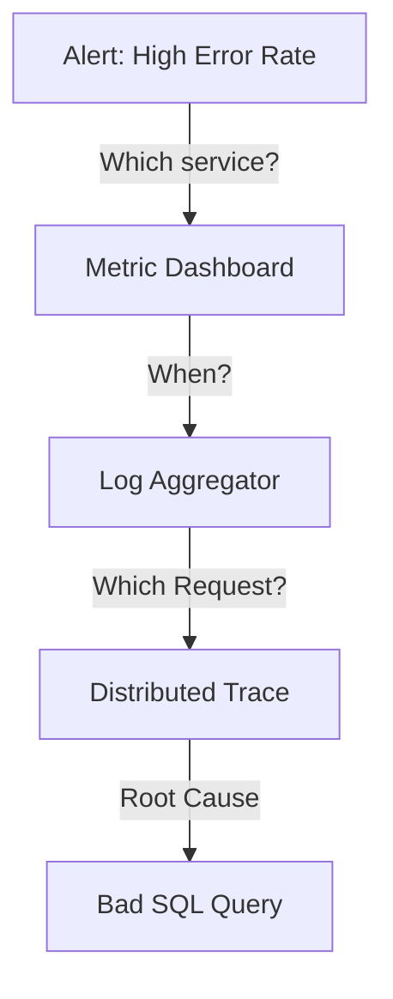

# Observability Architecture Reference

**Doc Version:** 1.0.0
**Role:** Reliability Engineer (SRE)
**Scope:** The Three Pillars & High Cardinality

---

## 1. Monitoring vs. Observability

*   **Monitoring**: Tells you *when* something is wrong. ("CPU is at 99%").
*   **Observability**: Tells you *why* something is wrong. ("CPU is at 99% because Customer A sent a malformed RegEx that caused infinite backtracking").
*   **Key Difference**: Monitoring handles "Known Unknowns". Observability handles "Unknown Unknowns".

---

## 2. The Three Pillars (The Data Signals)

### A. Metrics (Aggregatable)
*   **Definition**: Numeric representations of data measured over intervals.
*   **Structure**: `Name + Labels + Value + Timestamp`.
*   **Example**: `http_requests_total{method="POST", status="200"} 743`
*   **Cost**: Low storage (numbers are cheap).
*   **Weakness**: Lacks context. You know *that* it failed, not *why*.

### B. Logs (Discrete Events)
*   **Definition**: An immutable record of a discrete event.
*   **Structure**: String or JSON blob.
*   **Example**: `[ERROR] User 123 failed login: Password mismatch.`
*   **Cost**: High storage (text is heavy).
*   **Weakness**: Hard to look at in aggregate across 1,000 servers.

### C. Traces (Context)
*   **Definition**: The journey of a request across distributed systems.
*   **Spans**: A single unit of work (e.g., "SQL Query", "HTTP Call").
*   **Trace ID**: A unique ID passed via HTTP Headers (`x-trace-id`) to link spans together.
*   **Cost**: Extremely High (Sampling is usually required).

---

## 3. High Cardinality (The Enterprise Killer)

**Cardinality** refers to the number of unique elements in a set.
*   **Low Cardinality**: `http_status` (200, 404, 500). (~10 combinations).
*   **High Cardinality**: `user_id` (User_1, User_2... User_1M). (1M+ combinations).

**The Danger**: 
If you add `user_id` as a **label** to a Metric (Prometheus), you explode the database. Time-Series Databases (TSDB) are designed for low cardinality.
*   *Correct*: Log the User ID.
*   *Incorrect*: Create a Metric per User ID.

---

## 4. Visualizing the Correlation

