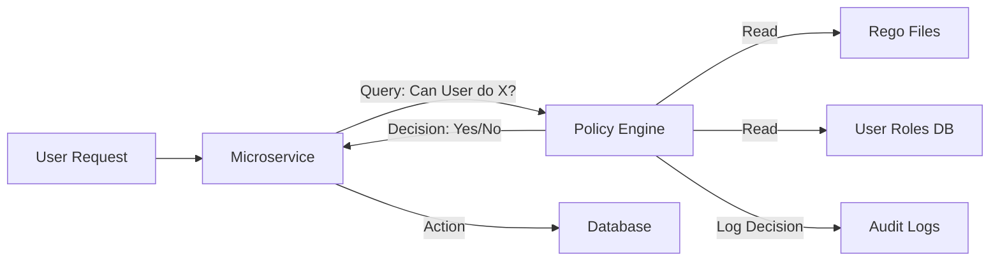

# Policy as Code Architecture Reference

**Doc Version:** 1.0.0
**Role:** Security Engineer
**Scope:** OPA/Rego & Decoupled Authorization

---

## 1. The Decoupled Architecture

In traditional applications, policy logic (If `user.role == admin`) is hardcoded into the business logic.
**Compliance as Code** decouples this:

*   **Service**: Focuses on business logic. "I need to do X."
*   **Policy Engine**: Focuses on decisions. "Is X allowed?"

### Open Policy Agent (OPA)
The industry standard for general-purpose policy.
*   **Input**: JSON Data (The Request).
*   **Policy**: Rego Code (The Rules).
*   **Data**: Context (User roles, LDAP scope).
*   **Output**: JSON Decision (Allow: true/false).

---

## 2. Rego: The Language of Policy

Rego is declarative (Datalog). It is not "Imperative" (Step-by-step).
*   **All rules must be true**: If you define multiple conditions in a single rule block, it acts like an `AND`.
*   **Any rule can be true**: If you define the same rule name twice, it acts like an `OR`.

**Example:**
```rego
default allow = false

allow {
    input.method == "GET"
    input.user.role == "admin"
}
```

---

## 3. The Audit Log (Immutable Proof)

Compliance is not just about blocking bad actions; it's about **Proving** you blocked them.
*   **Decision Logs**: The Policy Engine records every `(Input + Policy = Decision)`.
*   **Traceability**: You can look back at a log from 6 months ago and see *exactly* why a request was denied, even if the policy has changed since then.

---

## 4. Visualizing the Flow


