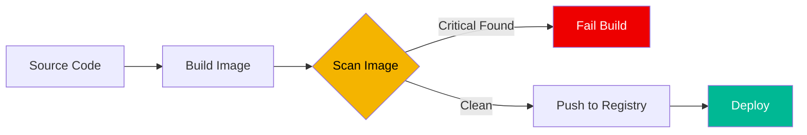

# 🐳 Container Security Basics (Beginner)

> **"Your container is only as safe as its base image."**

## 📚 Overview

Container security involves protecting the containerized applications from the build phase to the runtime phase. In this beginner module, we focus on the **Supply Chain**—ensuring the images we use are free from known vulnerabilities.

## Core Concept: Shared Kernel Risk
**[REFERENCE: Container Runtime Security](reference/container-runtime-ref.md)**

A Container is **NOT** a VM.
- **Shared Kernel**: All containers on a host share the same Linux Kernel. If you crash the kernel, you crash everyone.
- **Escape Risk**: If an attacker gets `root` inside a container, and that container is privileged, they own the host.
- **Mitigation**: `USER 1000` (Non-Root) is not just a suggestion; it's a mandatory requirement.

> See **[Container-Runtime-Ref.md](reference/container-runtime-ref.md)** for how Namespaces and Cgroups actually isolate processes.

## 🎯 Learning Objectives

- ✅ Understand the anatomy of a Docker image.
- ✅ Identify common container security risks (Root users, Bloatware).
- ✅ Perform basic vulnerability scans on local images.
- ✅ Learn the importance of "Small & Secure" base images (Alpine, Distroless).

---

## 🗺️ Curriculum Structure

| Part | Topic | Description |
| :--- | :--- | :--- |
| **[🟢 Part 1](./part-01-vulnerability-detection/)** | **Scanning** | CVEs and image scanning. |
| **[🟡 Part 2](./part-02-configuration-security/)** | **Audit** | Dockerfile security and anti-patterns. |

---

## 🏗️ Visual: Container Vulnerability Pipeline

## 📋 Professional Pattern: Principle of Least Privilege

Always specify a non-root user in your `Dockerfile`. Running as root inside a container makes it trivial for an attacker to escalate privileges to the host system if the container is compromised.

---

**Next Step**: Start with **[Part 1: Vulnerability Detection](./part-01-vulnerability-detection/readme.md)** 🚀
