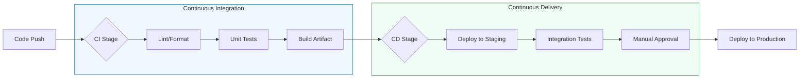

# 🏗️ Introduction to CI/CD: The Software Factory

> **"Development is the act of creation. CI/CD is the act of replication and delivery. In a modern enterprise, if it isn't in a pipeline, it doesn't exist."**

---

## 🧠 The Mental Model: The Automated Kitchen

**The Junior Struggle**: "I'll just manually copy the files to the server. It only takes a minute!"
**The Engineer Solution**: Use an **Automated Assembly Line**.

Think of CI/CD as an **High-End Pizza Shop**:
1.  **Continuous Integration (CI)**: As soon as a chef (Developer) writes down a recipe (Code), it is checked for errors (Linting/Unit Tests). The ingredients are prepped and the oven is pre-heated (Build process).
2.  **Continuous Delivery (CD)**: The pizza is baked, boxed, and placed on the counter, ready for the delivery driver (Staging/Manual Approval).
3.  **Continuous Deployment**: The delivery driver (Automation) immediately grabs the box and speeds it to the customer (Production).

---

## 🆚 Junior Way vs. Engineer Way

| Feature | The Junior Way (Problematic) | The Engineer Way (Production-ready) |
|:---|:---|:---|
| **deployment** | Drag-and-drop / manual `scp` | Automated pipeline push |
| **Testing** | "It works on my machine" | Mandatory automated test suites |
| **Rollbacks** | Panicked manual overwriting | Re-running a previous pipeline |
| **Environment** | Different config for every dev | Immutable Docker containers |
| **Speed** | Deployment takes hours | Deployment takes minutes |
| **Consistency**| Prone to "Human Error" | Predictable, repeatable results |

---

### 🎨 Visual: The CI/CD Lifecycle

---

## 🚦 Core Concepts

### 1. Continuous Integration (CI)
The practice of merging developer code into a shared repository several times a day. Each merge triggers an automated build and test sequence.
*   **Goal**: Detect bugs early and ensure the "main" branch is always buildable.

### 2. Continuous Delivery (CD)
Extends CI by automatically deploying all code changes to a testing or staging environment after the build stage.
*   **Goal**: Ensure that code is *always ready* for release at any time.

### 3. Continuous Deployment
The final evolution. Every change that passes all stages of your production pipeline is released to your customers automatically.
*   **Goal**: Zero-manual intervention from code push to production.

---

## ⚖️ Tool Comparison: Jenkins vs. The World

| Feature | Jenkins | GitHub Actions | GitLab CI |
| :--- | :--- | :--- | :--- |
| **Philosophy** | The "Swiss Army Knife" | The "Cloud-Native Integrator" | The "One Platform" Strategy |
| **Logic** | Groovy Pipelines (Jenkinsfile) | YAML Workflows | YAML Pipelines |
| **Extensibility** | 1800+ Plugins (Mature) | Marketplace Actions (Modern) | Integrated Built-ins |
| **Hosting** | Self-Managed (Your Control) | SaaS (Zero Maintenance) | SaaS or Self-Managed |
| **Best For** | On-prem / High Customization | Fast starts / GitHub users | Complete DevOps Lifecycle |

---

## 🏆 Real-World DevOps Story: The Friday Afternoon Fix

**The Scenario**: It's 4:45 PM on a Friday. A critical checkout bug is found in production.

**The Junior Way**: Manual fix! The developer rushes, compiles the wrong branch, forgets to run database migrations, and crashes the entire site for the weekend.

**The Engineer Way**: The developer pushes a fix. The pipeline:
1.  **Runs 1,000 tests** in 3 minutes.
2.  **Builds an Immutable Artifact** (Docker Image).
3.  **Deploys to Staging** for a quick manual sanity check.
4.  **Promotes to Production** with a single click.
The site is fixed by 4:55 PM. The team goes home on time.

---

## 🎤 Interview Preparation

### 🎯 Core Concepts
1. **Q: What is the main difference between Continuous Delivery and Continuous Deployment?**
   - *A: In Continuous Delivery, there is a manual approval/decision step before pushing to production. Continuous Deployment is fully automated—if tests pass, it goes live.*

2. **Q: Why is CI important in a team environment?**
   - *A: It prevents "Integration Hell." Frequent merges and automated tests ensure that the "main" branch is always stable and functional.*

3. **Q: What is a "Build Artifact"?**
   - *A: A versioned, deployable package (e.g., jar, war, Docker image) that represents the result of the build stage and is transported across the pipeline.*

### 🚀 Advanced Questions
4. **Q: What is a "Pipeline as Code"?**
   - *A: Storing your pipeline definition (e.g., Jenkinsfile or YAML) in version control alongside your application code. This ensures the pipeline is versioned, auditable, and reproducible.*

5. **Q: Explain the "Fail-Fast" principle in pipelines.**
   - *A: Configuring a pipeline to run the quickest, most likely-to-fail tests (linting, unit tests) first. If these fail, the pipeline stops immediately, providing fast feedback and saving compute resources.*

---

## 📝 Knowledge Check

### 🧠 Beginner Level
1. **Which practice focuses on frequently merging code to a shared repository?**
   - [ ] a) Continuous Deployment
   - [x] b) Continuous Integration
   - [ ] c) Continuous Delivery

2. **True/False: A pipeline should stop if a security scan finds a critical vulnerability.**
   - [x] **True**. Pipelines are quality gates.

### 🚀 Intermediate Level
3. **What is a DAG (Directed Acyclic Graph) in the context of CI/CD?**
   - [x] A model that allows jobs to run in parallel based on their dependencies, optimizing speed.

4. **Why is artifact immutability important?**
   - [x] To guarantee that the exact same code that passed tests in staging is what is deployed to production.

---

## 🎯 Next Steps
*   **[Jenkins Architecture](../02-jenkins-architecture/readme.md)**: Deep dive into how Jenkins scale-out workflows function.
