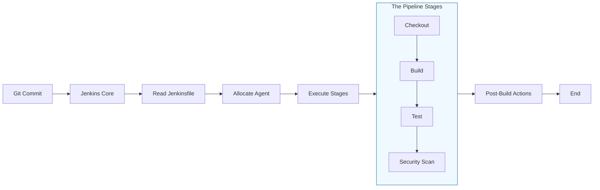

# 🏗️ Pipelines as Code: The Blueprint of Delivery

> **"If your pipeline is created in a GUI, it's a secret. If it's written in code, it's a standard. In DevOps, we version control our infrastructure just as we version our features."**

---

## 🧠 The Mental Model: The Blueprint of Delivery

**The Junior Struggle**: Creating 10 different "Freestyle" jobs by clicking around the UI. When the server migrates, they have to manually recreate every single job, plugin, and configuration by hand.

**The Engineer Solution**: Use a **Jenkinsfile**.

Think of a Jenkins Pipeline like a **Smart Home Blueprint**:
1.  **The Blueprint (`Jenkinsfile`)**: Instead of manually telling a contractor "put the sink here, then the light there," you provide a master plan.
2.  **The Execution (The Agents)**: The plan is generic; it can be built in any lot (Agent).
3.  **The Stages (Construction Phases)**: First you pour the foundation (Checkout), then you frame the walls (Build), then you install the plumbing (Test), and finally you paint (Deploy).

---

### 🎨 Visual: The Pipeline Lifecycle



---

## 🆚 Junior Way vs. Engineer Way

| Feature | The Junior Way (Problematic) | The Engineer Way (Production-ready) |
|:---|:---|:---|
| **Creation** | Manually clicking in the GUI | Writing a `Jenkinsfile` in Groovy |
| **Logic** | One long script without steps | Modular **Stages** and **Steps** |
| **Recovery** | Hard to restore deleted jobs | Jobs are recreated automatically from Git |
| **Scaling** | Copy-pasting job configurations | Using **Shared Libraries** for reuse |
| **Complexity** | Linear only (Step 1 -> Step 2) | Parallel stages and logic gates |
| **Environment** | Hardcoded paths and keys | Environment blocks and Secret injection |

---

## 🏗️ The Anatomy of a Jenkinsfile (Declarative)

A Declarative Pipeline is the industry standard. It is wrapped in a `pipeline {}` block and follows a strict hierarchy for readability.

```groovy
pipeline {
    agent any // WHERE: Specifies which machine runs the job

    environment { // WHAT: Defines variables available to all stages
        APP_NAME = "web-portal"
    }

    stages { // THE PROCESS: The container for all build phases
        stage('Build') {
            steps { // THE TASKS: The actual shell commands
                echo "Compiling ${APP_NAME}..."
                sh 'npm install'
            }
        }
        stage('Test') {
            steps {
                sh 'npm test'
            }
        }
    }

    post { // THE CLEANUP: Actions based on result (Success/Failure)
        always {
            archiveArtifacts artifacts: 'dist/*.zip'
        }
        failure {
            echo "Building ${APP_NAME} FAILED. Alerting team..."
        }
    }
}
```

---

## 🎤 Interview Preparation

### 🎯 Core Concepts
1. **Q: What is a Jenkinsfile and where should it be stored?**
   - *A: It is a text file containing the Pipeline-as-Code definition. It should be stored in the root of the source code repository (e.g., GitHub) to ensure the pipeline version matches the code version.*

2. **Q: Explain the difference between 'Declarative' and 'Scripted' Pipelines.**
   - *A: **Declarative** uses a rigid, opinionated structure (`pipeline {}`) that is easier to read and allows for UI integrations like Blue Ocean. **Scripted** is pure Groovy code, offering total flexibility at the cost of high complexity.*

3. **Q: What is the purpose of the 'post' section?**
   - *A: It allows you to run logic after the stages finish, regardless of the outcome. We use `always` for workspace cleanup, `success` for deployment triggers, and `failure` for Slack/Email notifications.*

### 🚀 Advanced Questions
4. **Q: How do you run two stages at the same time in a Jenkinsfile?**
   - *A: By using the **`parallel`** block inside a stage. This is critical for running tests across different operating systems or browser suites simultaneously to save time.*

5. **Q: What are Jenkins Shared Libraries?**
   - *A: It is a way to store common Groovy logic (like Slack notification templates or Docker build patterns) in a separate repo. Pipelines can then "import" this logic, preventing code duplication across 100+ different Jenkinsfiles.*

---

## 📝 Knowledge Check

1. **Which directive defines where a build will execute?**
   - [ ] a) environment
   - [ ] b) stages
   - [x] c) agent

2. **True/False: You should store your production API keys directly in the Jenkinsfile.**
   - [ ] True
   - [x] **False**. Use Jenkins Credentials and inject them into the `environment` block.

3. **What happens if a step inside a 'stage' fails?**
   - [x] The current stage stops, the entire pipeline is marked as 'FAILED', and the 'post { failure }' block runs.

---

## 🎯 Next Steps
*   **[CHALLENGES](./challenges.md)**: Build your first multi-stage pipeline.
*   **[CI/CD Integrations](../05-integrations-and-plugins/readme.md)**: Learning how to connect Jenkins to Webhooks and Registry.
