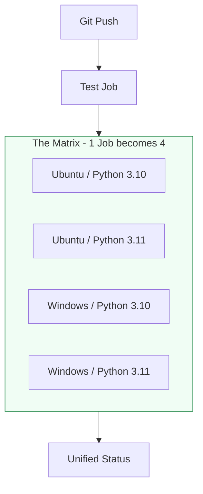

# 🏗️ GitHub Actions: The Built-in Robot

> **"If code is the engine, GitHub Actions is the autopilot. It doesn't live 'near' your code; it lives 'inside' your code, watching every commit and taking action instantly."**

---

## 🧠 The Mental Model: The Built-in Robot

**The Junior Struggle**: Using GitHub Actions like a simple cron job—running one long script every time they push. They don't use caching, so builds take 10 minutes, and they ignore environment security, hardcoding secrets in the YAML.

**The Engineer Solution**: Use **Event-Driven Orchestration**.

Think of GitHub Actions like a **Smart Security System** in your house:
1.  **The Sensors (Events/Triggers)**: The robot is watching. If someone opens the front door (`push`), it turns on the lights. If someone rings the bell (`pull_request`), it checks their ID (runs tests).
2.  **The Room (The Runner)**: The robot moves into a clean, empty room (Ubuntu/Windows/Mac) to do its work. Once finished, it burns the room down and starts fresh for the next job.
3.  **The Coordination (Jobs & Steps)**: The robot can do multiple things at once (cooking in the kitchen while cleaning the hallway) as long as they are distinct Jobs.

---

### 🎨 Visual: The Matrix Build Strategy

**Why it matters**: In the "Engineer Way," we don't assume our code works everywhere. We prove it works across OS versions simultaneously.

---

## 🆚 Junior Way vs. Engineer Way

| Feature | The Junior Way (Problematic) | The Engineer Way (Production-ready) |
|:---|:---|:---|
| **Build Speed** | Re-installs every library (Slow) | Uses **Caching** (`actions/cache`) |
| **Logic** | One monster workflow file | Clean, **Reusable Workflows** |
| **Secrets** | Hardcoded or `.env` files | **GitHub Secrets** + **Environment Secrets** |
| **Security**| Long-lived AWS Keys | **OIDC (OpenID Connect)** - Secretless! |
| **Scaling** | Runs everything on `ubuntu-latest` | Uses **Self-hosted Runners** for internal VPNs |
| **Governance**| Pushes directly to Prod | **Protection Rules** (Manual Approvals) |

---

## 🛡️ The "Secretless" Strategy: OIDC (OpenID Connect)

The gold standard for cloud security. Instead of saving a "Key" that can be stolen, GitHub Actions talks to AWS/Azure and proves its identity.

1.  **Identity Provider**: GitHub acts as the ID card issuer.
2.  **The Handshake**: AWS trusts GitHub. When the job starts, GitHub sends a temporary claim.
3.  **The Result**: No keys are stored in GitHub. Even if the repo is hacked, there are no permanent credentials to steal!

---

## 🎤 Interview Preparation

### 🎯 Core Concepts
1. **Q: What is the benefit of GitHub Actions being 'Integrated'?**
   - *A: It eliminates the overhead of managing a separate CI server (like Jenkins). It has native access to PR comments, labels, and environment-based protection rules directly in the same UI where developers work.*

2. **Q: Explain the difference between 'on: push' and 'on: pull_request'.**
   - *A: `push` triggers whenever code hits a branch. `pull_request` triggers only when a PR is opened or updated, often used for "Preview" deployments or linting before merging to the main branch.*

3. **Q: How does the 'needs' keyword change the order of execution?**
   - *A: By default, all Jobs in a workflow run in parallel. The `needs` keyword creates a dependency chain (e.g., Job B needs Job A), effectively turning parallel execution into a sequential pipeline.*

### 🚀 Advanced Questions
4. **Q: What are Composite Actions vs Reusable Workflows?**
   - *A: **Composite Actions** are groups of steps bundled together as a single Action. **Reusable Workflows** are entire workflow files that can be "called" by other repos, allowing for standardized YAML patterns across an organization.*

5. **Q: How do you optimize a pipeline that takes 20 minutes to download dependencies?**
   - *A: Implement the `actions/setup-[language]` caching feature (e.g., `cache: 'pip'` or `cache: 'npm'`). This persists the package folders between runs, typically reducing build time to under 3 minutes.*

---

## 📝 Knowledge Check

1. **Where are GitHub Action workflow files stored?**
   - [ ] a) Root directory
   - [x] b) `.github/workflows/`
   - [ ] c) `config/automation/`

2. **True/False: GitHub Actions gives you free compute (runners) for public repositories.**
   - [x] **True**. One of the main reasons it's popular for Open Source.

3. **What protects a production deployment from being triggered by an unreviewed commit?**
   - [x] GitHub Environments with **Required Reviewers**.

---

## 🎯 Next Steps
*   **[CHALLENGES](./challenges.md)**: Practice caching and matrix builds.
*   **[GitLab CI Basics](readme.md)**: Learning the enterprise powerhouse alternative.
