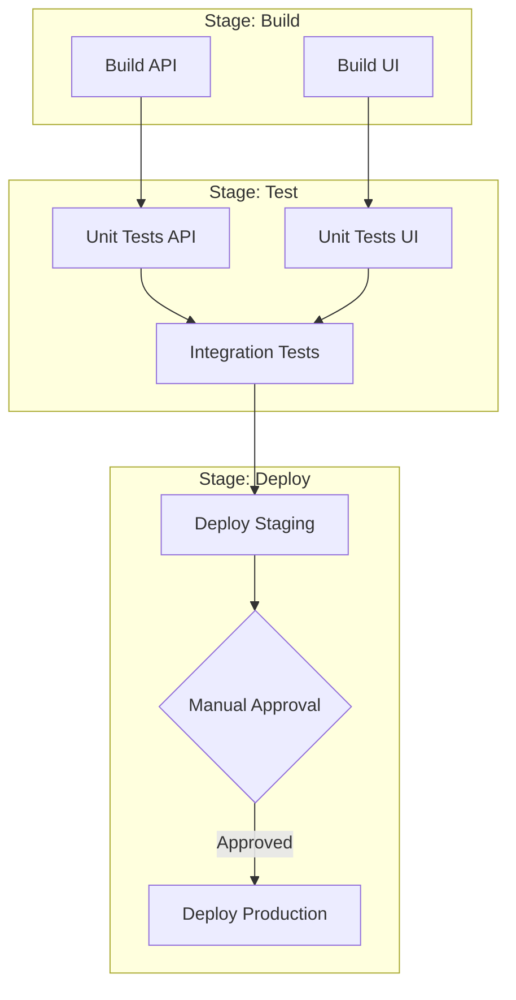

# Pipeline Orchestration Patterns Reference

**Doc Version:** 1.0.0
**Role:** Principal DevOps Architect
**Scope:** Advanced Pipeline Design & DAG Execution

---

## 1. The Directed Acyclic Graph (DAG)

Modern CI/CD systems execute pipelines as **DAGs**, not linear sequences.

### Graph Properties
- **Directed**: Jobs flow in one direction (Build → Test → Deploy).
- **Acyclic**: No circular dependencies (Job A cannot depend on Job B if Job B depends on Job A).
- **Parallelization**: Jobs with no dependencies run concurrently.

### Execution Engine
The orchestrator performs **topological sorting** to determine execution order:
1. Identify all jobs with zero dependencies (Entry points).
2. Execute them in parallel.
3. Mark completed jobs and unlock dependent jobs.
4. Repeat until all jobs complete or a failure occurs.

---

## 2. Fan-Out / Fan-In Pattern

**Fan-Out**: A single job triggers multiple parallel jobs.
**Fan-In**: Multiple jobs converge into a single downstream job.

### Use Case: Matrix Testing
```yaml
strategy:
  matrix:
    os: [ubuntu, windows, macos]
    python: [3.8, 3.9, 3.10, 3.11]
```
This creates **12 parallel jobs** (3 OS × 4 Python versions).

**Fan-In**: A final "Report" job waits for all 12 to complete before aggregating results.

---

## 3. Pipeline Stages vs. Jobs vs. Steps

Understanding the hierarchy prevents architectural mistakes:

| Level | Scope | Parallelism | Filesystem |
|:---|:---|:---|:---|
| **Pipeline** | Entire workflow | N/A | N/A |
| **Stage** | Logical grouping (Build, Test, Deploy) | Stages run sequentially | N/A |
| **Job** | Runs on a single agent | Jobs within a stage run in parallel | Isolated (each job gets fresh workspace) |
| **Step** | Individual command | Steps run sequentially | Shared within job |

**Critical Rule**: Jobs do NOT share filesystems. To pass artifacts between jobs, you MUST use explicit artifact upload/download mechanisms.

---

## 4. Conditional Execution Patterns

### A. Branch-Based Triggers
```yaml
on:
  push:
    branches: [main, release/*]
  pull_request:
    branches: [main]
```

### B. Path-Based Triggers (Monorepo)
Only run CI if specific directories change:
```yaml
on:
  push:
    paths:
      - 'services/api/**'
      - 'shared/lib/**'
```

### C. Manual Gates (Production)
```yaml
jobs:
  deploy-prod:
    environment: production  # Requires manual approval
```

---

## 5. Artifact Lifecycle Management

### The Immutability Principle
**Build Once, Deploy Many** requires strict artifact versioning:

1. **Build Stage**: Create `app-${GIT_SHA}.jar`
2. **Upload**: Push to Artifactory with immutable tag
3. **Deploy Dev**: Download `app-${GIT_SHA}.jar`
4. **Deploy Prod**: Download **same** `app-${GIT_SHA}.jar`

**Anti-Pattern**: Rebuilding code for each environment. This introduces non-determinism (different compiler versions, dependency updates).

---

## 6. Visualizing Complex Pipelines



> **Enterprise Note**: The "Manual Approval" gate is implemented as a **Protected Environment** in GitHub Actions or an **Input Step** in Jenkins. This creates an audit trail of who approved production deployments.
