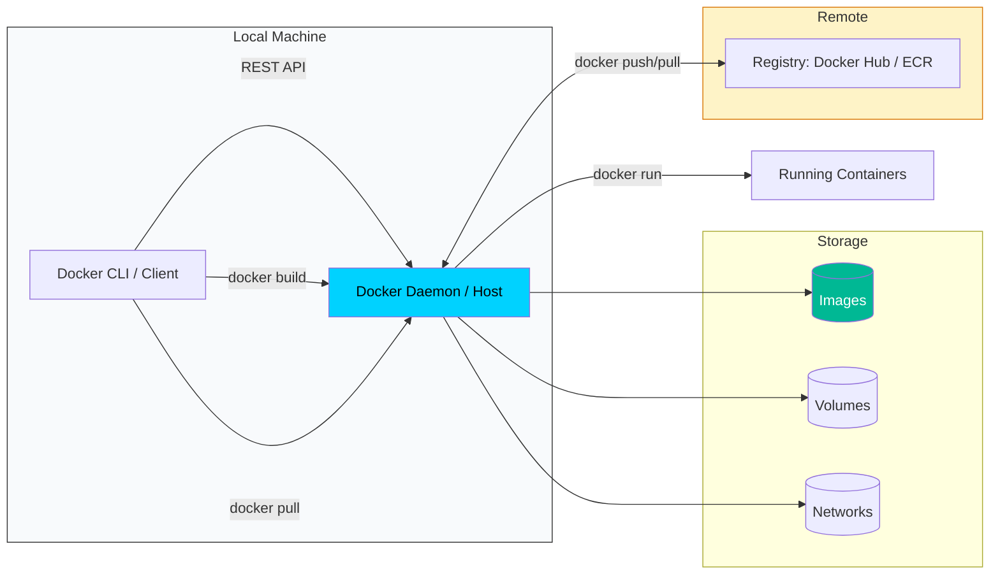

# 🐳 Docker Operations & Mastery Reference
> **Architecture-Grounded Guide for Transitioning from Single Containers to Orchestrated Fleets.**

This reference guide centralizes high-density Docker CLI commands, focusing on operational efficiency, image optimization, and preparing for Kubernetes-scale orchestration.

---

## 🏗️ Docker Architecture & Logic
Before running commands, it's vital to understand the interaction between the **Client**, the **Daemon (Host)**, and the **Registry**.



---

## ⚡ 1. Image Optimization
*Focus: Keeping production images lean, secure, and automated.*

| Category | Command | Use Case |
| :--- | :--- | :--- |
| **Pruning** | `docker image prune -a` | Remove ALL unused images (not just dangling ones). |
| **Multi-Stage** | `docker build --target builder -t app:dev .` | Stop at a specific stage (e.g., compile phase) for debugging. |
| **Analysis** | `docker history <image_id>` | View the size and command of each layer to find bloat. |
| **Export** | `docker save -o app.tar app:latest` | Save image to a tarball for air-gapped environment transfers. |
| **Cleanup** | `docker system prune --volumes` | Deep cleanup: removes stopped containers, unused networks, AND volumes. |

---

## 🕸️ 2. Orchestration Prep (Networking & Compose)
*Focus: Simulating multi-tier environments and inter-container connectivity.*

| Category | Command | Use Case |
| :--- | :--- | :--- |
| **Network Create** | `docker network create --driver bridge app-net` | Create a private network to isolate microservices. |
| **Compose Up** | `docker-compose up -d --build` | Force a rebuild and start stack in detached mode. |
| **Compose Down** | `docker-compose down -v` | Stop services and **delete** the ephemeral volumes/networks. |
| **Manual Connect**| `docker network connect app-net container_b` | Dynamically attach a running container to a new network. |
| **Compose Logs** | `docker-compose logs -f --tail=100` | Follow logs of the entire stack with a 100-line buffer. |

---

## 💾 3. Persistence & State
*Focus: Managing persistent data for databases and stateful microservices.*

| Category | Command | Use Case |
| :--- | :--- | :--- |
| **Volume Inspect** | `docker volume inspect <vol_name>` | Find the actual path on the Linux host (`Mountpoint`) where data lives. |
| **Bind Mount** | `docker run -v $(pwd)/config:/etc/app/config ...` | Sync local config files into a container for real-time updates. |
| **Anonymous Vol** | `docker volume ls -f dangling=true` | List volumes not attached to any container (candidate for deletion). |
| **Backup** | `docker run --rm -v vol_data:/src -v $(pwd):/backup alpine tar czf /backup/data.tar.gz /src` | One-liner to backup a volume to a local tarball. |

---

## 🔍 4. Debugging & Internals
*Focus: Deep-diving into container state and resource consumption.*

| Category | Command | Use Case |
| :--- | :--- | :--- |
| **Live Shell** | `docker exec -it <container> /bin/sh` | Enter a running container (use `sh` if `bash` isn't available). |
| **Resource Stats**| `docker stats --no-stream` | Get a snapshot of CPU, Memory, and Network I/O for all containers. |
| **JSON Inspect** | `docker inspect --format='{{.NetworkSettings.IPAddress}}' <id>` | Extract specific data (like IP) without scrolling through 200 lines of JSON. |
| **Events** | `docker events --since 5m` | See real-time events (create, die, oom) from the Docker daemon. |
| **Process Tree** | `docker top <container_name>` | List the processes running inside the container as seen by the host. |

---

## 🎓 Pro-Tip: The "Atomic" Cleanup
When a project fails or you want to start fresh, use the **Nuclear Option**:
```bash
# Deletes EVERYTHING: containers, images, volumes, and networks
docker system prune -a --volumes -f
```

---
*Created for the Devops Curriculum - Phase 3: Container Orchestration*
