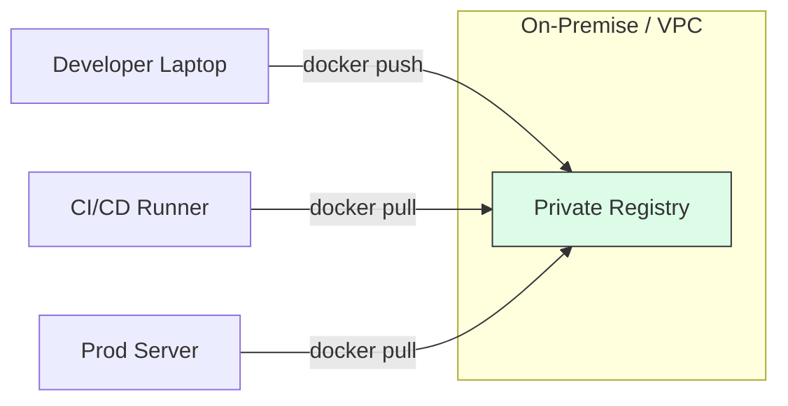

# 🏪 Module 09: Private Docker Registries

> **"If Docker Hub is the global supermarket, a Private Registry is your personal pantry. It’s faster, more secure, and works even when the internet is down."**



## 📚 Overview

While Docker Hub is great, professional organizations often host their own **Private Registry**. This allows them to store proprietary source code securely, speed up deployments (since data stays on the local network), and avoid Docker Hub's "Rate Limiting" issues. In this module, you will learn how to run your own registry server inside a container.

## 🎓 Learning Objectives

By the end of this module, you will:
- ✅ Launch a local **Docker Registry** using the official `registry:2` image.
- ✅ Master the **Prefix Tagging** logic (`registry_url/image_name`).
- ✅ Configure **`daemon.json`** to allow "Insecure" local registries.
- ✅ Setup **Persistence** so your stored images aren't lost on restart.
- ✅ Secure a production registry with **Basic Auth** and **SSL/TLS**.

---

## 🛠️ Launching Your Pantry

To start a simple registry for local development:
```bash
docker run -d \
  -p 5000:5000 \
  --name local-registry \
  --restart always \
  -v registry-data:/var/lib/registry \
  registry:2
```

---

## 🚀 The Three-Step Push Pattern

To move an image from your laptop to your private registry, you must follow this exact ritual:

1.  **Build/Pull**: Get an image (e.g., `nginx`).
2.  **Re-Tag**: Crucially, you must rename it with your registry's URL.
    ```bash
    docker tag nginx:latest localhost:5000/my-company-nginx
    ```
3.  **Push**: Upload the cargo.
    ```bash
    docker push localhost:5000/my-company-nginx
    ```

---

## 🏆 Real-World DevOps Story: The Bandwidth Bill

**The Scenario**: A company had 100 servers in a local data center. Every time they deployed an update, all 100 servers pulled a 500MB image from Docker Hub.
**The Crisis**: They were paying thousands of dollars in "Egress Fees" to the cloud provider, and the office internet became unusable during every deployment.
**The Fix**: A DevOps Engineer installed a **Private Registry** inside the local data center. They configured it as a "Pull-Through Cache."
**The Discovery**: Now, only one server pulls the image from the cloud; the other 99 pull it from the local registry at gigabit speeds with **zero** bandwidth cost.
**The Lesson**: **Data sovereignty and speed are competitive advantages.** Don't rely on the public internet for production traffic.

---

## 🚀 Professional Pattern: The `daemon.json` Trick

Docker is secure by default—it refuses to talk to a registry that doesn't have an SSL certificate. In a local lab environment, this can be annoying.

**The Pro Shortcut**:
Edit your `/etc/docker/daemon.json` (Linux) or Docker Desktop Settings (Windows/Mac) to add:
```json
{
  "insecure-registries" : ["myregistry.local:5000"]
}
```
*Restart Docker, and it will now allow unencrypted pushes to that specific address.*

---

## ❓ Interview Preparation (Private Registry)

1. **Q: How does Docker know which registry to push to when you run 'docker push'?**
   *A: It looks at the first part of the image tag. If you run `docker push my-app`, it assumes Docker Hub. If you run `docker push 192.168.1.100:5000/my-app`, it immediately knows to target the private registry at that IP.*

2. **Q: What is a 'Pull-Through Cache' registry?**
   *A: It's a configuration where your private registry acts as a middleman. If an image is requested, the registry checks its local storage first. If it's missing, it pulls it from Docker Hub, saves a copy, and serves it to you.*

3. **Q: Why should you mount a volume to `/var/lib/registry`?**
   *A: By default, images pushed to a registry container are stored in its writable layer. If the container is destroyed, all your uploaded images vanish. A volume ensures the images persist across container updates.*

4. **Q: How do you secure a private registry?**
   *A: Use 'htpasswd' for Basic Authentication and provide SSL certificates (via environment variables or a reverse proxy like Nginx) to enable HTTPS communication.*

5. **Q: What is the 'Garbage Collection' in the context of a Docker registry?**
   *A: Over time, old image versions take up a lot of space. Garbage collection is a process (run via `registry garbage-collect`) that scans for "orphaned" layers that are no longer referenced by any tags and deletes them.*

---

## 📝 Knowledge Check

1. **What is the default port for the official Docker Registry image?**
   - [ ] a) 80
   - [ ] b) 8080
   - [x] c) 5000

2. **To push `webapp:v1` to a registry at `10.0.0.5`, you must first tag it as...**
   - [x] a) `10.0.0.5:5000/webapp:v1`
   - [ ] b) `webapp:v1/10.0.0.5`
   - [ ] c) `registry/webapp:v1`

3. **Which image is used to run a self-hosted Docker registry?**
   - [ ] a) `docker/hub`
   - [x] b) `registry:2`
   - [ ] c) `image-server:latest`

4. **True or False: By default, Docker requires HTTPS for all registry communication.**
   - [x] True
   - [ ] False

5. **Where are images stored inside the registry container?**
   - [ ] a) `/etc/registry`
   - [x] b) `/var/lib/registry`
   - [ ] c) `/home/registry`

---

## 🔗 Next Steps

The warehouse is secure. Now let's learn how to pack our bags for a long move.

Proceed to: **[Module 05: Backup & Restore](../05-backup-restore-migration/readme.md)** →
