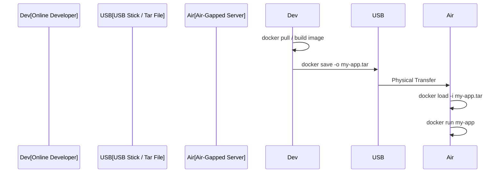

# 💾 Module 10: Backup, Restore & Migration

> **"A registry is a luxury. A .tar file is a necessity. For the times when the internet vanishes, your archive is the only thing standing between you and a total system failure."**



## 📚 Overview

In an ideal world, we always have a registry. In the real world, we deal with **Air-Gapped Systems** (classified environments or remote sites with no internet), database corruption, and "Emergency Surgery" on running containers. This module teaches you how to turn your active containers and images into portable files that can travel on a USB stick or a secure backup drive.

## 🎓 Learning Objectives

By the end of this module, you will:
- ✅ Capture the state of a live container using **`docker commit`**.
- ✅ Export high-fidelity images into **`.tar` archives**.
- ✅ Master the **Air-Gapped Workflow** for remote deployments.
- ✅ Differentiate between **`save`** (High Fidelity) and **`export`** (Flattened).
- ✅ Implement a manual backup strategy for local container states.

---

## 🏗️ Capturing the Moment

### 1. The Emergency Snapshot (`commit`)
Imagine you spent 2 hours debugging a server and finally fixed it by changing one config file. You don't want to lose that work if the container crashes.
```bash
docker commit -m "Emergency bugfix for nginx config" my-running-server my-bugfix-image:v1
```
*Tip: Always update your Dockerfile later! Commits are not a substitute for proper automation.*

### 2. The Portable Archive (`save`)
To move an image to a machine without a registry:
```bash
# Export to file
docker save -o my-backup.tar my-image:latest
# Import from file
docker load -i my-backup.tar
```

---

## 🧩 Save vs. Export: The "High Fidelity" Choice

| Feature | `docker save` | `docker export` |
| :--- | :--- | :--- |
| **Input** | Takes an **Image**. | Takes a **Running Container**. |
| **History** | Preserves all layers and history. | **Flattens** everything into 1 layer. |
| **Metadata** | Keeps ENV variables, labels, etc. | Loses image metadata. |
| **Best For** | Backing up your finished work. | Shrinking a bloated image for a quick look. |

---

## 🏆 Real-World DevOps Story: The Deep Sea Server

**The Scenario**: An oil rig in the middle of the Atlantic Ocean needed a critical security patch for its monitoring dashboard. There was no satellite internet, only a weekly supply helicopter.
**The Crisis**: The original developer had only pushed the code to a private GitHub repo on land.
**The Fix**: A DevOps Engineer on land pulled the new image, ran `docker save -o patch.tar`, and put it on a physical USB drive. The drive flew to the rig on the helicopter.
**The Discovery**: Once the rig's technician ran `docker load -i patch.tar`, the dashboard was updated in 30 seconds.
**The Lesson**: **Offline portability is a critical DevOps skill.** Never design a system that *requires* an internet connection to be updated.

---

## 🚀 Professional Pattern: Versioned Snapshots

When doing manual snapshots, never use the `latest` tag. Always include a date or a reason.
```bash
# Good
docker commit -m "pre-migration-checkpoint" prod-app prod-app:backup-2023-10-12
```
This allows you to roll back to a specific "Point in Time" if your migration fails.

---

## ❓ Interview Preparation (Migration & Backup)

1. **Q: Why is 'docker commit' generally considered an anti-pattern?**
   *A: It breaks the principle of 'Reproducibility'. Manual changes captured via commit are not documented in the Dockerfile, making it impossible for other developers or a CI/CD pipeline to recreate the exact same image from scratch.*

2. **Q: You have a 2GB image that you need to move to a remote site. Should you use 'save' or 'export'?**
   *A: If you only need the final files and don't care about the history or metadata, 'export' might result in a slightly smaller, flattened file. However, 'save' is safer as it includes everything needed to run the container exactly as it was.*

3. **Q: How can you check what's inside a '.tar' file produced by `docker save`?**
   *A: You can use standard linux tools like `tar -tf my-image.tar`. Inside, you will see several folders (one for each layer) and a `manifest.json` file that describes the image structure.*

4. **Q: What is the main difference between an image backup and a volume backup?**
   *A: An image backup (`save`) stores the application code and environment. A volume backup (manually copying `/var/lib/docker/volumes`) stores the customer data, database logs, and user uploads. You need both for a full disaster recovery.*

5. **Q: Can you load a Linux-based '.tar' image onto a Windows host?**
   *A: Yes, as long as the Windows host is running Docker with the same backend (e.g., WSL 2) and supports the container's architecture (usually x86_64).*

---

## 📝 Knowledge Check

1. **Which command creates a new image from a running container's changes?**
   - [ ] a) `docker save`
   - [x] b) `docker commit`
   - [ ] c) `docker snapshot`

2. **Which command prepares an image for transfer to an air-gapped system?**
   - [x] a) `docker save`
   - [ ] b) `docker push`
   - [ ] c) `docker cp`

3. **What happens to the 'metadata' (labels, env vars) when you use `docker export`?**
   - [ ] a) They are encrypted
   - [ ] b) They are preserved
   - [x] c) They are lost (the image is 'flattened')

4. **True or False: `docker load` can import multiple images from a single `.tar` archive.**
   - [x] True
   - [ ] False

5. **Which command is used to bring an archived `.tar` file back into the Docker engine?**
   - [ ] a) `docker import` (used for exports)
   - [x] b) `docker load` (used for saves)
   - [ ] c) `docker pull`

---

## 🔗 Next Steps

The archives are safe. Now let's learn how to put a professional "Face" on our applications using the world's most popular web server.

Proceed to: **[Module 06: Nginx & SSL](../06-nginx-ssl/readme.md)** →
