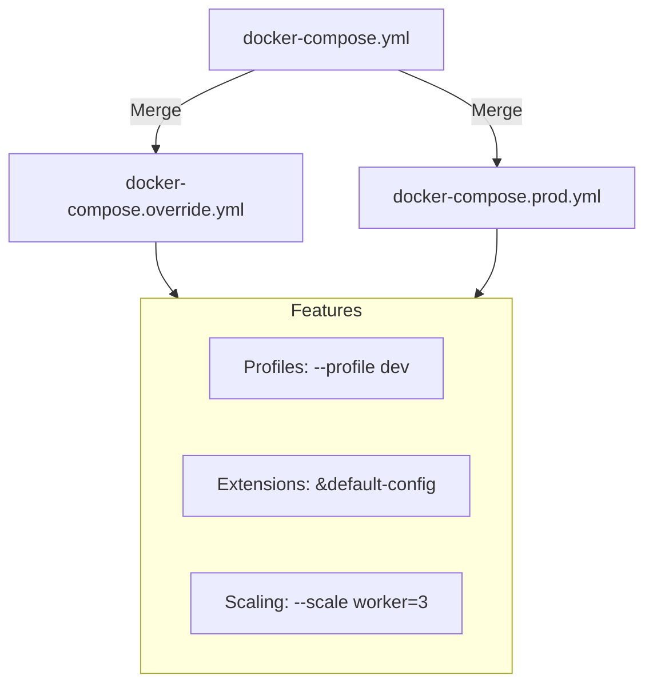

# 🛠️ Module 17: Advanced Compose Features

> **"Code reuse is the hallmark of a senior engineer. Don't copy-paste your YAML; extend it, profile it, and make it work for every environment."**



## 📚 Overview

As your application grows, a single `docker-compose.yml` becomes a nightmare of repeated configuration. **Advanced Docker Compose** features allow you to write "DRY" (Don't Repeat Yourself) YAML. You can create different profiles for different developer roles, extend services using fragments, and manage multi-environment deployments without maintaining five identical files.

## 🎓 Learning Objectives

By the end of this module, you will:

- ✅ Master **Service Extension** (`extends` and YAML anchors).
- ✅ Use **Profiles** to selectively start services (e.g., `frontend-only`).
- ✅ Implement **Multi-File Overrides** for Dev vs. Production.
- ✅ Understand **YAML Anchors and Aliases** for clean configuration.
- ✅ Use **Docker Compose Watch** for seamless code synchronization.

---

## 🏗️ DRY YAML: Anchors and Extensions

Stop copy-pasting your environment variables. Use **Anchors (`&`)** and **Aliases (`*`)**.

```yaml
x-logging: &default-logging
  options:
    max-size: '1M'
    max-file: '2'

services:
  web:
    image: nginx
    logging: *default-logging
  
  api:
    image: my-api
    logging: *default-logging
```

---

## 🚀 Profiles: The "Toggle" Switch

What if you have a massive stack but only want to run the database and the cache for background testing? Use **Profiles**.

```yaml
services:
  app:
    image: my-app
    profiles: ["frontend"] # Starts with --profile frontend
  
  db:
    image: postgres
    # No profile = Always starts
```
**Command**: `docker compose --profile frontend up`

---

## 🏆 Real-World DevOps Story: The YAML Wall of Shame

**The Scenario**: A company had a single `docker-compose.yml` that was **1,500 lines long**. It contained every service for Dev, Test, and CI. Developers had to manually comment out half the file just to run the app on their laptops.
**The Crisis**: Someone accidentally pushed a version with the production database connection string commented out, breaking the CI/CD pipeline for 5 hours.
**The Fix**: A Senior DevOps engineer split the file into `base.yml`, `dev.yml`, and `prod.yml`. They used **Extends** to share common settings.
**The Discovery**: The "Master" file shrank from 1,500 lines to 80 lines.
**The Lesson**: **Complexity is the enemy of reliability.** Use Compose features to keep your YAML modular and safe.

---

## 🚀 Professional Pattern: Multi-File Overrides

Docker Compose automatically looks for `docker-compose.override.yml`. Use it for your local "secrets" or dev-only configurations (like mounting source code).

**docker-compose.yml** (Safe for Git):
```yaml
services:
  api:
    image: my-app:latest
```

**docker-compose.override.yml** (In .gitignore):
```yaml
services:
  api:
    build: .
    volumes:
      - .:/app
```

---

## ❓ Interview Preparation (Advanced Compose)

1. **Q: What is the difference between YAML Anchors (&/ *) and the 'extends' keyword?**
   *A: YAML Anchors work at the file level to repeat blocks of text. The `extends` keyword allows you to inherit configuration from a service in a COMPLETELY DIFFERENT file, making it much more powerful for large systems.*

2. **Q: How do you start a Docker Compose project with two specific files?**
   *A: Use the `-f` flag: `docker compose -f base.yml -f pro.yml up -d`. Note that the order matters; the second file will override any conflicting values in the first one.*

3. **Q: Why use 'Profiles' instead of just creating two different files?**
   *A: Profiles allow you to keep everything in one file but provide a 'Toggle' for optional services (like monitoring tools, debuggers, or seed scripts) that might be needed intermittently by different teams.*

4. **Q: What is 'Docker Compose Watch'?**
   *A: It's a modern feature that watches your local filesystem and automatically updates the container when a file changes. It can either 'sync' the file into the running container or 'rebuild' the image if it perceives a critical change (like a new dependency).*

5. **Q: Can you use environment variables inside a Compose file?**
   *A: Yes, using the `${VAR_NAME}` syntax. Compose will pull these from your shell environment or a `.env` file in the same directory.*

---

## 📝 Knowledge Check

1. **Which character is used to create a YAML Anchor?**
   - [ ] a) `$`
   - [x] b) `&`
   - [ ] c) `*`

2. **Which Compose feature allows you to only start certain services for specific tasks?**
   - [ ] a) `groups`
   - [x] b) `profiles`
   - [ ] c) `targets`

3. **In multi-file Compose, which file takes priority for conflicting keys?**
   - [ ] a) The first file mentioned in the command
   - [x] b) The last file mentioned in the command
   - [ ] c) The largest file

4. **True or False: The `extends` keyword can refer to a service in another YAML file.**
   - [x] True
   - [ ] False

5. **Where does Docker Compose look for environment variables by default?**
   - [ ] a) `config.json`
   - [x] b) `.env`
   - [ ] c) `dockerfile`

---

## 🔗 Next Steps

The configuration is modular. Now let's learn how to manage the "Highway" of internal data and traffic.

Proceed to: **[Module 18: Advanced Networks & Volumes](../02-networks-volumes/readme.md)** →
