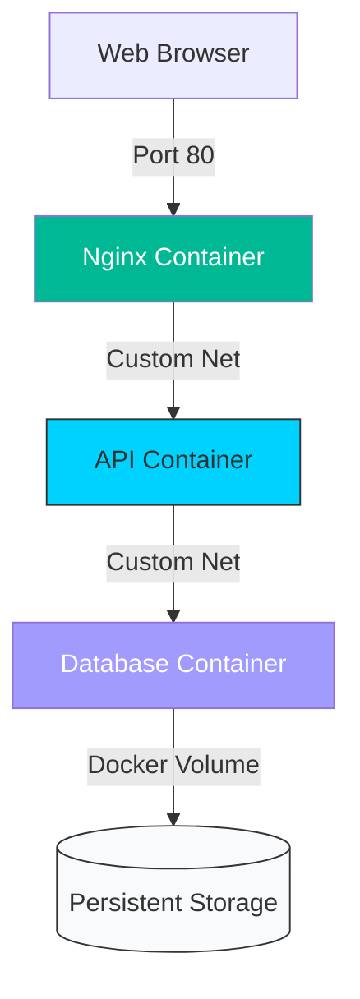

# 🟡 Part 2: Orchestration & Architecture

> **"One container is a process. Ten containers are a system. Organizing them is the art of Orchestration."**

## 📖 Overview

In this part, we move from running single containers to managing multi-container applications. We explore how containers talk to each other (**Networking**), how they store data (**Volumes**), and how to orchestrate them as a group using **Docker Compose**.

---

## 🏗️ The Multi-Container Stack

---

## 🎯 Learning Objectives

- ✅ **Networking**: Bridge, Host, and Overlay networks.
- ✅ **Storage**: Bind Mounds vs. Docker Volumes.
- ✅ **Orchestration**: Defining services in `docker-compose.yml`.
- ✅ **Efficiency**: Multi-stage builds for smaller images.

---

## 🗺️ Included Modules

1. **[01-Networking-and-Storage](./01-networking-and-storage/readme.md)**: Connecting containers and persisting data.
2. **[02-Docker-Compose](./02-docker-compose/readme.md)**: The "Infrastructure as Code" of local development.

---

## 💼 Career Impact: Scaling Up

Managing one container is a hobby; managing a **system** is a profession. This part provides the skills needed for "Middle-Tier" DevOps engineering.

- **Stack Control**: You can now deploy an entire Full Stack application (Frontend, Backend, DB, Proxy) with a single command: `docker compose up`.
- **Reliability**: You will know how to prevent data loss using Volumes, a critical requirement for production databases.
- **Security**: You will implement network isolation, a core pillar of modern "Zero Trust" architectures.

---

**Next Step**: Connect your containers in **[01-Networking-and-Storage](./01-networking-and-storage/readme.md)** 🚀
