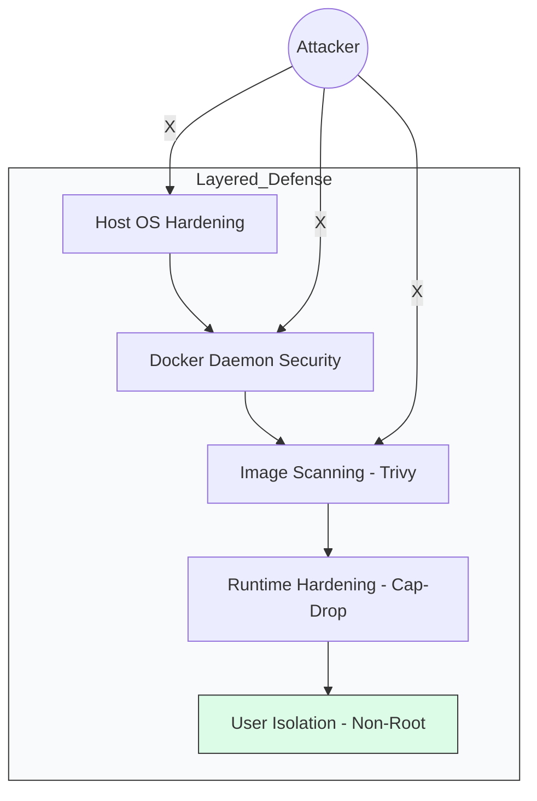

# 🔐 Module 12: Advanced Docker Security

> **"A container is a boundary, not a wall. If you run your app as root, you haven't built a castle; you've built a glass house with a 'Free Entry' sign."**



## 📚 Overview

Security is not a checkbox; it is a mindset. In a production environment, a single compromised container can lead to a full cluster takeover. This module dives into the advanced techniques used by SecOps engineers to lock down Docker environments, from "Rootless" engines to kernel-level syscall filtering.

## 🎓 Learning Objectives

By the end of this module, you will:

- ✅ Implement the **Principle of Least Privilege** (Non-root users).
- ✅ Integrate **Vulnerability Scanning** (Trivy) into your workflow.
- ✅ Master **Linux Capabilities** (`cap_drop` and `cap_add`).
- ✅ Run **Read-Only Containers** to prevent malware persistence.
- ✅ Understand **Seccomp and AppArmor** profiles.

---

## 🛠️ The Non-Root Standard

By default, Docker containers run as **root**. This means if a hacker escapes the container, they are root on your server. **This is unacceptable in production.**

**The Secure Dockerfile**:

```dockerfile
FROM python:3.11-slim
# 1. Create a system user
RUN groupadd -r appgroup && useradd -r -g appgroup appuser
# 2. Set the working directory
WORKDIR /app
# 3. Copy files and change ownership
COPY --chown=appuser:appgroup . .
# 4. Switch to the non-privileged user
USER appuser
CMD ["python", "app.py"]
```

---

## 🔍 Vulnerability Scanning with Trivy

Don't trust and don't verify—scan. **Trivy** is the industry standard for finding CVEs (Common Vulnerabilities and Exposures) in your images.

```bash
# Scan an image for 'Critical' issues only
trivy image --severity CRITICAL python:3.6
```
*Result: You will likely see 100+ vulnerabilities in Python 3.6. This is why we use 'Slim' or 'Alpine' images.*

---

## 🛡️ Runtime Hardening: Cap-Drop

Docker containers have ~14 "Capabilities" (powers) allowed by default. Most apps only need 1 or 2.

**The Pro Strategy**: Drop **ALL** powers and add back only the bare minimum.

```yaml
services:
  api:
    image: my-app
    cap_drop:
      - ALL
    cap_add:
      - NET_BIND_SERVICE # Only allow binding to ports < 1024
```

---

## 🏆 Real-World DevOps Story: The Crypto-Jacking Container

**The Scenario**: A company ran a public-facing Nginx container. They didn't use a non-root user and hadn't updated the image in 2 years.
**The Crisis**: A hacker used a known Nginx vulnerability to get a shell inside the container. Because they were 'root', they installed a Bitcoin miner.
**The Discovery**: The company only noticed when their AWS bill jumped by $5,000 in one week. The hacker had moved from the Nginx container to the host machine and started 50 more miners.
**The Fix**: They rebuilt all images using **Distroless** (images with NO shell/tools) and enforced a **Read-Only Filesystem**.
**The Lesson**: **If the container is read-only and has no shell, a hacker can't install anything.**

---

## 🚀 Professional Pattern: Distroless Images

"The best way to secure a shell is to not have one."
Google's **Distroless** images contain only your application and its dependencies. They do not contain `bash`, `sh`, `apt`, or even `ls`.

```dockerfile
# Build stage
FROM node:18 AS build
WORKDIR /app
COPY . .
RUN npm install && npm run build

# Run stage (Distroless)
FROM gcr.io/distroless/nodejs18-debian11
COPY --from=build /app /app
WORKDIR /app
CMD ["server.js"]
```
*A hacker who gets into this container will find themselves in a void with no tools to do harm.*

---

## ❓ Interview Preparation (Docker Security)

1. **Q: What is the benefit of a 'Read-Only' root filesystem?**
   *A: It prevents a successful attacker from writing malicious scripts, modifying application code, or installing backdoors (like miners or keyloggers) permanently into the container. It forces the container to be truly immutable.*

2. **Q: Explain 'Docker Content Trust'.**
   *A: It's a feature that ensures you only pull images that have been digitally signed by the publisher. It protects you against 'Man-in-the-Middle' attacks where an attacker replaces a legitimate image with a malicious one.*

3. **Q: What is a 'Seccomp Profile'?**
   *A: Seccomp (Secure Computing mode) is a Linux kernel feature that filters the system calls a process can make. Docker's default profile blocks dangerous calls like `mount()`, `reboot()`, and `ptrace()`, reducing the 'Escape' surface of the container.*

4. **Q: Why use Multi-Stage builds for security?**
   *A: Multi-stage builds allow you to use a heavy image (with compilers, SSH keys, and dev tools) to build your app, and then copy only the finished executable into a tiny, clean production image. This removes build-time secrets and tools from the final product.*

5. **Q: How can you limit the resources a container uses for security?**
   *A: Use CPU and Memory limits in your Compose file. This prevents 'Denial of Service' (DoS) attacks where a single compromised container consumes all the host's RAM/CPU, crashing other mission-critical services.*

---

## 📝 Knowledge Check

1. **Which instruction in a Dockerfile is used to switch to a non-privileged user?**
   - [ ] a) `SWITCH`
   - [x] b) `USER`
   - [ ] c) `RUN as`

2. **What does `cap_drop: - ALL` do?**
   - [ ] a) Deletes all files in the container
   - [x] b) Removes all root-level Linux kernel powers from the container
   - [ ] c) Stops the container immediately

3. **Which image type contains NO shell, package manager, or standard Linux utilities?**
   - [ ] a) Alpine
   - [ ] b) Slim
   - [x] c) Distroless

4. **True or False: A container running with `--read-only` can still write to a mounted Volume.**
   - [x] True (Volumes are exempt from the read-only root)
   - [ ] False

5. **Which tool is best for scanning your local images for vulnerabilities?**
   - [ ] a) Docker PS
   - [x] b) Trivy
   - [ ] c) Git Guard

---

## 🔗 Next Steps

The locks are on. Now let's learn how to balance the engine for maximum performance.

Proceed to: **[Module 13: Resource Management](../02-resource-management/readme.md)** →
