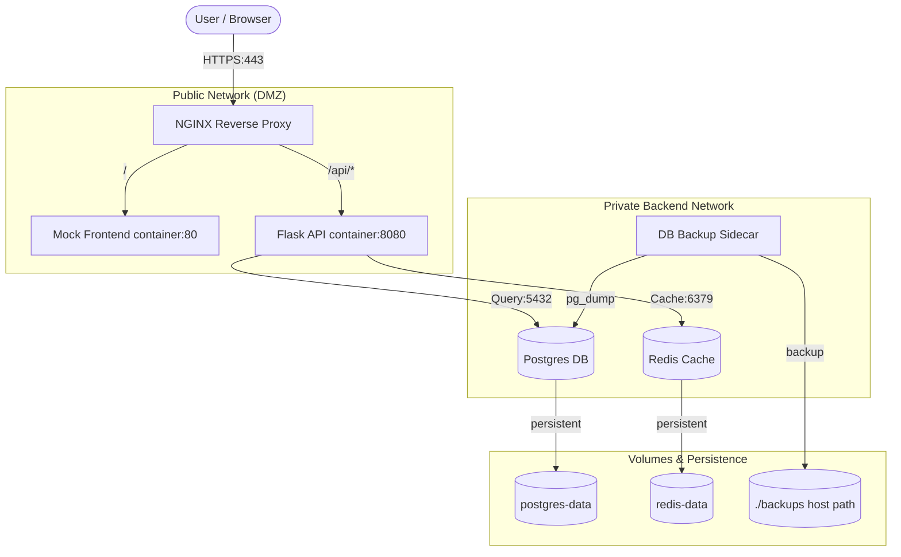

Link: https://youtu.be/YMBT1NguJJw

---

# Integrated Full-Stack Project Architecture

Before diving into the steps, it is essential to understand the architectural design of this system. This project implements a **5-Tier Production Grade Stack** using Docker Compose.

## 🏗️ Architectural Overview
The following diagram illustrates how traffic flows from the user into the system and how services interact within different networks.



## 📡 Service Communication & Networking
1.  **Isolation (Multi-Network)**: We use two distinct networks:
    - `public`: For services that need to talk to the Nginx entry point.
    - `private`: For internal database and cache communication (Postgres/Redis are NOT reachable from the internet).
2.  **Service Discovery**: Containers communicate using their service names (e.g., Flask connects to `host="postgres"`) via Docker's internal DNS.
3.  **Reverse Proxy Strategy**: Nginx handles **SSL Termination**. It determines where to route traffic based on the URI:
    - Requests to `/` serve the static frontend.
    - Requests to `/api/` are forwarded to the Flask Gunicorn server.

## 🔒 Security & Environment Strategy
- **Secrets Management**: Sensitive data like `DB_PASSWORD` or `API_KEY` are mounted as Docker Secrets (`/run/secrets/*`). This ensures passwords never appear in `docker inspect` or ENV listings.
- **Rootless Operation**: Services like Nginx and Flask are configured to run as non-root users where possible within their respective Alpine images.
- **Environment Separation**: We use `compose.prod.yaml` to layer on production settings (restart policies, healthchecks, SSL configs) while keeping the base `compose.yaml` clean.

---

## Steps: 
### Run Commands in the Flask directory 
```bash
cd Flask
```
### Create and activate a virtual environment 
```bash
python3 -m venv venv
source venv/bin/activate
```
### Install Flask packages 
```bash
pip install Flask
```
### Create Requirements.txt
```bash
pip freeze > requirements.txt
```
### Set the FLASK_APP environment variable
```bash
export FLASK_APP=app.py
```
### Run the Flask application
```bash   
flask --app app run 
# or
python -m flask run
```

## Step-2 
### Create a Dockerfile
```bash
touch Dockerfile
```
### Install Gunicorn
```bash
pip install gunicorn
```
### Update Requirements.txt
```bash
pip freeze > requirements.txt
```
### Deactive python venv
```bash 
deactivate
```

## Step-3
### Build Docker Image
```bash
docker build -t ganil151/flask:0.1.0 .
```
### Connect to docker image 
```bash
docker run -d -p 7070:8080 ganil151/flask:0.1.0
# or with environment variable
docker run -d -p 7070:8080 -e APP_VERSION="0.1.0 
ganil151/flask:0.1.0
```
### Test the flask application
```bash
curl http://localhost:7070/about
```
### Create compose.yaml file
```bash
cd ..
touch compose.yaml
```
### Run docker compose
```bash
docker compose up -d 
docker compose ps
```

## Step-4 Environment Variables & Secrets in Docker Compose
- Create a dev.env file
```bash 
cd Flask
touch dev.env
```
- Add environment variables to dev.env file
- Edit compose.yaml file
```yaml
---
services:
  flask:
    image: ganil151/flask:latest
    build: 
      context: Flask
      dockerfile: Dockerfile
    ports:
      - 7071:8080
    env_file:  # <------
      - ./Flask/dev.env
    environment:
      - APP_VERSION=0.1.0
      - DB_PASSWORD  # <------
```

## Step-5 Docker Compose Config
- Create a config-dev.yaml file
```bash 
touch config-dev.yaml
```
- Add environment variables to config-dev.yaml file
```yaml
env: dev
version: 0.1.0
```
- Edit compose.yaml file
```yaml
---
services:
  flask:
    image: ganil151/flask:latest
    build:
      context: Flask
      dockerfile: Dockerfile
    ports:
      - 7071:8080
    env_file:
      - ./Flask/dev.env
    secrets:
      - source: api_key
        target: /run/api_key
      - source: api_key
        target: /Flask/api_key.txt
    configs:  # <------ HERE 
      - source: config-dev
        target: /config-dev-v2.yaml
    environment:
      - APP_VERSION=0.1.0
      - DB_PASSWORD
    volumes:   # <------ HERE 
      - ./Flask/config-dev.yaml:/config-dev.yaml

secrets:
  api_key:
    file: ./Flask/api_key.txt

configs: # <------ HERE 
  config-dev:
    file: ./Flask/config-dev.yaml
```

### Edit app.py file
```python
import os 
from flask import Flask
app = Flask(__name__)

@app.route('/about', methods=['GET'])
def about():
    version = os.environ.get('APP_VERSION', '0.1.0') 
    return {'version': version}, 200 
  
@app.route('/secrets', methods=['GET'])
def secrets():
    creds = dict()
    creds['db_password'] = os.environ.get('DB_PASSWORD')
    creds['api_key'] = open('/run/api_key', 'r').read().strip()
    creds['api_key_v2'] = open('/Flask/api_key.txt', 'r').read().strip()
    return creds, 200

@app.route('/config', methods=['GET'])  # <------ HERE 
def config():
    config = dict()
    config['config_dev'] = open('/config-dev.yaml', 'r').read().strip()
    config['config_dev_v2'] = open('/config-dev-v2.yaml', 'r').read().strip()
    return config, 200
```

### Bind Mounts
- Edit app.py file
```python
import os 
from flask import Flask, requests # <------ HERE 
app = Flask(__name__)

@app.route('/about', methods=['GET'])
def about():
    version = os.environ.get('APP_VERSION', '0.1.0') 
    return {'version': version}, 200 
  
@app.route('/secrets', methods=['GET'])
def secrets():
    creds = dict()
    creds['db_password'] = os.environ.get('DB_PASSWORD')
    creds['api_key'] = open('/run/api_key', 'r').read().strip()
    creds['api_key_v2'] = open('/Flask/api_key.txt', 'r').read().strip()
    return creds, 200

@app.route('/config', methods=['GET']) 
def config():
    config = dict()
    config['config_dev'] = open('/config-dev.yaml', 'r').read().strip()
    config['config_dev_v2'] = open('/config-dev-v2.yaml', 'r').read().strip()
    return config, 200
    

@app.route('/volumes', methods=['GET', 'POST']) # <---- AND HERE
def volumes():
    filename = '/data/test.txt'
    if request.method == 'POST':
        os.makedirs(os.path.dirname(filename), exist_ok=True)
        with open(filename, 'w') as f:
            f.write(request.data.decode('utf-8'))
        return 'Saved!', 201
    else:
        with open(filename, 'r') as f:
            return f.read(), 200

```

- Edit compose.yaml file
```yaml
services:
  flask:
    image: ganil151/flask:latest
    build:
      context: Flask
      dockerfile: Dockerfile
    ports:
      - 7071:8080
    env_file:
      - ./Flask/dev.env
    secrets:
      - source: api_key
        target: /run/api_key
      - source: api_key
        target: /Flask/api_key.txt
    configs:
      - source: config-dev
        target: /config-dev.yaml
      - source: config-dev
        target: /config-dev-v2.yaml
    environment:
      - APP_VERSION=0.1.0
      - DB_PASSWORD
    volumes:
      - ./Flask/config-dev.yaml:/config-dev.yaml
     # - ./Flask/data:/data # <------ HERE 
      - flask-data:/data # <------ HERE using volume instead of bind mount for security reason

secrets:
  api_key:
    file: ./Flask/api_key.txt

configs:
  config-dev:
    file: ./Flask/config-dev.yaml

volumes:
  flask-data:
```
___

## Step-6 Docker Hot Reloading
- Create a Dockerfile.dev file
```bash
touch Dockerfile.dev
```
- Edit Dockerfile.dev file
```bash
vi Dockerfile.dev
```
- Edit compose.yaml file
```bash
services:
  flask:
    image: ganil151/flask:latest
    build:
      context: Flask
      dockerfile: Dockerfile.dev # <------ HERE 
    ports:
      - 7071:8080
    env_file:
      - ./Flask/dev.env
    secrets:
      - source: api_key
        target: /run/api_key
      - source: api_key
        target: /Flask/api_key.txt
    configs:
      - source: config-dev
        target: /config-dev.yaml
      - source: config-dev
        target: /config-dev-v2.yaml
    environment:
      - APP_VERSION=0.1.0
      - DB_PASSWORD
      - FLASK_DEBUG=1 # <------ HERE 
    volumes:
      - ./Flask/config-dev.yaml:/config-dev.yaml
      - ./Flask-data:/data
      - ./Flask:/app # <------ HERE 

secrets:
  api_key:
    file: ./Flask/api_key.txt

configs:
  config-dev:
    file: ./Flask/config-dev.yaml

volumes:
  flask-data:
  
```
- Create a dockerignore file
```bash
touch .dockerignore
```
- Run test
```bash
docker compose up --build
# Output:
Attaching to flask-1
flask-1  |  * Serving Flask app 'app'
flask-1  |  * Debug mode: on
flask-1  | WARNING: This is a development server. Do not use it in a production deployment. Use a production WSGI server instead.
flask-1  |  * Running on all addresses (0.0.0.0)
flask-1  |  * Running on http://127.0.0.1:8080
flask-1  |  * Running on http://172.18.0.2:8080
flask-1  | Press CTRL+C to quit
flask-1  |  * Restarting with stat
flask-1  |  * Debugger is active!
flask-1  |  * Debugger PIN: 338-066-660
```

___

## Step-7 Docker Compose Postgres
- Crate a pg_password.txt file
```bash
touch pg_password.txt
```

- Edit pg_password.txt file
```bash
echo "devops123" > pg_password.txt
```

- Edit compose.yaml file
```yaml
services:
  flask:
    image: ganil151/flask:latest
    build:
      context: Flask
      dockerfile: Dockerfile.dev
    ports:
      - 7071:8080
    env_file:
      - ./Flask/dev.env
    secrets:
      - source: api_key
        target: /run/api_key
      - source: api_key
        target: /Flask/api_key.txt
    configs:
      - source: config-dev
        target: /config-dev.yaml
      - source: config-dev
        target: /config-dev-v2.yaml
    environment:
      - APP_VERSION=0.1.0
      - DB_PASSWORD
      - FLASK_DEBUG=1
    volumes:
      - ./Flask/config-dev.yaml:/config-dev.yaml
      - ./Flask-data:/data
      - ./Flask:/app
    networks: # <------ HERE 
      - private
    
  postgres: # <------ HERE 
    image: postgres:16.3
    ports:
      - "5432:5432"
    environment:
      POSTGRES_USER: myuser
      POSTGRES_DB: mydb
      POSTGRES_PASSWORD_FILE: /run/secrets/pg_password
    secrets:
      - pg_password
    volumes:
      - ./postgres-data:/var/lib/postgresql/data
    networks:
      - private

secrets:
  api_key:
    file: ./Flask/api_key.txt
  pg_password: # <------ HERE 
    file: ./pg_password.txt

configs:
  config-dev:
    file: ./Flask/config-dev.yaml

volumes:
  flask-data:
  postgres-data: # <------ HERE 

networks:  # <------ HERE 
  private:
    driver: bridge
    ipam:
      config:
        - subnet: "10.0.0.0/19"
          gateway: "10.0.0.1"
      
```

- Run test
```bash
docker compose up -d
```

- Check logs
```bash
docker compose logs -f
```

- SSH into container
```bash
docker exec -it projects-postgres-1 psql -h localhost -p 5432 -U myuser -d mydb
```

- Create a table
```bash
CREATE TABLE item (
  item_id serial PRIMARY KEY,
  priority VARCHAR (265),
  task varchar (265)
);
```

- Create a User
```bash
CREATE USER myapp WITH ENCRYPTED PASSWORD 'devops123';
```

- Grant all privileges to the user
```bash
GRANT ALL PRIVILEGES ON ALL TABLES IN SCHEMA public TO myapp;
```

- Grant all permissions to the user
```bash
GRANT ALL PRIVILEGES ON ALL SEQUENCES IN SCHEMA public TO myapp;
```

- Install psycopg2
```bash
# first
source .venv/bin/activate
# then 
pip install psycopg[binary,pool]
# then update requirements.txt
pip freeze > requirements.txt
```

- Edit app.py file
```python
import os 
from flask import Flask, request
from psycopg_pool import ConnectionPool # <------ HERE 

def dbConnect():   # <------ HERE 
    """Connect to the database"""
    
    db_host = os.environ.get('DB_HOST')
    db_database = os.environ.get('DB_DATABASE')
    db_user = os.environ.get('DB_USER')
    db_port = os.environ.get('DB_PORT')
    db_password = open('/run/pg_password', 'r').read().strip()

    # Create a connection URL for the database
    url = f'host={db_host} dbname={db_database} user={db_user} port={db_port} password={db_password}'
    
    # Connect to the database
    pool = ConnectionPool(url)
    pool.wait()

    return pool

# Create a connection pool for Post
pool = dbConnect()
    

app = Flask(__name__)

@app.route('/about', methods=['GET'])
def about():
    version = os.environ.get('APP_VERSION', '0.1.0') 
    return {'app_version': version}, 200 
  
@app.route('/secrets', methods=['GET'])
def secrets():
    creds = dict()
    creds['db_password'] = os.environ.get('DB_PASSWORD')
    creds['api_key'] = open('/run/api_key', 'r').read().strip()
    creds['api_key_v2'] = open('/Flask/api_key.txt', 'r').read().strip()
    return creds, 200

@app.route('/config', methods=['GET']) 
def config():
    config = dict()
    config['config_dev'] = open('/config-dev.yaml', 'r').read().strip()
    config['config_dev_v2'] = open('/config-dev-v2.yaml', 'r').read().strip()
    return config, 200
    

@app.route('/volumes', methods=['GET', 'POST'])
def volumes():
    filename = '/data/test.txt'
    if request.method == 'POST':
        os.makedirs(os.path.dirname(filename), exist_ok=True)
        with open(filename, 'w') as f:
            f.write(request.data.decode('utf-8'))
        return 'Saved!', 201
    else:
        with open(filename, 'r') as f:
            return f.read(), 200

# Save an item to the database
def save_item(priority, task, table, pool):   # <------ HERE 
    """Save an item to the database"""

    # Connect to an existing database
    with pool.connection() as conn:
        with conn.cursor() as cur:

            # Prepare the SQL query
            query = f'INSERT INTO {table} (priority, task) VALUES (%s, %s)'
            
            # Send the query to the database
            cur.execute(query, (priority, task))

            # Make the changes to the database
            conn.commit()

# Return the items from the database
def get_items(table, pool):   # <------ HERE 
    """Return the items from the database"""

    # Connect to an existing database
    with pool.connection() as conn:
        with conn.cursor() as cur:
            # Prepare the SQL query
            query = f'SELECT item_id, priority, task FROM {table}'
            
            # Send the query to the database
            cur.execute(query)

            items = []

            for rec in cur:
                item = {'id': rec[0], 'priority': rec[1], 'task': rec[2]}
                items.append(item)
            
            # Return the items from the database
            return items, 200

@app.route('/items', methods=['GET', 'POST']) # <------ HERE 
def items():
    match request.method:
        case 'POST':
            req = request.get_json()
            save_item(req['priority'], req['task'], 'item', pool)
            return {'message': 'item saved'}, 201
        case 'GET':
            return get_items('item', pool)
        case _:
            return {'message': 'method not allowed'}, 405
        
```
- Edit compose.yaml file
```yaml
services:
  flask:
    image: ganil151/flask:latest
    build:
      context: Flask
      dockerfile: Dockerfile.dev
    ports:
      - 7071:8080
    env_file:
      - ./Flask/dev.env
    secrets:
      - source: api_key
        target: /run/api_key
      - source: api_key
        target: /Flask/api_key.txt
      - source: pg_password # <------ HERE 
        target: /run/pg_password
    configs:
      - source: config-dev
        target: /config-dev.yaml
      - source: config-dev
        target: /config-dev-v2.yaml
    environment:
      - APP_VERSION=0.1.0
      - DB_PASSWORD
      - FLASK_DEBUG=1
      - FLASK_APP=./app.py # <------ HERE 
      - DB_HOST=postgres # <------ HERE 
      - DB_PORT=5432 # <------ HERE 
      - DB_USER=myuser # <------ HERE 
      - DB_DATABASE=mydb # <------ HERE 
    volumes:
      - ./Flask/config-dev.yaml:/config-dev.yaml
      - ./Flask-data:/data
      - ./Flask:/app
    networks:
      - private

  postgres:
    image: postgres:16.3
    ports:
      - "5432:5432"
    environment:
      POSTGRES_USER: myuser
      POSTGRES_DB: mydb
      POSTGRES_PASSWORD_FILE: /run/secrets/pg_password
    secrets:
      - pg_password
    volumes:
      - ./postgres-data:/var/lib/postgresql/data
    networks:
      - private

secrets:
  api_key:
    file: ./Flask/api_key.txt
  pg_password:
    file: ./pg_password.txt

configs:
  config-dev:
    file: ./Flask/config-dev.yaml

volumes:
  flask-data:
  postgres-data:


networks:
  private:
    driver: bridge
    ipam:
      config:
        - subnet: "10.0.0.0/19"
          gateway: "10.0.0.1"

```

- Run test
```bash
docker compose up --build
# then run command
curl -s -X POST -H "Content-Type: application/json" -d '{"priority": "High", "task": "Learn Docker"}' http://localhost:7071/items
# then run command
curl -s http://localhost:7071/items
```
___

## Step-8 Docker Compose Nginx
- Add the dependencies in the compose.yaml file
```yaml
services:
  flask:
    image: ganil151/flask:latest
    build:
      context: Flask
      dockerfile: Dockerfile.dev
    ports:
      - 7071:8080
    env_file:
      - ./Flask/dev.env
    secrets:
      - source: api_key
        target: /run/api_key
      - source: api_key
        target: /Flask/api_key.txt
      - source: pg_password
        target: /run/pg_password
    configs:
      - source: config-dev
        target: /config-dev.yaml
      - source: config-dev
        target: /config-dev-v2.yaml
    environment:
      - APP_VERSION=0.1.0
      - DB_PASSWORD
      - FLASK_DEBUG=1
      - FLASK_APP=./app.py
      - DB_HOST=postgres
      - DB_PORT=5432
      - DB_USER=myuser
      - DB_DATABASE=mydb
    volumes:
      - ./Flask/config-dev.yaml:/config-dev.yaml
      - ./Flask-data:/data
      - ./Flask:/app
    networks:
      - private
    depends_on: # <------ HERE----<<<<<
      - postgres

  postgres:
    image: postgres:16.3
    ports:
      - "5432:5432"
    environment:
      POSTGRES_USER: myuser
      POSTGRES_DB: mydb
      POSTGRES_PASSWORD_FILE: /run/secrets/pg_password
    secrets:
      - pg_password
    volumes:
      - ./postgres-data:/var/lib/postgresql/data
    networks:
      - private

secrets:
  api_key:
    file: ./Flask/api_key.txt
  pg_password:
    file: ./pg_password.txt

configs:
  config-dev:
    file: ./Flask/config-dev.yaml

volumes:
  flask-data:
  postgres-data:


networks:
  private:
    driver: bridge
    ipam:
      config:
        - subnet: "10.0.0.0/19"
          gateway: "10.0.0.1"
```
- Create a nginx.conf file
```conf
user nginx;
worker_processes auto;
error_log /var/log/nginx/error.log notice;
pid /run/nginx.pid;


events {
    worker_connections 1024;
}

http {
    upstream myapp {
        server flask:8080;
    }

    server {
        listen 8080

        location / {
            proxy_pass http://myapp;
        }
    }
}
```
- Update compose.yaml file
```yaml
services:
  nginx: # <------ HERE----<<<<<
    image: nginx:1.26.1 # <------ HERE----<<<<<
    ports: # <------ HERE----<<<<<
      - 8080:8080 # <------ HERE----<<<<<
    configs: # <------ HERE----<<<<<
      - source: nginx_config # <------ HERE----<<<<<
        target: /etc/nginx/nginx.conf # <------ HERE----<<<<<
    networks: # <------ HERE----<<<<<
      - public # <------ HERE----<<<<<
    depends_on: # <------ HERE----<<<<<
      flask: # <------ HERE----<<<<<
        condition: service_healthy # <------ HERE----<<<<<
        restart: true # <------ HERE----<<<<<
  flask:
    image: ganil151/flask:latest
    build:
      context: Flask
      dockerfile: Dockerfile.dev
    # ports: # <------ HERE----<<<<<
    #   - 7071:8080 # <------ HERE----<<<<<
    env_file:
      - ./Flask/dev.env
    secrets:
      - source: api_key
        target: /run/api_key
      - source: api_key
        target: /Flask/api_key.txt
      - source: pg_password
        target: /run/pg_password
    configs:
      - source: config-dev
        target: /config-dev.yaml
      - source: config-dev
        target: /config-dev-v2.yaml
    environment:
      - APP_VERSION=0.1.0
      - DB_PASSWORD
      - FLASK_DEBUG=1
      - FLASK_APP=./app.py
      - DB_HOST=postgres
      - DB_PORT=5432
      - DB_USER=myuser
      - DB_DATABASE=mydb
    volumes:
      - ./Flask/config-dev.yaml:/config-dev.yaml
      - ./Flask-data:/data
      - ./Flask:/app
    networks:
      - private
      - public  # <------ HERE----<<<<<
    depends_on:
      - postgres
    healthcheck: # <------ HERE----<<<<<
      test: ["CMD", "curl", "-f", "http://localhost:8080/about"]
      interval: 5s
      timeout: 5s
      retries: 5
      start_period: 15s

  postgres:
    image: postgres:16.3
    # ports:
    #   - "5432:5432"
    environment:
      POSTGRES_USER: myuser
      POSTGRES_DB: mydb
      POSTGRES_PASSWORD_FILE: /run/secrets/pg_password
    secrets:
      - pg_password
    volumes:
      - ./postgres-data:/var/lib/postgresql/data
    networks:
      - private
      - public # <------ HERE----<<<<<

secrets:
  api_key:
    file: ./Flask/api_key.txt
  pg_password:
    file: ./pg_password.txt

configs:
  config-dev:
    file: ./Flask/config-dev.yaml
  nginx_config:  # <------ HERE----<<<<<
    file: ./nginx.conf

volumes:
  flask-data:
  postgres-data:


networks:
  public: # <------ HERE----<<<<<
    driver: bridge
  private:
    driver: bridge
    ipam:
      config:
        - subnet: "10.0.0.0/19"
          gateway: "10.0.0.1"

```
- Inspect projects-postgres-1 container
```bash 
docker inspect projects-postgres-1 | grep -A 20 "Mounts"
```
- Then SSH into Nginx container
```bash
docker exec -it projects-nginx-1 sh
```
- Install curl & netcat on the nginx container
```bash
apt-get update && apt-get install -y netcat-openbsd
```
- Run netcat to check if the flask container is running
```bash
nc -vz flask 8080
```
- Run netcat to check if the postgres container is running
```bash
nc -vz postgres 5432
```
- Run curl to check if the flask container is running
```bash
curl http://flask:8080/about
```
- Run nslookup to check if the flask container is running
```bash
apt-get update && apt-get install -y dnsutils
# then run
nslookup flask
```
- Check if the file is mounted
```bash
ls /etc/nginx/nginx.conf
```
___

## Step-9 Secure Nginx with Let's Encrypt
- Create a nginx-certbot.env file 
```bash
touch nginx-certbot.env
```
- Add the following to the nginx-certbot.env file
```env
CERTBOT_EMAIL=me@your-domain.com

# Optional (Defaults)
DHPARAM_SIZE=2048
ELLIPTIC_CURVE=secp256r1
RENEWAL_INTERVAL=8d
RSA_KEY_SIZE=2048
STAGING=1
USE_ECDSA=1

# Advanced (Defaults)
CERTBOT_AUTHENICATOR=webroot
CERTBOT_DNS_PROPAGATION_SECONDS=""
DEBUG=0
USE_LOCAL_CA=0
```
- Create a myapp.conf file
```bash
touch myapp.conf
```
- Add the following to the myapp.conf file
```conf
upstream myapp {
    # flask service name from compose.yaml
    server flask:8080;
}

server {
    listen 443 ssl default_server reuseport;

    server_name api.devopsexample.com;

    # Load the certificates files
    ssl_certificate /etc/letsencrypt/live/api.devopsexample.com/fullchain.pem;
    ssl_certificate_key /etc/letsencrypt/live/api.devopsexample.com/privkey.pem;
    ssl_trusted_certificate /etc/letsencrypt/live/api.devopsexample.com/chain.pem;

    # Load the Diffie-Hellman parameters.
    ssl_dhparam /etc/letsencrypt/ssl-dhparams.pem;

    # Load the Diffie-Hellman parameters.
    include /etc/letsencrypt/options-ssl-nginx.conf;

    location / {
        proxy_pass http://myapp;
    }
}
```
- Update compose.yaml file
```yaml
services:
  nginx:
    image: ganil151/nginx-certbot:5.2.1-nginx1.27.0-alpine # <---- Here we define the image
    restart: always
    ports: # <---- Here we define the ports
      - 80:80
      - 443:443
    configs:
      - source: myapp_config # <---- Here we define the config
        target: /etc/nginx/user_conf.d/myapp.conf
    env_file: # <---- Here we define the env file
      - ./nginx-certbot.env
    networks:
      - public
    volumes: # <---- Here we define the volumes
      - nginx_secrets:/etc/letsencrypt
      - nginx_data:/var/lib/letsencrypt
    depends_on:
      flask:
        condition: service_healthy
        restart: true
  flask:
    image: ganil151/flask:latest
    build:
      context: Flask
      dockerfile: Dockerfile
    # ports:
    #   - 7071:8080
    env_file:
      - ./Flask/dev.env
    secrets:
      - source: api_key
        target: /run/api_key
      - source: api_key
        target: /Flask/api_key.txt
      - source: pg_password
        target: /run/pg_password
    configs:
      - source: config-dev
        target: /config-dev.yaml
      - source: config-dev
        target: /config-dev-v2.yaml
    environment:
      - APP_VERSION=0.1.0
      # - DB_PASSWORD
      - FLASK_DEBUG=1
      - FLASK_APP=./app.py
      - DB_HOST=postgres
      - DB_PORT=5432
      - DB_USER=myuser
      - DB_DATABASE=mydb
    volumes:
      - ./Flask/config-dev.yaml:/config-dev.yaml
      - ./Flask-data:/data
      - ./Flask:/app
    networks:
      - private
      - public
    depends_on:
      - postgres
    healthcheck:
      test: [ "CMD", "curl", "-f", "http://localhost:8080/about" ]
      interval: 5s
      timeout: 5s
      retries: 5
      start_period: 15s

  postgres:
    image: postgres:16.3-alpine
    restart: always
    # ports:
    #   - "5432:5432"
    environment:
      POSTGRES_USER: myuser
      POSTGRES_DB: mydb
      POSTGRES_PASSWORD_FILE: /run/secrets/pg_password
    secrets:
      - pg_password
    volumes:
      - ./postgres-data:/var/lib/postgresql/data
    networks:
      - private
      - public

secrets:
  api_key:
    file: ./Flask/api_key.txt
  pg_password:
    file: ./pg_password.txt

configs:
  config-dev:
    file: ./Flask/config-dev.yaml
  # nginx_config: # <---- Here  
  #   file: ./nginx.conf
  myapp_config: # <---- Here we define the config
    file: ./myapp.conf

volumes:
  flask-data:
  postgres-data:
  nginx_secrets:
  nginx_data:


networks:
  public:
    driver: bridge
  private:
    driver: bridge
    ipam:
      config:
        - subnet: "10.0.0.0/19"
          gateway: "10.0.0.1"
```
- Run docker compose config to check the configuration
```bash
docker compose config
```
___

## Step-10 Deploying the application
- Create an ec2 instance and attach the myapp.pem file to it
- Connect to the ec2 instance
```bash
ssh -i myapp.pem ec2-user@<ec2-public-dns-name>
```
- Install docker and docker compose on the ec2 instance
```bash
# Add Docker's official GPG key:
sudo apt update
sudo apt install ca-certificates curl
sudo install -m 0755 -d /etc/apt/keyrings
sudo curl -fsSL https://download.docker.com/linux/ubuntu/gpg -o /etc/apt/keyrings/docker.asc
sudo chmod a+r /etc/apt/keyrings/docker.asc

# Add the repository to Apt sources:
sudo tee /etc/apt/sources.list.d/docker.sources <<EOF
Types: deb
URIs: https://download.docker.com/linux/ubuntu
Suites: $(. /etc/os-release && echo "${UBUNTU_CODENAME:-$VERSION_CODENAME}")
Components: stable
Signed-By: /etc/apt/keyrings/docker.asc
EOF

sudo apt update
sudo apt install docker-ce docker-ce-cli containerd.io docker-compose-plugin
# then 
sudo groupadd docker
sudo usermod -aG docker $USER
sudo reboot
```
- Copy the myapp.pem file to the ec2 instance
```bash
rsync -avz -e "ssh -i myapp.pem" . ubuntu@<ec2-public-ip>:/home/ubuntu/
# or
scp myapp.pem ubuntu@<ec2-public-dns-name>:/home/ubuntu/
```
- Run docker compose up -d
```bash
docker compose up -d
```

___

## Step-11 Pushing Images to Docker Hub
Before deploying to a remote server (like EC2), you must build and push your custom images from your local machine to Docker Hub.

1. **Login to Docker Hub**:
```bash
docker login
```

2. **Build and Push the Images**:
```bash
docker compose build
docker compose push
```
> [!IMPORTANT]
> Ensure the image names and tags in `compose.yaml` (e.g., `ganil151/flask:latest`) match your Docker Hub repository and desired tag.

___

## Step-12 Multi-Environment Setup (Dev vs Prod)
In a professional workflow, we separate development concerns (hot-reloading, debug logs) from production concerns (SSL, restart policies).

### 1. The Modular Structure
We now use three specialized files:
- **`compose.yaml`**: The base configuration containing shared services, networks, and volumes.
- **`docker-compose.override.yml`**: Automatically used by Docker during local development. Adds volumes for hot-reloading and debug flags.
- **`compose.prod.yaml`**: The production-ready configuration. Includes the NGINX/Certbot stack and strict restart policies.

### 2. How to Run
#### For Local Development
Simply run the standard command. Docker will automatically merge `compose.yaml` and `docker-compose.override.yml`:
```bash
docker compose up -d
```

#### For Production
Explicitly specify the base and production files:
```bash
docker compose -f compose.yaml -f compose.prod.yaml up -d
```

> [!TIP]
> This separation prevents sensitive production configurations (like SSL certificates) from cluttering your local development environment.

___

## Step-13 Integrating Redis Cache
We've added **Redis** to the stack to improve application performance. The Flask app uses Redis to track the number of visits to the `/about` page.

### 1. Flask Integration
We use the `redis` Python library to connect to the `redis` service defined in our Compose file.
```python
import redis
cache = redis.Redis(host='redis', port=6379, decode_responses=True)

@app.route('/about')
def about():
    hits = cache.incr('visitor_count')
    return {'visitor_count': hits}
```

### 2. Benefits
- **Performance**: Redis is an in-memory database, making it extremely fast for high-frequency counters or session storage.
- **Persistence**: We use `--appendonly yes` to ensure data survives container restarts.

___

## Step-14 Automated Database Backups
Data resilience is crucial. We now have a **db-backup sidecar** container that automatically creates a PostgreSQL dump every 24 hours.

### 1. How it Works
The `db-backup` service runs a simple loop that:
1. Connects to the `postgres` container.
2. Runs `pg_dump` using the shared secret password.
3. Saves the `.sql` file to a host-mounted `./backups` directory.

### 2. Manual Backup
You can trigger a manual backup anytime by running:
```bash
docker compose exec db-backup pg_dump -h postgres -U myuser mydb > ./backups/manual_backup.sql
```

___

## Step-15 Full-Stack Integration (Mock Frontend)
To complete the architecture, we've added a **Frontend** service. This demonstrates how multiple services communicate through a single entry point (the NGINX reverse proxy).

### 1. Architecture Overview
- **User** → **NGINX** (SSL Termination)
- **NGINX** (`/`) → **Frontend** (Static HTML)
- **NGINX** (`/api/*`) → **Flask** (JSON API)
- **Flask** → **Postgres** (Persistent Data)
- **Flask** → **Redis** (Visitor Counters)

### 2. Frontend Communication
The frontend uses `fetch('/api/about')` to get stats from the backend. The single-domain approach (using NGINX to route `/api`) avoids **CORS** (Cross-Origin Resource Sharing) issues entirely.

### 3. Verification
Run the production stack:
```bash
docker compose -f compose.yaml -f compose.prod.yaml up -d
```
Visit your domain, and you should see the frontend displaying data fetched from the backend API, which in turn is powered by Redis and Postgres.

## Operational Documentation
For managing, troubleshooting, and automating this project, refer to:
- **[Project Runbook](./runbook.md)**: Standard operating procedures for deployment and recovery.
- **[Ansible Playbook](./ansible/setup.yml)**: Automation for host setup and production deployment.

___

## Troubleshooting

### 1. Docker Compose Syntax Error
**Error**: `services.api_key additional properties 'file' not allowed`
**Reason**: `secrets` and `configs` definitions must be at the **top level** of the `compose.yaml` file, not nested under `services`.
**Fix**:
```yaml
services:
  flask:
    ...
    secrets:
      - source: api_key
        target: /run/api_key

# Define at top level
secrets:
  api_key:
    file: ./Flask/api_key.txt
```

### 2. Path Mismatch (FileNotFoundError)
**Error**: `FileNotFoundError: [Errno 2] No such file or directory: '/run/secrets/api_key'`
**Reason**: The `target` specified in the `compose.yaml` does not match the path the code is trying to open.
**Fix**: Ensure the `target` in `compose.yaml` matches the string in `open('path')`.
> [!NOTE]
> If you need the secret in multiple locations, you can mount the same source to multiple targets.

### 3. Config Target Requirements
**Error**: `target` for configs must be absolute.
**Reason**: Unlike bind mounts, Docker `configs` and `secrets` targets must be absolute paths within the container.
**Fix**: Use `/config.yaml` instead of `./config.yaml`.

### 4. Mount Conflicts
**Problem**: Using both `volumes` and `configs` (or `secrets`) on the same container path.
**Fix**: If you are using `configs` to manage a file, remove any `volumes` entry that tries to mount to that same destination.

### 5. Flask Typo
**Error**: `ImportError: cannot import name 'requests' from 'flask'`
**Fix**: Use `from flask import request` (singular) instead of `requests`. The `requests` library is a separate package for making HTTP calls, while `request` is the Flask object for handling incoming data.

### 6. Outdated Containers
**Problem**: Changes in `app.py` or `Dockerfile` are not reflecting.
**Fix**: Use the `--build` flag to force a rebuild of the image:
```bash
docker compose up --build
```

### 7. Invalid FLASK_DEBUG Value
**Error**: `Error: Invalid value for '--debug': './app.py' is not a valid boolean.`
**Reason**: `FLASK_DEBUG` must be a boolean value (e.g., `1`, `true`, `on`). It cannot be a file path.
**Fix**: Set `FLASK_DEBUG=1` in your `compose.yaml` environment section.

### 8. YAML Indentation & Typo Errors
**Error**: `services.flask additional properties 'postgres' not allowed`
**Reason**: 
1. **Indentation**: In YAML, all services must be aligned at the same level under the `services:` key. If `postgres:` is indented more than `flask:`, it's treated as a property of Flask.
2. **Typos**: A misspelling like `postsgres:` can lead to "property not allowed" errors if incorrectly nested, or simply prevent other services from finding the database.
**Fix**: Ensure all services are aligned at the same indentation level and spelled correctly.

### 9. Postgres Secrets (pg_password.txt)
**Problem**: Postgres container fails to start or says "password file not found".
**Reason**: When using `POSTGRES_PASSWORD_FILE`, the secret file must exist on the host and be correctly mapped in the `secrets:` section.
**Fix**: 
1. Create the file: `echo "mypassword" > pg_password.txt`.
2. Ensure the top-level `secrets` block points to the correct file path.

### 10. Bind Mounts vs. Named Volumes
**Problem**: Data disappears when the container is deleted, or a folder like `./Flask-data` is created on your host unexpectedly.
**Reason**: 
- `./data:/data` is a **bind mount** (maps to a folder on your host).
- `flask-data:/data` is a **named volume** (managed by Docker).
**Tip**: Use named volumes for production-like persistence (e.g., database storage) and bind mounts for development (e.g., syncing code for Hot Reloading).

### 11. Psycopg ConnectionPool (Import & Usage)
**Error**: 
- `ImportError: cannot import name 'ConnectionPool' from 'psycopg'`
- `AttributeError: type object 'ConnectionPool' has no attribute 'connect'`
**Reason**: 
1. `ConnectionPool` lives in the `psycopg_pool` package, not the core `psycopg` package.
2. In `psycopg_pool`, you initialize the pool directly using the constructor `ConnectionPool(url)`, not a `.connect()` method.
**Fix**: 
1. Install the pool package: `pip install "psycopg[pool]"`
2. Change the import to: `from psycopg_pool import ConnectionPool`
3. Use `pool = ConnectionPool(url)` instead of `ConnectionPool.connect(url)`.

### 12. Invalid Connection Option "database"
**Error**: `error connecting in 'pool-1': invalid connection option "database"`
**Reason**: `psycopg` (and libpq) uses the keyword `dbname`, not `database`, in the connection string.
**Fix**: Change `database={...}` to `dbname={...}` in your connection URL.

### 13. Password Authentication Failed
**Error**: `FATAL: password authentication failed for user "myuser"`
**Reason**: When using Docker secrets for Postgres (`POSTGRES_PASSWORD_FILE`), your app also needs access to that same secret file to read the password.
**Fix**: 
1. Mount the `pg_password` secret to your `flask` service in `compose.yaml`.
2. Update your code to read the password from the mount path (e.g., `/run/pg_password`).

### 14. Nested Response Tuples
**Error**: `TypeError: ... but it was a tuple.`
**Reason**: If your helper function (like `get_items`) already returns `(data, status)`, returning `helper(), 200` in the route creates a nested tuple `((data, 200), 200)`, which Flask doesn't support.
**Fix**: Simply `return helper()` if the helper already provides the status code.
### 15. Undefined Config or Secret
**Error**: `service "nginx" refers to undefined config nginx_config: invalid compose project`
**Reason**: You have referenced a config (or secret) in a service, but it is not defined in the top-level `configs:` (or `secrets:`) section, or there is a typo in the name.
**Fix**:
1. Check that the config is defined at the root level of `compose.yaml`.
2. Ensure the name in the service exactly matches the name in the top-level definition (e.g., `nginx_config` vs `nginx-config`).
### 16. Healthcheck Failure (Service Unhealthy)
**Problem**: The application logs show it's running, but `docker compose ps` shows `unhealthy` and dependencies (like Nginx) fail to start.
**Logs**:
```text
flask-1  |  * Serving Flask app 'app'
flask-1  |  * Debug mode: on
flask-1  |  * Running on http://10.0.0.3:8080
...
dependency failed to start: container projects-flask-1 is unhealthy
```
**Reason**: The healthcheck command (e.g., `curl`) is missing from the container image, or the service is not responding on the expected port/path.
**Fix**:
1. Ensure the required tools are installed in your Dockerfile (e.g., `apk add --no-cache curl` for Alpine).
2. Verify that the healthcheck `test` command in `compose.yaml` uses the correct port and endpoint.
3. Check the service logs (`docker compose logs flask`) to see if the application started correctly.

### 17. Undefined Column (Postgres)
**Error**: `psycopg.errors.UndefinedColumn: column "..." of relation "..." does not exist`
**Reason**: Your Flask code is trying to access a column that doesn't exist in the database table. This often happens if the database schema was created before a code change added a new column.
**Fix**:
1. SSH into the Postgres container: `docker exec -it <container_name> psql -U <user> -d <database>`.
2. check the table structure: `\d <table_name>`.
3. Add the missing column manually or delete the volume (`docker compose down -v`) and restart to recreate the schema (WARNING: this deletes data).

### 18. Container Exits Immediately (Syntax Errors)
**Problem**: A container (like Nginx) is missing from `docker ps` or keeps restarting.
**Logs**: `docker compose logs nginx` shows:
```text
[emerg] 1#1: invalid host in "listen" directive in /etc/nginx/nginx.conf:...
# OR
/docker-entrypoint.sh: ... nginx: [emerg] unexpected end of file, expecting ";" in /etc/nginx/nginx.conf:17
```
**Reason**: Often a syntax error in a mounted configuration file (like a missing semicolon in `nginx.conf`) causes the process to exit immediately.
**Fix**: Fix the syntax error in the source file on your host and run `docker compose up -d` to restart the service.

### 19. Missing Debugging Tools (nc, curl, etc.)
**Error**: `sh: 1: nc: not found` or `sh: curl: not found`
**Reason**: Official Docker images (like `nginx:1.26.1` or `alpine`) are often minimal and don't include debugging tools by default to keep the image size small.
**Fix**:
1. For temporary debugging, install the tool inside the running container:
   - **Debian/Ubuntu (Nginx)**: `apt update && apt install -y netcat-openbsd curl`
   - **Alpine (Flask)**: `apk add --no-cache netcat-openbsd curl`
2. If you need the tool permanently, add the installation command to your `Dockerfile`.
### 20. Undefined Volume
**Error**: `service "nginx" refers to undefined volume nginx_data: invalid compose project`
**Reason**: You have referenced a named volume in a service's `volumes:` section, but it is not defined in the top-level `volumes:` block.
**Fix**: Add the volume name to the top-level `volumes:` section of your `compose.yaml`.

### 21. Image Not Found / Image Pull Failure
**Error**: `failed to resolve reference "docker.io/ganil151/...": not found`
**Reason**: Docker is trying to pull an image from Docker Hub that doesn't exist or has a different tag.
**Fix**:
1. Check if you pushed the image from your local machine: `docker compose push`.
2. Verify the exact tag name (e.g., `latest` vs `0.1.0` vs specific versions like `5.2.1-nginx1.27.0-alpine`).

---

## 🔗 Next Steps

Congratulations! You have completed the Container Orchestration track. You are now ready to scale these skills to production clusters.

Proceed to: **[Phase 4: Kubernetes Mastery](../../../../../readme.md)** →

