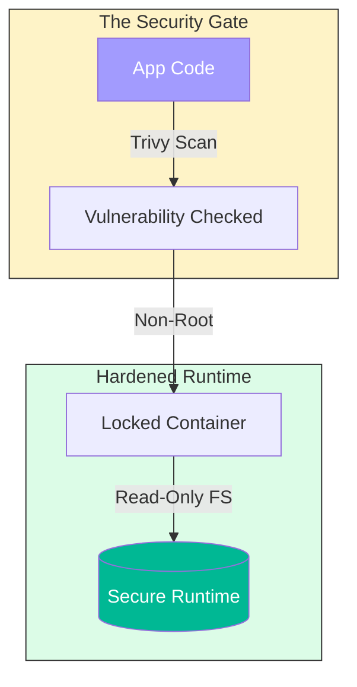

# 🔴 Part 3: Advanced Ops & Projects

> **"Production is not just 'works on my machine.' It's about security, optimization, and scale."**

## 📖 Overview

In this final part, we turn professional. We learn how to secure our containers against attackers, optimize our images for speed and size, and finally, we apply everything we've learned by building real-world Full Stack applications.

---

## 🛡️ The Security Shield

---

## 🎯 Learning Objectives

- ✅ **Security**: Scan images for CVEs and implement "Least Privilege."
- ✅ **Optimization**: Reduce image size from 1GB to 50MB.
- ✅ **Integration**: Deploy full stacks (Frontend + Backend + DB) with one command.

---

## 🗺️ Included Modules

1. **[01-Security-and-Optimization](./01-security-and-optimization/readme.md)**: Hardening your containers.
2. **[02-Real-World-Projects](./02-real-world-projects/readme.md)**: Hands-on labs (MERN Stack, Python Microservices).

---

## 💼 Career Impact: The Professional Phase

This is where you separate yourself from the "Tutorial Experts." Companies don't just want Docker; they want **Secure, Reliable, and Efficient** Docker.

- **SecOps Ready**: You will be capable of leading security audits for containerized environments.
- **Cost Optimization**: By reducing image sizes and managing resources, you directly save the company money on cloud bills (AWS/Azure).
- **Scale Confidence**: You move from "it works on my machine" to "it is ready for 1 million users."

---

**Next Step**: Secure your stack in **[01-Security-and-Optimization](./01-security-and-optimization/readme.md)** 🚀
