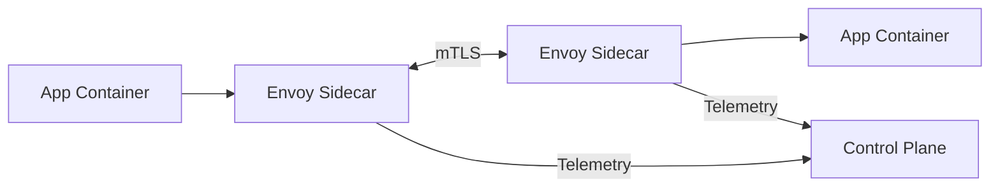
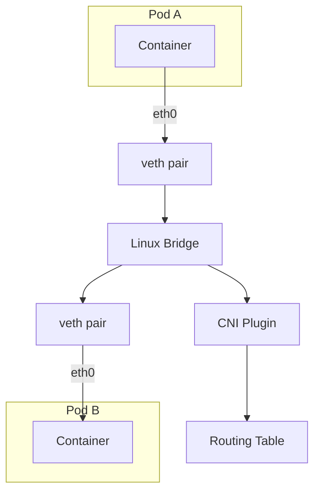

# Container Networking Deep Dive Reference

**Doc Version:** 1.0.0
**Role:** Network Engineer
**Scope:** CNI, Service Mesh, and Network Policies

---

## 1. The Container Network Interface (CNI)

Kubernetes does NOT implement networking. It delegates to **CNI Plugins**.

### The CNI Specification
When a Pod is created:
1. Kubelet calls the CNI plugin
2. CNI plugin creates a network namespace
3. CNI plugin assigns an IP address
4. CNI plugin configures routing

### Popular CNI Plugins
| Plugin | Model | Performance | Features |
|:---|:---|:---|:---|
| **Calico** | Layer 3 (BGP) | High | Network Policies, Encryption |
| **Flannel** | Overlay (VXLAN) | Medium | Simple, no Network Policies |
| **Cilium** | eBPF | Highest | L7 policies, Observability |
| **Weave** | Overlay | Medium | Encryption, Multicast |

---

## 2. The Three Network Planes

### A. Pod-to-Pod Network
- **Requirement**: Every Pod gets a unique IP
- **Flat Network**: Pods can talk to any other Pod without NAT
- **Implementation**: CNI plugin creates virtual network interfaces

### B. Service Network (ClusterIP)
- **Problem**: Pods are ephemeral. IPs change.
- **Solution**: Services provide stable virtual IPs
- **Implementation**: `kube-proxy` programs iptables/IPVS rules
  - Traffic to `10.96.0.1:80` → Load balanced to Pods with matching labels

### C. External Network (Ingress/LoadBalancer)
- **Ingress**: Layer 7 HTTP routing (nginx, Traefik)
- **LoadBalancer**: Layer 4 cloud provider integration (AWS ELB, GCP LB)

---

## 3. Network Policies (Firewall Rules)

By default, Kubernetes is **zero-trust**: All Pods can talk to all Pods.

### Deny All (Default Deny)
```yaml
apiVersion: networking.k8s.io/v1
kind: NetworkPolicy
metadata:
  name: default-deny
spec:
  podSelector: {}
  policyTypes:
  - Ingress
  - Egress
```

### Allow Specific Traffic
```yaml
apiVersion: networking.k8s.io/v1
kind: NetworkPolicy
metadata:
  name: allow-frontend-to-backend
spec:
  podSelector:
    matchLabels:
      app: backend
  ingress:
  - from:
    - podSelector:
        matchLabels:
          app: frontend
    ports:
    - protocol: TCP
      port: 8080
```

**Governance**: Implement **default-deny** in production namespaces. Explicitly allow only required traffic.

---

## 4. Service Mesh (Advanced)

A **Service Mesh** (Istio, Linkerd) adds a sidecar proxy to every Pod.

### Capabilities
- **mTLS**: Automatic encryption between Pods
- **Traffic Management**: Canary deployments, circuit breakers
- **Observability**: Distributed tracing without code changes
- **Policy**: Rate limiting, retries

### Architecture


**Trade-off**: Service meshes add complexity and latency. Only use if you need the features.

---

## 5. DNS in Kubernetes

Every Service gets a DNS name: `<service-name>.<namespace>.svc.cluster.local`

### CoreDNS
- Runs as a Deployment in `kube-system`
- Pods are configured to use CoreDNS as their nameserver
- Watches API Server for Service changes

**Example**: A Pod in namespace `default` can reach a Service `database` in namespace `prod` via:
`database.prod.svc.cluster.local`

---

## 6. Visualizing the Network Stack



> **Enterprise Pattern**: Use **Calico** for on-prem (no overlay overhead) and **Cilium** for cloud (eBPF performance + L7 policies).
