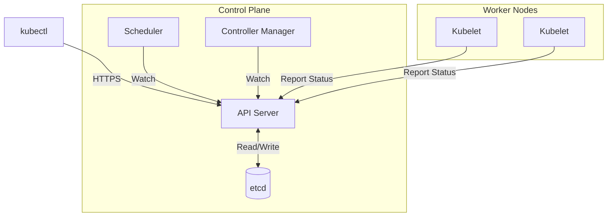

# Kubernetes Control Plane Architecture Reference

**Doc Version:** 1.0.0
**Role:** Kubernetes Architect
**Scope:** Control Plane Components & State Management

---

## 1. The Control Plane: The Brain of Kubernetes

The Control Plane is a collection of processes that maintain the **Desired State** of the cluster.

### Core Components

#### A. API Server (`kube-apiserver`)
- **Role**: The front door. All communication goes through the API Server.
- **Responsibilities**:
  - Authentication & Authorization (RBAC)
  - Admission Control (Webhooks, Policy Enforcement)
  - REST API for all Kubernetes objects
- **Stateless**: Can be horizontally scaled
- **Security**: The ONLY component that talks to etcd

#### B. etcd
- **Role**: The database. Stores the entire cluster state.
- **Technology**: Distributed key-value store (Raft consensus)
- **Data**: Every Pod, Service, ConfigMap, Secret
- **Critical**: If etcd is lost, the cluster is lost. **Backup etcd religiously.**
- **Access**: Only the API Server should have direct access

#### C. Scheduler (`kube-scheduler`)
- **Role**: Decides which Node runs which Pod
- **Algorithm**:
  1. **Filtering**: Remove Nodes that don't meet requirements (CPU, Memory, Taints)
  2. **Scoring**: Rank remaining Nodes (spread evenly, affinity rules)
  3. **Binding**: Assign Pod to highest-scoring Node
- **Extensible**: Custom schedulers can be written

#### D. Controller Manager (`kube-controller-manager`)
- **Role**: Runs control loops that watch the cluster state and make changes
- **Examples**:
  - **ReplicaSet Controller**: Ensures N replicas are running
  - **Node Controller**: Detects when Nodes go down
  - **Service Account Controller**: Creates default ServiceAccounts
- **Pattern**: `while true: observe(); diff(); act();`

#### E. Cloud Controller Manager (Optional)
- **Role**: Integrates with cloud provider APIs (AWS, GCP, Azure)
- **Examples**:
  - Provision LoadBalancers for `type: LoadBalancer` Services
  - Attach persistent disks to Nodes

---

## 2. The Reconciliation Loop (Operator Pattern)

Kubernetes is **declarative**. You don't tell it *how* to do something; you tell it *what* you want.

### The Loop
```
1. Watch: API Server notifies Controller of changes
2. Compare: Desired State (YAML) vs Current State (etcd)
3. Act: If different, take action (create Pod, delete Service)
4. Repeat: Forever
```

**Self-Healing**: If you manually delete a Pod in a Deployment, the ReplicaSet Controller immediately creates a new one.

---

## 3. High Availability (HA) Control Plane

In production, the Control Plane must be redundant.

### Topology
- **3+ API Servers**: Behind a LoadBalancer
- **3+ etcd nodes**: Raft requires odd numbers (3, 5, 7)
- **Leader Election**: Only one Scheduler and Controller Manager is active at a time (the others are on standby)

### Split-Brain Prevention
etcd uses **Raft Consensus**:
- Requires majority (quorum) to commit writes
- 3 nodes: Can tolerate 1 failure
- 5 nodes: Can tolerate 2 failures

---

## 4. Visualizing the Architecture



> **Enterprise Note**: The API Server is the **single point of authentication**. All components (even Kubelet) must present valid certificates. This is why Kubernetes uses mTLS (mutual TLS) everywhere.
