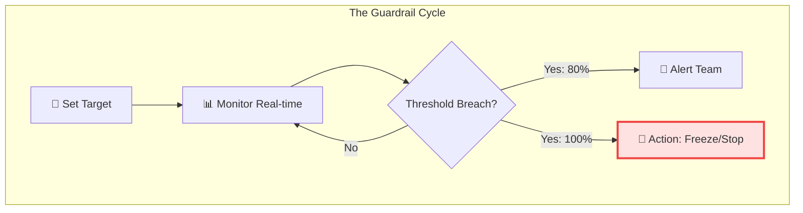
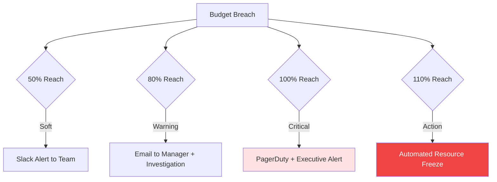

# 📉 Part 04: Budgeting Basics & Guardrails

> **"A budget is not a ceiling; it's a compass. In the cloud, a budget is your first line of defense against the 'Infinite Credit Card' phenomenon."**

## 📚 Overview

Cloud environments are theoretically infinite, which means your bill is also theoretically infinite. **Budgeting** is the practice of setting hard and soft limits on your cloud spend. In this module, we explore how to move from "Reactive" budgeting (checking the bill at the end of the month) to "Proactive" budgeting (automating alerts and actions before you overspend).

## 💼 Career Impact: The "Guardrail Governor"

Building budgets is about protecting the company from financial catastrophe.

- **Risk Mitigation**: You become the person who prevents the "Million Dollar Mistake" by implementing automated safety valves.
- **Operational Trust**: When Finance knows that Engineering has hard limits in place, they are more likely to approve experimental projects and larger cloud budgets.
- **Expertise in High-Stakes Environments**: Skills in automated enforcement and anomaly detection are highly valued in FinTech, Healthcare, and large enterprise sectors.

## 🎓 Learning Objectives

By the end of this module, you will:

- ✅ Create **Multi-Threshold Budgets** (Actual vs Forecasted).
- ✅ Implement **Anomaly Detection** to catch sudden spikes.
- ✅ Understand the difference between **Soft Alerts** and **Hard Enforcement**.
- ✅ Automate **Corrective Actions** (e.g., shutting down dev labs).
- ✅ Design a **Budget Escalation Matrix** for your organization.

---

## 🏗️ The Three Types of Guardrails

| Type              | Name          | Purpose                                                      |
| :---------------- | :------------ | :----------------------------------------------------------- |
| **Soft Alert**    | Information   | "Hey team, we've used 50% of the budget." No action taken.   |
| **Warning Alert** | Investigation | "80% reached. Stop starting new instances and review."       |
| **Hard Limit**    | Enforcement   | "100% reached. Automatically denying new resource requests." |

---

## 🚀 Professional Pattern: The Friday Night "Reaper"

Sandboxes and Development environments should not run 24/7. Senior DevOps engineers use **Automated Scheduling** to save up to 70% on non-production costs.

**The Pro Standard**:

- **Cron Job**: Mon-Fri, 9 AM - 6 PM.
- **Action**: Use a Lambda function or CloudWatch Event to `STOP` all EC2/RDS instances with the tag `env: dev` outside these hours.
- **Exceptions**: Allow a `override: true` tag for special overnight tests.

---

## 🏆 Real-World DevOps Story: The Friday Night Surprise

**The Scenario**: An engineer's AWS credentials were leaked on a public Slack channel. At 6 PM on a Friday, an attacker used the keys to launch 50 "High-GPU" instances for bitcoin mining in an obscure region (e.g., `me-central-1`).
**The Crisis**: Because the team was offline for the weekend, the miner would have run for 60 hours.
**The Fix**: Fortunately, the company had **Anomaly Detection** enabled. Within 15 minutes of the spike reaching $100, an automated alert triggered an **AWS Budget Action**.
**The Discovery**: The Budget Action was configured to "Attach a Deny-All policy to the IAM User" if an anomaly was detected. The user was locked out, and the instances were flagged for deletion.
**The Lesson**: **Speed of reaction is everything.** Machine-learning based anomaly detection sees what humans miss.

---

## 🛡️ Anomaly Detection: The Silent Watcher

Unlike a fixed budget (e.g., $1,000), **Anomaly Detection** looks for deviations from *normal* behavior.

- **Normal**: You spend $30 every Monday morning.
- **Anomaly**: You spend $300 this Monday morning.
*Even if you are still way below your $10,000 monthly budget, Anomaly Detection will alert you immediately because the PATTERN has changed.*

---

## 🆚 Junior Way vs. Engineer Way

| Feature | The Junior Way (Problematic) | The Engineer Way (Production-ready) |
|:---|:---|:---|
| **Monitoring** | Checking the bill once a month | **Real-time spend alerts** at 50/80/100% |
| **Reaction** | "Oh no, we spent too much" | **Automated Budget Actions** (Lockdown) |
| **Logic** | Static Dollar limits only | **Anomaly Detection** (ML-based patterns) |
| **Enforcement** | Asking people to stop | **Service Quotas** and Hard Caps |
| **Idle Apps** | Everything stays on forever | **Scheduled Reapers** for non-prod |

---

## 🏗️ The Budget Escalation Matrix

In a professional environment, different levels of breach require different levels of response. You don't call the CTO for a $50 overage in a sandbox.

---

## 🎤 Interview Preparation (Budgeting & Control)

### 🎯 Core Concepts
1. **Q: What is the difference between 'Actual' spend and 'Forecasted' spend alerts?**
   - *A: 'Actual' alerts trigger when you've already spent the money. 'Forecasted' alerts use ML to predict that your current usage will hit the limit by month-end. Forecasted alerts are essential for proactive management.*

2. **Q: How do you handle a budget breach in a mission-critical Production account?**
   - *A: You **never** kill production resources automatically. Instead, you escalate. Use high-priority paging to inform leadership. In production, we favor Availability over Cost; in Dev, we favor Cost over Availability.*

3. **Q: What is a 'Service Quota' and how does it relate to budgeting?**
   - *A: Service Quotas are hard limits set by the provider (e.g., 'Only 20 VPCs'). They act as a 'Safety Valve'—even if a script goes rogue, it will eventually hit a limit and stop, capping the loss.*

4. **Q: Can you automate a budget to shutdown resources?**
   - *A: Yes. In AWS, 'Budget Actions' can run SSM documents, Lambda functions, or attach IAM policies to block further spending once a threshold is reached.*

5. **Q: Why should 'Anomaly Detection' be enabled even if you have strict fixed budgets?**
   - *A: Fixed budgets only tell you *when* you reach a total. Anomaly detection tells you *if something is weird.* A hacker could spend $5k in one hour; while still under your $50k budget, it's a critical anomaly.*

### 🚀 Advanced Questions
6. **Q: What is an 'AWS SCP' (Service Control Policy) and how can it prevent 'Shadow IT'?**
   - *A: An SCP is a policy that sets a boundary on what actions members of an AWS Organization can take. It can be used to prevent teams from launching expensive instance types (like `p3.16xlarge`) without explicit approval, essentially acting as a proactive budget guardrail.*

7. **Q: Explain 'Tag-Based Budgeting'.**
   - *A: Instead of one giant account budget, you create budgets for specific tags (e.g., `project: alpha`). This allows you to track and alert on the spend of a single microservice independently of the rest of the account.*

8. **Q: How do you design a 'Budget Action' that is safe for a hybrid environment?**
   - *A: Ensure the action only targets resources with specific 'Ephemeral' tags (like `env: dev`). The script should check for 'Critical' tags before taking any destructive action like stopping or terminating.*

9. **Q: What is 'Credits management' and how does it impact budgeting?**
   - *A: Many cloud providers give credits (from startup programs or enterprise deals). Budgeting tools often show 'Gross' spend (before credits) and 'Net' spend (after credits). FinOps focus on **Gross** spend because credits eventually run out.*

10. **Q: How does 'Auto-Scaling' act as both a cost-saver and a budget-breaker?**
    - *A: It's a saver because it scales down when idle. It's a breaker if a DDoS attack or a bug triggers infinite scaling. You must always set 'Max Capacity' caps on Auto-Scaling groups to prevent a budget overrun.*

---

## 📝 Knowledge Check

1. **Which alert type triggers before you've actually spent the money?**
   - [x] Forecasted Spend Alert.

2. **What is the safest action to take on a Production budget breach?**
   - [x] Send a high-priority alert to leadership.

3. **True or False: Anomaly Detection requires manual threshold setting for every service.**
   - [x] **False**. (It uses Machine Learning).

4. **Which cloud feature acts as a 'Safety Valve' to limit total resource count?**
   - [x] Service Quotas.

5. **What is the main benefit of the 'Nightly Reaper' pattern?**
   - [x] Saves up to 70% on development costs.

6. **Which service in AWS is used specifically for setting budgets?**
   - [x] AWS Budgets.

7. **What is 'Shadow IT'?**
   - [x] Resources launched by teams without following central governance or budget approval.

8. **An alert at 80% usage is considered what type of guardrail?**
   - [x] Warning / Soft Alert.

9. **What does 'Reaping' mean in a FinOps context?**
   - [x] Automatically stopping or deleting idle/wasteful resources.

10. **If spend spikes from $5 to $500 in one hour, which tool catches it first?**
    - [x] Anomaly Detection.

---

## 🔗 Next Steps

Congratulations! You've mastered the fundamentals of **FinOps**.

Return to: **[The FinOps Master Hub](../readme.md)** →
