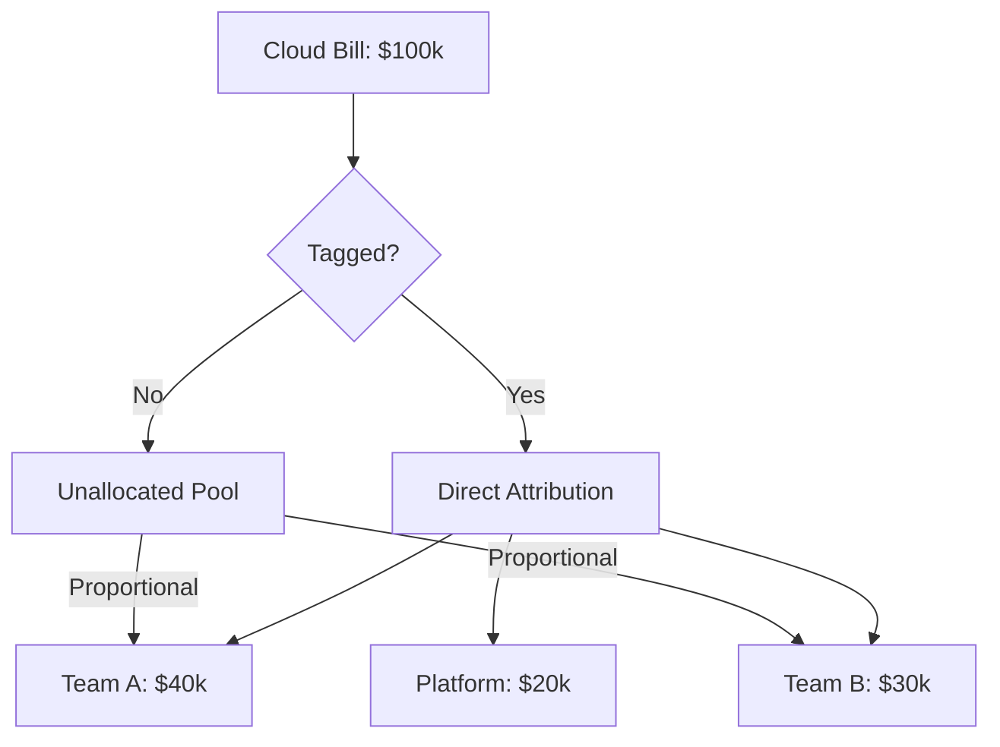

# Cloud Cost Attribution & Chargeback Reference

**Doc Version:** 1.0.0
**Role:** FinOps Practitioner
**Scope:** Cost Allocation Models & Showback/Chargeback

---

## 1. The Attribution Problem

In traditional IT, costs are fixed (buy a server once). In cloud, costs are **variable** and **shared**.

**The Challenge**: A single EC2 instance might run:
- Frontend service (Team A)
- Background jobs (Team B)
- Monitoring agent (Platform Team)

**Question**: Who pays?

---

## 2. Cost Allocation Models

### A. Direct Attribution (Tagging)
**Method**: Tag every resource with cost center/team/project.

```yaml
Tags:
  CostCenter: "Engineering"
  Team: "Data-Platform"
  Environment: "Production"
  Project: "ML-Pipeline"
```

**Pros**: Accurate, granular
**Cons**: Requires discipline. Untagged resources = "Unknown"

**Governance**: Enforce tagging via **Policy as Code** (AWS Config Rules, Azure Policy):
```json
{
  "effect": "deny",
  "condition": "tags.CostCenter == null"
}
```

### B. Proportional Allocation (Shared Resources)
**Use Case**: A shared Kubernetes cluster.

**Method**: Allocate costs based on resource usage (CPU/Memory requests).
- Team A uses 60% of cluster CPU → Pays 60% of cluster cost
- Team B uses 40% of cluster CPU → Pays 40% of cluster cost

**Tools**: Kubecost, OpenCost

### C. Activity-Based Costing
**Use Case**: Serverless (Lambda, Cloud Functions).

**Method**: Allocate based on invocations/duration.
- API Gateway: Cost per request
- Lambda: Cost per GB-second

---

## 3. Showback vs. Chargeback

### Showback (Informational)
- **Definition**: Show teams their costs, but don't actually bill them.
- **Goal**: Awareness and behavior change.
- **Example**: Monthly email: "Your team spent $12,000 this month."

### Chargeback (Financial)
- **Definition**: Actually deduct costs from team budgets.
- **Goal**: Accountability and cost control.
- **Example**: Finance system transfers $12,000 from Engineering budget to Cloud budget.

**Governance**: Start with Showback. Move to Chargeback only after processes mature.

---

## 4. The Unit Economics Model

**Unit Economics**: Cost per business metric.

### Examples
- **E-commerce**: Cost per order processed
- **SaaS**: Cost per active user
- **Media**: Cost per GB streamed

### Calculation
```
Unit Cost = Total Cloud Cost / Business Metric
```

**Why It Matters**: 
- Revenue grows 2x → Cloud cost should grow <2x (economies of scale)
- If Unit Cost increases, you have an efficiency problem

---

## 5. Reserved Instances & Savings Plans

### The Commitment Model
- **On-Demand**: Pay full price, no commitment
- **Reserved Instances (RI)**: Commit to 1-3 years → 30-70% discount
- **Savings Plans**: Commit to $/hour spend → Flexible across instance types

### The Risk
**Over-commitment**: You commit to $10k/month but only use $5k → You still pay $10k
**Under-commitment**: You use $10k/month but only committed to $5k → Pay full price on the extra $5k

**Best Practice**: Use **RI Coverage Reports** to identify stable workloads. Only commit to the "baseline" usage.

---

## 6. Visualizing Cost Attribution



> **Enterprise Pattern**: Implement a **Tagging Policy** on Day 1. Retroactively tagging 10,000 resources is a nightmare. Use **Tag Inheritance** (tags on VPC propagate to subnets/instances) to reduce manual work.
