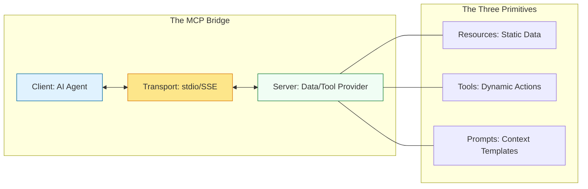

# 🤖 Part 01: Architecture & Primitives

> **"To control a machine, you must speak its language. MCP provides the vocabulary for AI models to talk to the world."**

## 📚 Overview

The power of an AI model is often limited by its "training cutoff." It knows how to write code, but it doesn't know what is currently in your `production.yml` file. **MCP Architecture** solves this by establishing a clear separation between the "Brain" (the AI model) and the "Environment" (the data and tools).

In this module, we explore the foundational primitives that make this possible: **Resources, Tools, and Prompts**.

## 💼 Career Impact: The "AI Systems Engineer"

As AI becomes integrated into every DevOps pipeline, engineers who understand the "Connecting Protocol" will lead the next wave of automation.

- **Strategic Value**: You move from writing manual scripts to building autonomous systems that can safely execute those scripts.
- **Future Proofing**: MCP is the industry standard (led by Anthropic) for AI tool use. Mastering it now places you at the forefront of AI engineering.
- **Architecture Leadership**: You will be the one designing how AI agents safely access company data without leaking secrets.

## 🎓 Learning Objectives

By the end of this module, you will:

- ✅ Deconstruct the **Client-Server communication** flow.
- ✅ Master the three primitives: **Resources, Tools, and Prompts**.
- ✅ Understand the role of **JSON-RPC** in AI message passing.
- ✅ Identify the difference between **stdio** and **SSE** transports.

---

## 🏗️ The Three Primitives: The "DNA" of MCP

| Primitive | Technical Definition | DevOps Use Case |
| :--- | :--- | :--- |
| **Resources** | Read-only data sources (Files, API responses, DB logs). | Reading a `Dockerfile` to analyze its layers. |
| **Tools** | Executable functions that can change the world (CLI, API writes). | Running `kubectl apply -f deployment.yaml`. |
| **Prompts** | Standardized instruction templates with variable slots. | A "Security Scan" prompt that asks the AI to find CVEs. |

---

## 🚀 Professional Pattern: The Read-Only Resource Buffer

A common mistake is turning every data source into a "Tool." If an AI only needs to **see** information, expose it as a **Resource**.

- **Bad Practice**: Exposing a Tool `get_logs()` that the AI has to "Call" repeatedly.
- **Pro Standard**: Exposing `logs://app-stdout` as a Resource that the AI can "Observe". This allows the server to push updates to the AI automatically, keeping the context fresh without excessive tool calls.

---

## ❓ Interview Preparation (MCP Primitives)

1. **Q: What is the difference between a Tool and a Resource in MCP?**
   *A: A Resource is a data source (read-only) that provides context. A Tool is an executable function (read/write) that performs an action. Use Resources for 'knowing' and Tools for 'doing'.*

2. **Q: Why does MCP use JSON-RPC instead of a simpler format like raw JSON?**
   *A: JSON-RPC provides a standardized way to handle 'Requests', 'Responses', and 'Notifications'. This allows the MCP Client to reliably know if a tool call succeeded, failed, or timed out, which is critical for complex AI agentic loops.*

3. **Q: What is a 'Prompt Template' in MCP?**
   *A: It is a pre-defined instruction that the server provides to the client. This ensures that when an AI is asked to do a specific task (like 'Scan for Security'), it follows a company-approved set of instructions every time.*

---

## 📝 Knowledge Check

1. **Which primitive allows an AI to perform an action like 'Reboot Server'?**
   - [ ] a) Resource
   - [x] b) Tool
   - [ ] c) Prompt

2. **True or False: A Resource in MCP is typically read-only.**
   - [x] True
   - [ ] False

3. **What layer handles the actual moving of bits between the AI and the Server?**
   - [ ] a) Primitives
   - [ ] b) JSON-RPC
   - [x] c) Transport (stdio/SSE)

---

## 🔗 Next Steps

You've mastered the theory. Now let's see it in action by exploring the local ecosystem and working with real servers.

Proceed to: **[Part 02: Ecosystem & Servers](../part-02-ecosystem-and-servers/readme.md)** →
