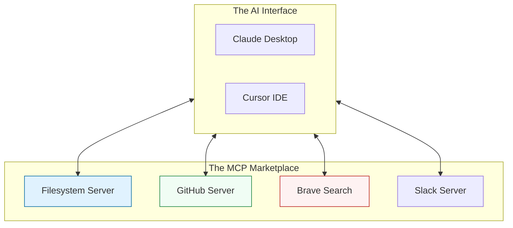

# 🌐 Part 02: Ecosystem & Servers

> **"Don't reinvent the wheel; just connect it to the car. The MCP ecosystem provides ready-made servers for the most common DevOps data sources."**



## 📚 Overview

The true power of MCP lies in its rapidly growing **Ecosystem**. Instead of writing custom code to read from GitHub or search the web, you can use community-maintained MCP servers. These servers act as "Adapters" that translate the specific API of a service into the universal language of MCP.

In this module, we focus on setting up and configuring the most essential servers for a DevOps workflow.

## 💼 Career Impact: The "Power User"

Mastering the MCP ecosystem makes you exponentially faster at common technical tasks.

- **Workflow Optimization**: Tasks that used to take 30 minutes (like analyzing a complex repository) now take 30 seconds.
- **Cross-Platform Mastery**: You gain the ability to orchestrate data across GitHub, Slack, and your local machine using a single AI interface.
- **Efficiency Leadership**: You can implement these tools for your entire team, drastically reducing the "Time-to-Context" for new developers.

## 🎓 Learning Objectives

By the end of this module, you will:

- ✅ Configure and run the **Filesystem MCP Server**.
- ✅ Integrate with the **GitHub MCP Server** to manage issues and PRs.
- ✅ Use **Web Search Servers** (Brave/Google) to provide the AI with real-time documentation.
- ✅ Understand the **Config File Structure** (JSON) for MCP Clients.

---

## 🛠️ The "Local Hub": Filesystem Configuration

The Filesystem server is the most critical tool for DevOps. It allows the AI to "see" your infrastructure code.

**Example: `claude_desktop_config.json`**

```json
{
  "mcpServers": {
    "filesystem": {
      "command": "npx",
      "args": [
        "-y",
        "@modelcontextprotocol/server-filesystem",
        "/Users/user/Documents/Devops"
      ]
    }
  }
}
```

---

## 🚀 Professional Pattern: The "Documentation Context" Bridge

When troubleshooting a new technology (e.g., a specific Kubernetes operator), don't expect the AI's internal training to be 100% accurate.

**The Pro Standard**:

1. Enable the **Brave Search** MCP server.
2. Ask the AI: *"Search for the latest official documentation on [Topic] and use it to analyze my local config."*
3. The AI will fetch the latest docs via MCP, compare them to your local files (via Filesystem MCP), and provide a fact-based solution.

---

## 🏆 Real-World DevOps Story: The Migration Map

**The Scenario**: A team was migrating 50 microservices from Jenkins to GitHub Actions. Every service had a slightly different `Jenkinsfile`.
**The Solution**: They connected the **GitHub MCP Server** and the **Filesystem MCP Server**. They told the AI: *"Read the Jenkinsfile for Repo X, convert it to a GitHub Action workflow, and commit it to a new branch called `migrate-to-actions`."*
**The Result**: The AI was able to process all 50 repos in one afternoon. It used MCP to fetch the source, edit the files, and push the changes directly to GitHub.
**The Lesson**: **Context-aware automation is the force multiplier.** By linking local edits with remote git actions, the AI became an autonomous migration agent.

---

## ❓ Interview Preparation (Ecosystem & Config)

1. **Q: How do you add a new MCP server to your local environment?**
   *A: You modify the configuration file of your MCP Client (e.g., VS Code or Claude Desktop). You specify the command to run (usually `npx` or `python`) and the arguments required by that specific server.*

2. **Q: What is the risk of using 'npx' directly in your MCP configuration?**
   *A: Security. `npx` downloads and executes code from npm. If a package is compromised, it could execute malicious commands on your machine. The pro standard is to use pinned versions or pre-audited local installations.*

3. **Q: Can you run multiple instances of the same MCP server?**
   *A: Yes. For example, you might run two Filesystem servers: one pointed at your `Code` directory and one pointed at your `Documentation` directory, ensuring strict isolation between them.*

---

## 📝 Knowledge Check

1. **Which tool is typically used to launch Node.js-based MCP servers without manual installation?**
   - [ ] a) pip
   - [x] b) npx
   - [ ] c) brew

2. **In a config file, what does the 'args' field represent?**
   - [ ] a) The server's name
   - [x] b) Extra parameters (like directory paths or API keys)
   - [ ] c) The model's temperature

3. **True or False: The GitHub MCP server requires an API Personal Access Token (PAT) to function.**
   - [x] True
   - [ ] False

---

## 🔗 Next Steps

The ecosystem is vast. Now that you know how to use existing servers, it's time to learn how to build your own custom tools.

Proceed to: **[Part 03: Building Custom Servers](../part-03-building-custom-servers/readme.md)** →
