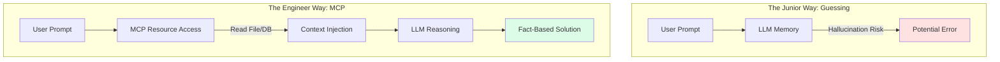
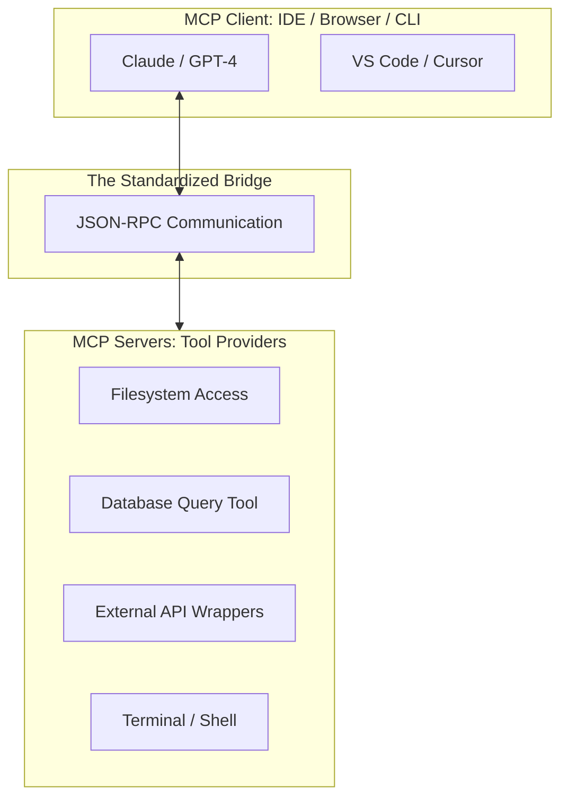

# 🤖 MCP Mastery: The AI Systems Architect

> **"If an AI model is the brain, MCP is the central nervous system. It connects the intelligence of the LLM to the physical tools and data of your local machine and enterprise infrastructure."**

---

## 🧠 The Mental Model: The Central Nervous System

**The Junior Struggle**: "I already use ChatGPT and Claude. Why do I need a 'Protocol' to talk to them? I just paste my code and they help me."
**The Engineer Solution**: You realize that "Copy-Pasting" is like having a brain in a jar. It can think, but it can't **Act** or **See** the world.

Think of **MCP as the Spinal Cord**:
- **The Brain (LLM)**: Decides what needs to be done.
- **The Nerves (MCP Protocol)**: Send the signal.
- **The Hands (MCP Servers)**: Perform the action (Query a DB, write a file).
- **The Eyes (MCP Resources)**: Read the status (Log files, API metrics).

---

## 🆚 Junior Way vs. Engineer Way

| Feature | The Junior Way (Problematic) | The Engineer Way (Production-ready) |
|:---|:---|:---|
| **Context** | Copy-pasting code into a chat box | **Dynamic Context** via MCP Resources |
| **Actions** | Manually running commands AI suggests | **Tool-calling** for automated execution |
| **Trust** | Guessing/Hallucinating (Unchecked) | **Grounding** in real-time filesystem/DB facts |
| **Security** | Pasting sensitive logs into public AI | **Local/Private MCP Servers** (Zero egress) |
| **Workflow** | Context-switching between IDE & Browser| **Integrated Copiloting** within the terminal/IDE |
| **Scale** | One script at a time | **Agentic Orchestration** of multi-step tasks |

---

## 🏗️ The Grounding Pattern: Moving from Guessing to Knowing

---

## 🏗️ The MCP Ecosystem

---

## 🗺️ Curriculum Path

1. **[Part 01: Architecture & Primitives](./part-01-architecture-and-primitives/readme.md)**: Understanding the core building blocks of AI connectivity.
2. **[Part 02: Ecosystem & Servers](./part-02-ecosystem-and-servers/readme.md)**: Working with the filesystem, GitHub, and external search servers.
3. **[Part 03: Building Custom Servers](./part-03-building-custom-servers/readme.md)**: Creating your own tools using the MCP SDK (Node.js/Python).
4. **[Part 04: Security & Best Practices](./part-04-security-and-best-practices/readme.md)**: Hardening the AI's "hands" with sandboxing and governance.

---

## 🏆 Real-World DevOps Story: The 3 AM AI On-Call

**The Scenario**: A database deadlock. The engineer had the docs but couldn't find the specific SQL queries needed.
**The Fix**: Used an MCP-enabled IDE. Gave the AI access to the DB server and the docs. The AI looked at the real-time process list, cross-referenced it with the recovery docs, and proposed a surgical `KILL` command.
**The Lesson**: **Speed is life.** The AI didn't just give advice; it acted as a co-pilot with direct visibility into the system, resolving the incident in 4 minutes instead of 40.

---

## 🎤 Interview Preparation (Core)

1. **Q: What is the Model Context Protocol (MCP)?**
   - *A: MCP is an open standard that allows AI models to connect securely to local or remote data (Resources) and functions (Tools), moving AI from simple chat interactions to agentic local execution.*

2. **Q: How does MCP differ from traditional REST APIs?**
   - *A: MCP is a bi-directional protocol designed for context. It uses JSON-RPC to allow an AI (Client) to discover and invoke multiple resources and tools dynamically, whereas REST is typically a fixed request-response for specific endpoints.*

3. **Q: Explain 'Grounding' in AI terms.**
   - *A: Grounding is the process of providing an LLM with real-time, factual data from a system (via MCP Resources) to prevent it from hallucinating or guessing based on older training data.*

4. **Q: What are the three core primitives of MCP?**
   - *A: **Resources** (Read-only data), **Tools** (Executable functions), and **Prompts** (Reasoning templates).*

5. **Q: What is JSON-RPC and why is it used in MCP?**
   - *A: JSON-RPC is a lightweight remote procedure call protocol. It is used in MCP because it is stateless, vendor-neutral, and perfect for the fast, bi-directional messaging required between an AI model and a tool server.*

6. **Q: What is an MCP Client vs. an MCP Server?**
   - *A: A **Client** is the AI interface (like Claude Desktop or VS Code) that uses tools. A **Server** is the provider (like a script or API wrapper) that exposes those tools/data to the client.*

7. **Q: How do you secure an MCP Server that has 'write' access to a filesystem?**
   - *A: Through **Sandboxing** (restricting access to specific directories), **PII Scrubbing**, and **Human-in-the-Loop** confirmation for destructive actions (like `rm` or `deploy`).*

8. **Q: What is 'Agentic Orchestration'?**
   - *A: It is the ability of an AI agent to use a series of tools in order to complete a multi-step goal (e.g., "Find the bug, write the fix, run the tests, and submit a PR").*

9. **Q: Why is 'Transport' (STDIO or SSE) important in MCP?**
   - *A: Transport defines how the client and server talk. **STDIO** is used for local tools (fastest), while **SSE** (Server-Sent Events) is used for remote or web-based MCP servers.*

10. **Q: What is the benefit of using MCP Prompts over simple pre-defined chat instructions?**
    - *A: MCP Prompts can be dynamically injected with server-side context and are standardized, allowing them to be shared across different AI clients while maintaining consistent reasoning patterns.*

---

## 📝 Knowledge Check

1. **Which primitive allows an AI to *perform* an action?**
   - [x] Tools.

2. **Which primitive allows an AI to *see* a log file?**
   - [x] Resources.

3. **True/False: MCP allows AI to work with data that isn't in its training set.**
   - [x] **True**.

4. **What is the standard data format for MCP messages?**
   - [x] JSON-RPC.

5. **Which transport is typically used for local MCP servers?**
   - [x] STDIO.

6. **A 'Bug Fix' template provided by a server is which primitive?**
   - [x] Prompts.

7. **Which concept describes limiting an AI to a specific folder?**
   - [x] Sandboxing.

8. **What does SSE stand for in MCP transport?**
   - [x] Server-Sent Events.

9. **Who initiates the connection: Client or Server?**
   - [x] Client.

10. **What is the primary goal of the 'Model Context Protocol'?**
    - [x] To standardize how AI models interact with tools and data.

---

## 🔗 Next Steps
The bridge is built. Now let's dive into the core primitives.
1. Proceed to: **[Part 01: Architecture & Primitives](./part-01-architecture-and-primitives/readme.md)** →
2. Return to: **[Phase 3 Hub](../readme.md)** →
