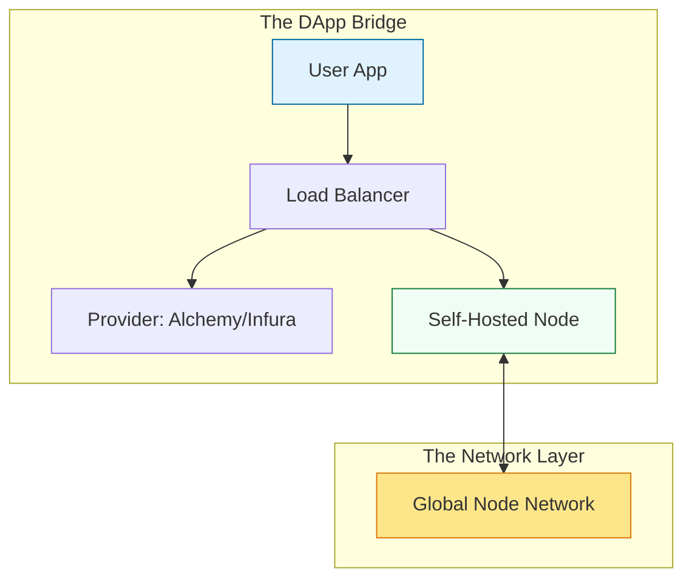

# 🌐 Part 03: Decentralized Operations

> **"In Web3, your API is a node. Managing the communication layer between the blockchain and your users is the core of Decentralized Operations."**

## 📚 Overview

How does a website actually "talk" to the blockchain? It uses a standard interface called **JSON-RPC**. From an operational perspective, this means managing a fleet of nodes (or a combination of managed and self-hosted ones) to ensure that users can always read data and send transactions.

In this module, we explore the "Hybrid RPC" strategy and the mechanics of Proof of Stake validation.

## 💼 Career Impact: The "Web3 Architect"

Managing the connection between the "Traditional Web" and "Web3" is where the highest value is created.

- **High Availability Mastery**: You learn to design systems that are resilient to the outages of major node providers.
- **Protocol Depth**: Understanding RPC methods allows you to debug issues that standard frontend developers can't solve.

## 🎓 Learning Objectives

By the end of this module, you will:

- ✅ Master the **JSON-RPC interface** for interacting with blockchain nodes.
- ✅ Implement the **Hybrid RPC Strategy** (Managed vs Self-Hosted).
- ✅ Understand the operational side of **Proof of Stake (PoS)** and Staking.
- ✅ Configure **Load Balancers** for blockchain RPC endpoints.

---

## 🏗️ The Hybrid RPC Strategy

Senior DevOps engineers avoid "Vendor Lock-in" in the decentralized world.

| Component | Role | Benefit |
| :--- | :--- | :--- |
| **Managed Provider** | Primary Read Traffic. | High throughput and global caching. |
| **Self-Hosted Node** | Sensitive Writes & Failover. | Zero-Trust security and autonomy. |

---

## 🚀 Professional Pattern: The "Sanity Check" Failover

Don't trust a single RPC endpoint to tell you the truth.

- **The Pro Standard**:
    1. Your application sends a request to an Infura endpoint.
    2. Simultaneously, a background process checks the "Current Block Number" on your self-hosted node.
    3. If the managed provider is trailing by more than 2 blocks, the load balancer automatically reroutes traffic to your node.

**Why this matters**: This prevents your application from showing users "Ghost Data" (stale information) during a provider lag incident.

---

## 🏆 Real-World DevOps Story: The Blackout PR

**The Scenario**: A major RPC provider went down for 4 hours. 90% of the decentralized apps on Ethereum were unusable—except for one major NFT marketplace.
**The Discovery**: That marketplace had implemented a custom failover logic that switched to a fleet of in-house nodes the moment responses took longer than 200ms.
**The Lesson**: **Centralization in a decentralized world is a single point of failure.** Redundancy isn't just a luxury; it's the mission.

---

## ❓ Interview Preparation (RPC & Ops)

1. **Q: What is a 'Websockets' (WSS) versus 'HTTP' RPC endpoint?**
   *A: HTTP is for one-time requests (like 'What is my balance?'). WSS is for a constant connection that 'streams' data (like 'Tell me every time a new block is minted'). WSS is critical for real-time dashboards.*

2. **Q: How do you secure an RPC endpoint from public abuse?**
   *A: Use **API Keys**, **Whitelisting** (only allowing specific origins or IPs), and **Rate Limiting** at the Nginx or Load Balancer level.*

---

## 📝 Knowledge Check

1. **Which protocol is used for a DApp to communicate with a node?**
   - [ ] a) GraphQL
   - [x] b) JSON-RPC
   - [ ] c) gRPC

2. **True or False: Using a managed provider always means your application is fully decentralized.**
   - [ ] True
   - [x] False (The provider remains a centralized point of failure)

---

## 🔗 Next Steps

The traffic is flowing. The final step is learning how to perform upgrades and monitor the health of your decentralized fleet.

Proceed to: **[Part 04: Maintenance & Governance](../part-04-maintenance-and-governance/readme.md)** →
