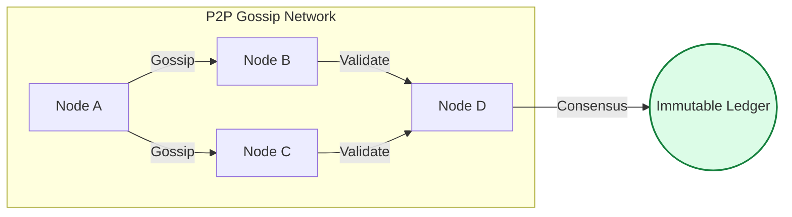

# ⛓️ Blockchain Operations: The Web3 Infrastructure Architect

> **"In traditional DevOps, we manage servers for a company. In Blockchain DevOps, we manage nodes for a protocol. The machine is the same, but the mission is decentralized."**

---

## 🧠 The Mental Model: The Shared Global Ledger

**The Junior Struggle**: "I've used databases before. Why do I need a 'Blockchain'? It just seems like a slow database that everyone can see."
**The Engineer Solution**: You realize that a blockchain isn't for *storing data*; it's for **Storing Truth**.

Think of it as a **Global Shared Excel Sheet**:
- **Traditional DB**: The boss owns the Excel file. If they delete a row, you can't stop them.
- **Blockchain**: Everyone has an identical copy. Every new row (Transaction) must be agreed upon by the network. Once written in "Digital Ink," it can never be erased.

---

## 🆚 Junior Way vs. Engineer Way

| Feature | The Junior Way (Problematic) | The Engineer Way (Production-ready) |
|:---|:---|:---|
| **Storage** | Using Standard HDDs or slow Cloud Disks | **NVMe SSDs** with high IOPS (mandatory) |
| **Node Selection** | Running a Light Node for production | **Full or Archive Nodes** for data integrity |
| **Availability** | 100% reliance on public RPC (Infura) | **Hybrid Strategy** (Self-hosted + Managed) |
| **Keys** | Keys stored in cleartext environment files | **HSMs or Secure Enclaves** for validator keys |
| **Upgrades** | "I'll update it when it fails" | Proactive tracking of **Hard/Soft Forks** |
| **Monitoring** | Simple Ping/Health checks | **Block Height** and **Peer Count** tracking |

---

## 🏗️ The Immutable Truth: Block Propagation

---

## 📋 Blockchain Node Summary

| Node Type | Analogy | Why we use it | Hardware Requirement |
| :--- | :--- | :--- | :--- |
| **Light Node** | The **Receipt Reader** | Fast verification of transactions. | Low (Laptop/Phone) |
| **Full Node** | The **Security Guard** | Validates all blocks and state. | Medium (SSD + 16GB RAM) |
| **Archive Node**| The **Historian** | Every transaction since day 1. | High (Multi-TB NVMe) |
| **Validator** | The **Judge** | Writes new blocks (Consensus). | High (Max Uptime + Stake) |

---

## 🗺️ Curriculum Path

1. **[Part 01: Architecture & Node Types](./part-01-architecture-and-node-types/readme.md)**: The "Who, what, and why" of decentralized infrastructure.
2. **[Part 02: Infrastructure & Resources](./part-02-infrastructure-and-resources/readme.md)**: Disk I/O, RAM, and the geometry of P2P networking.
3. **[Part 03: Decentralized Operations](./part-03-decentralized-operations/readme.md)**: Consensus mechanisms and RPC management.
4. **[Part 04: Maintenance & Governance](./part-04-maintenance-and-governance/readme.md)**: Hard forks, zero-downtime upgrades, and monitoring.

---

## 🏆 Real-World DevOps Story: The Million Dollar Disk Lag

**The Scenario**: A DeFi project used standard network storage (GP2 volumes) for an Ethereum node.
**The Discovery**: During traffic spikes, the disk couldn't keep up with state updates. The node fell 1,000 blocks behind and returned stale price data.
**The Fix**: Upgraded to **Local NVMe SSDs**, increasing IOPS by 10x.
**The Lesson**: **Hardware is your consensus.** If your disk is slow, you are functionally disconnected from reality.

---

## 🎤 Interview Preparation (Web3 Ops)

1. **Q: How does Blockchain DevOps differ from traditional SRE?**
   - *A: SRE focuses on an app's availability; Web3 Ops focuses on **Node Sync** and **Network Connectivity**. Our 'Provider' is a decentralized protocol, not just a cloud vendor.*

2. **Q: What is a 'Genesis Block'?**
   - *A: The first block ever created in a blockchain. It is hardcoded into the software and serves as the foundation for the entire immutable chain.*

3. **Q: Why is disk IOPS critical for a Blockchain Full Node?**
   - *A: Full nodes must constantly update the 'State Trie' (account balances, contract data). If the disk is slow, the node cannot process new blocks fast enough to stay 'in sync' with the network tip.*

4. **Q: Explain 'Gossip' in a P2P context.**
   - *A: It's the mechanism where nodes share information. When a node hears about a new transaction, it 'gossips' it to its neighbors, spreading it across the global network in seconds.*

5. **Q: What is the risk of 'Double Signing' for a validator?**
   - *A: It occurs when two nodes run the same validator key. The protocol sees this as an attack on consensus and 'slashes' the validator's stake (destroying their money).*

6. **Q: What is an RPC (Remote Procedure Call) Node?**
   - *A: A node that exposes an API (usually JSON-RPC) allowing external applications (DApps) to query the blockchain and submit transactions.*

7. **Q: Define 'Consensus Mechanism' and give two examples.**
   - *A: The process by which nodes agree on the validity of the ledger. Examples: **Proof of Work (PoW)** (Mining) and **Proof of Stake (PoS)** (Staking).*

8. **Q: What is a 'Hard Fork'?**
   - *A: A radical change to the network protocol that makes previously invalid blocks valid (or vice versa). It requires all nodes to upgrade to the new software to remain on the correct chain.*

9. **Q: How do you monitor its 'Sync Health'?**
   - *A: By comparing the node's current **Block Height** against the latest height reported by established public nodes or block explorers. A 'behind' count indicates sync issues.*

10. **Q: What is an 'Archive Node' and why would a DevOps team run one?**
    - *A: It stores the entire history of the blockchain's state. Teams run them for data-heavy applications that need to query historical balances or transaction results from years ago.*

---

## 📝 Knowledge Check

1. **Which disk technology is required for Ethereum Full Nodes?**
   - [x] NVMe SSD.

2. **What is a 'Hard Fork'?**
   - [x] A non-backward compatible network upgrade.

3. **Which node type participates in writing new blocks?**
   - [x] Validator.

4. **What is 'Slashing'?**
   - [x] A penalty where a validator's stake is taken due to bad behavior (e.g., uptime failure or double signing).

5. **Which protocol allows DApps to talk to a node?**
   - [x] JSON-RPC.

6. **True/False: Data on a blockchain can be easily deleted if 51% of nodes agree.**
   - [x] **False**. Even with 51% agreement, the goal is adding new data, not deleting old history.

7. **What is the first block in a chain called?**
   - [x] Genesis Block.

8. **Peer Discovery is part of which layer?**
   - [x] P2P / Networking.

9. **Which node type is used only for verifying receipts without storing the full chain?**
   - [x] Light Node.

10. **What does PoS stand for?**
    - [x] Proof of Stake.

---

## 🔗 Next Steps
The ledger is waiting. Let's start with the architecture.
1. Proceed to: **[Part 01: Architecture & Node Types](./part-01-architecture-and-node-types/readme.md)** →
2. Return to: **[Phase 3 Hub](../readme.md)** →
