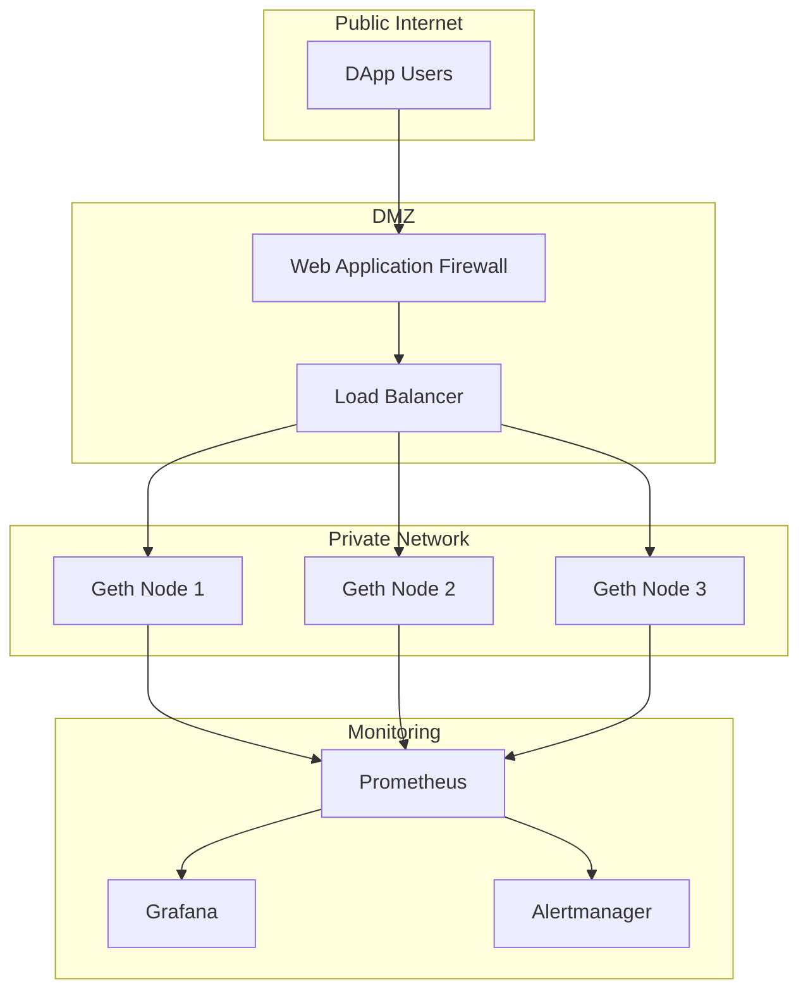

# Blockchain Infrastructure & Operations Reference

**Doc Version:** 1.0.0
**Role:** Web3 SRE
**Scope:** Hardware Requirements, RPC Management, and Monitoring

---

## 1. Hardware Requirements

Blockchain nodes have extreme I/O demands.

### Ethereum Full Node (Geth)
| Component | Minimum | Recommended | Rationale |
|:---|:---|:---|:---|
| **CPU** | 4 cores | 8+ cores | State trie updates are CPU-intensive |
| **RAM** | 16 GB | 32 GB | In-memory caching of state |
| **Disk** | 1 TB NVMe | 2 TB NVMe | State grows ~50 GB/year, requires high IOPS |
| **Network** | 25 Mbps | 100+ Mbps | P2P gossip + RPC traffic |

**Critical**: **NVMe SSDs are mandatory**. HDDs cannot keep up with state updates (>10k IOPS required).

### Bitcoin Full Node
| Component | Minimum | Recommended |
|:---|:---|:---|
| **CPU** | 2 cores | 4 cores |
| **RAM** | 4 GB | 8 GB |
| **Disk** | 500 GB SSD | 1 TB SSD |
| **Network** | 10 Mbps | 50 Mbps |

**Note**: Bitcoin's UTXO model is less I/O intensive than Ethereum's account model.

---

## 2. Sync Strategies

### A. Full Sync (From Genesis)
**Time**: 7-14 days (Ethereum), 2-3 days (Bitcoin)
**Process**: Download and validate every block since genesis
**Pros**: Maximum security, independent verification
**Cons**: Extremely slow

### B. Fast Sync (Ethereum)
**Time**: 6-12 hours
**Process**: Download state snapshot, then sync recent blocks
**Pros**: Much faster
**Cons**: Trusts snapshot provider (less secure)

### C. Snap Sync (Ethereum, Default)
**Time**: 2-4 hours
**Process**: Download state in parallel chunks
**Pros**: Fastest
**Cons**: Requires high bandwidth

**Governance**: For production RPC nodes, use **Fast Sync** minimum. For validators, consider Full Sync for maximum security.

---

## 3. RPC Endpoint Management

### The RPC Layer
Blockchain nodes expose a JSON-RPC API for querying state and submitting transactions.

#### Common Methods
```javascript
// Query balance
eth_getBalance(address, blockNumber)

// Submit transaction
eth_sendRawTransaction(signedTx)

// Call smart contract (read-only)
eth_call({to, data}, blockNumber)
```

### Rate Limiting
Public RPC endpoints are heavily abused.

**Pattern**: Implement rate limiting by IP and API key.
```nginx
limit_req_zone $binary_remote_addr zone=rpc:10m rate=10r/s;

location /rpc {
    limit_req zone=rpc burst=20;
    proxy_pass http://geth:8545;
}
```

### Load Balancing
**Pattern**: Run multiple nodes behind a load balancer.
```yaml
# HAProxy config
backend geth_cluster
    balance roundrobin
    server geth1 10.0.1.10:8545 check
    server geth2 10.0.1.11:8545 check
    server geth3 10.0.1.12:8545 check
```

**Health Check**: Use `eth_syncing` to verify node is in sync.

---

## 4. Monitoring & Alerting

### Key Metrics

#### A. Sync Status
```bash
# Geth
geth attach --exec "eth.syncing"

# If false, node is synced
# If object, shows currentBlock vs highestBlock
```

**Alert**: If node falls >100 blocks behind, page on-call.

#### B. Peer Count
```bash
geth attach --exec "net.peerCount"
```

**Healthy**: 25-50 peers
**Alert**: If peers < 5, node is isolated

#### C. Disk I/O
```bash
iostat -x 1
```

**Watch**: `%util` (should be <80%)
**Alert**: If sustained >90%, disk is bottleneck

#### D. Memory Usage
```bash
free -h
```

**Alert**: If swap is being used, add more RAM

### Prometheus Metrics
Modern clients expose Prometheus endpoints:
```yaml
# Geth
--metrics --metrics.addr 0.0.0.0 --metrics.port 6060

# Scrape config
- job_name: 'geth'
  static_configs:
  - targets: ['localhost:6060']
```

**Key Metrics**:
- `chain_head_block`: Current block height
- `txpool_pending`: Pending transactions
- `p2p_peers`: Connected peers

---

## 5. Disaster Recovery

### Backup Strategy
**What to Backup**:
- **Keystore**: Validator keys (CRITICAL)
- **Configuration**: `config.toml`, `genesis.json`
- **NOT the blockchain**: Re-sync from network (faster than restore)

**Frequency**: Daily automated backups of keystore to encrypted S3/GCS.

### Failover
**Pattern**: Active-Passive validator setup.
1. Primary validator runs on Server A
2. Backup validator on Server B (offline)
3. If Server A fails, manually start Server B

**Warning**: NEVER run two validators with the same keys simultaneously (slashing risk).

---

## 6. Visualizing the Infrastructure



> **Enterprise Pattern**: Use **Kubernetes StatefulSets** for node deployment. Each node gets a persistent volume and stable network identity. This allows for zero-downtime rolling upgrades during hard forks.
