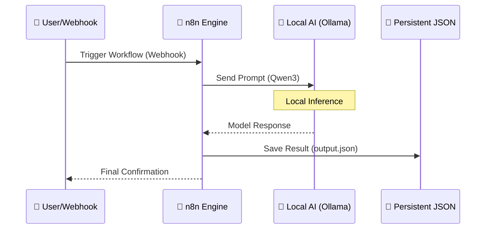

# 🤖 n8n + Local AI (Qwen3) Implementation Checklist

This document outlines the architectural roadmap for deploying a self-hosted, production-ready automation engine integrated with local Large Language Models (LLMs).

## 🏗️ Deployment Architecture



---

## 📋 Implementation Tasks

### 1. Environment Preparation
- [x] **Initialize Project Directory**  
  Project located at `/home/gsmash/Documents/n8n_docker`.
- [x] **Consolidate `.env` Variables**  
  All variables migrated to a single `.env` file for centralized management.
- [ ] **Create Volume Directories**  
  ```bash
  mkdir -p n8n_data postgres_data ollama_data
  ```

### 2. Docker Architecture (Clean Stack)
- [x] **Refactor `docker-compose.yml`**  
  Updated to use `env_file: .env` for all services (Postgres, n8n, Ollama).
- [x] **Service Interdependence**  
  n8n now waits for the Postgres healthcheck before starting.

### 3. Model Provisioning (Automated)
- [x] **Auto-Pull Qwen3**  
  The Ollama service is configured to automatically pull `qwen3` on startup.
- [x] **Verify Model Status**  
  Check if the model is ready:
  ```bash
  docker exec -it ollama ollama list
  ```

### 4. n8n AI Node Configuration
- [ ] **Connect to Ollama**  
  In the n8n UI, configure the "Ollama Chat Model" node:
  - **Base URL**: `http://ollama:11434`
  - **Model Name**: `qwen3`
- [ ] **Credential Setup**  
  Note: Local Ollama usually requires no API key/Auth.

### 5. Maintenance & Monitoring
- [ ] **Monitor Deployment**  
  Follow logs to ensure services are stable:
  ```bash
  sudo docker compose logs -f
  ```
- [ ] **Debug Specific Service**  
  If n8n is restarting, check its specific logs:
  ```bash
  sudo docker logs n8n_automation
  ```

### 6. Functional Testing
- [ ] **Build "Brain" Workflow**  
  1. **Webhook Node**: Listen for incoming POST requests.
  2. **AI Agent / Chat Model Node**: Process the input prompt using Qwen3.
  3. **Read/Write Binary File Node**: Save the LLM output to `/home/node/.n8n/output.json`.
- [ ] **Execution**  
  Trigger the webhook and verify output appears in `./n8n_data/output.json`.

---

## 🛠️ Current `.env` Standard
```env
# Database
POSTGRES_USER=ganil
POSTGRES_PASSWORD=...
POSTGRES_DB=n8n

# n8n Core
N8N_ENCRYPTION_KEY=...
DB_TYPE=postgres
DB_POSTGRESDB_HOST=db

# AI
OLLAMA_MODEL=qwen3
OLLAMA_HOST=ollama:11434
```
