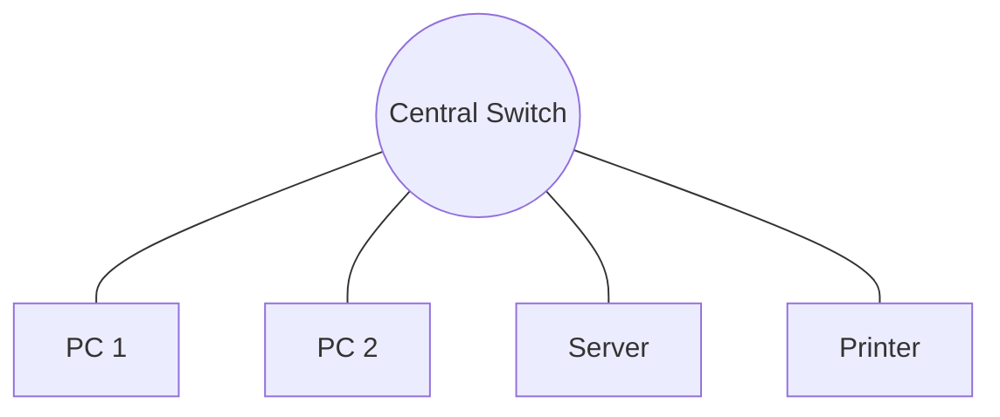
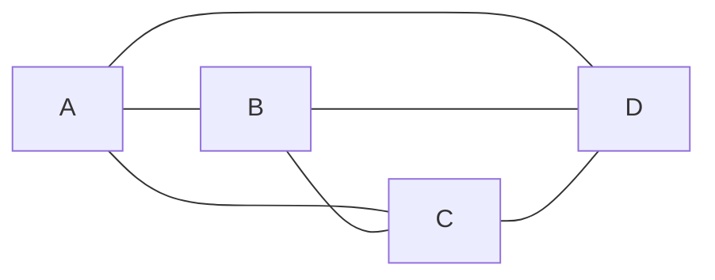

# í³Š Network Topologies

## Star Topology
The most common topology in modern LANs. All devices connect to a central hub (Switch).

## Mesh Topology
Used in high-availability environments where every node connects to every other node.

