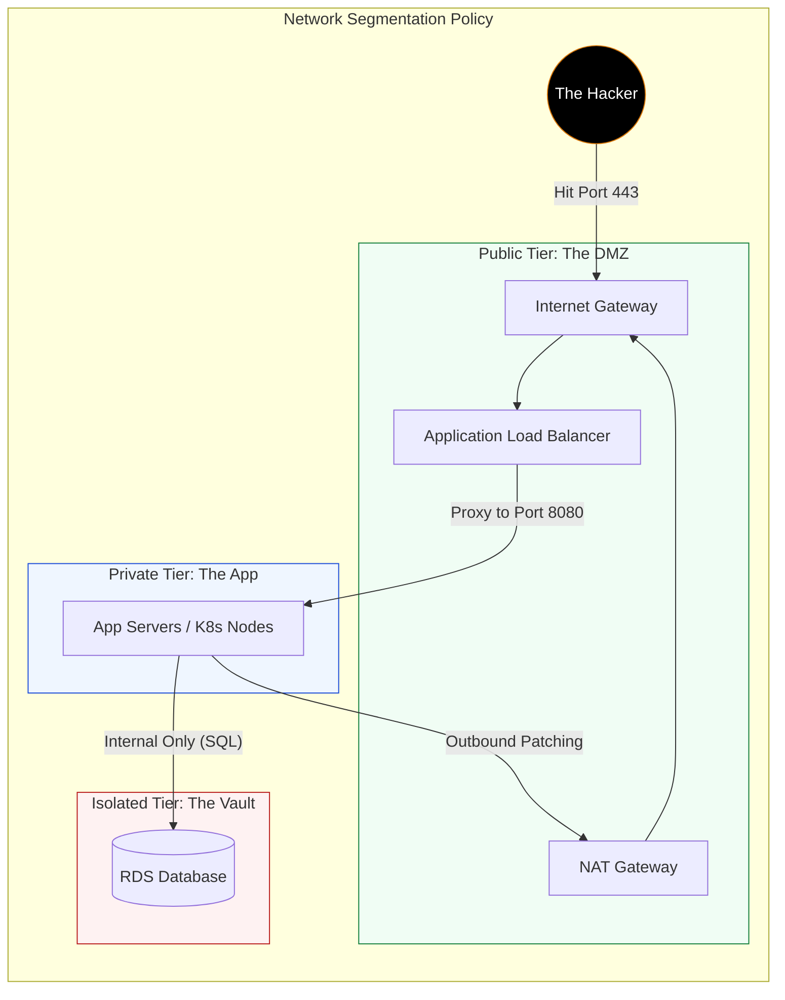

# 🏰 Module 02.03: Public, Private & Isolated Zoning

> **"Junior, putting a Database in a Public Subnet is indistinguishable from professional negligence. We rely on depth. If the first wall falls, the second wall must hold. Architecture IS Security."**

---

## 🏗️ Junior’s Mission

**Goal**: Design the network topology.
**Why it matters**: A hacker can only attack what they can reach. By default, 90% of your infrastructure should be unreachable from the internet.

---

## 🌍 Operational Reality

**In Theory**: "Public means accessible by everyone, Private means accessible by us."
**In Production**:
*   **Public (DMZ)**: Has an **Internet Gateway (IGW)** route. Only Load Balancers and NAT Gateways live here.
*   **Private (App Tier)**: Has a **NAT Gateway** route. Instances can *fetch* updates from the internet but cannot *receive* connections from it.
*   **Isolated (Data Tier)**: Has **NO** internet route. It talks only to the Private Tier. It cannot patch itself from the internet.

---

## 🛠️ The Toolbelt

Verifying reachability.

| Tool | Command | Purpose |
| :--- | :--- | :--- |
| **traceroute** | `traceroute google.com` | From a Private server: Hops should go Local -> NAT -> IGW -> ISP. |
| **curl** | `curl ifconfig.me` | From a Private server: Returns the Public IP of the *NAT Gateway*, not the server itself. |
| **aws ec2** | `describe-route-tables` | The source of truth. Security Groups block ports; Route Tables block paths. |

---

## 🔍 Deep Dive: The 3-Tier Architecture

**The Critical Flow**:
1.  **Inbound**: Internet -> IGW -> ALB (Public) -> App (Private).
2.  **Outbound**: App (Private) -> NAT (Public) -> IGW -> Internet.
3.  **Data**: DB (Isolated) -> NOWHERE.

---

## > [!IMPORTANT] Senior SRE Pro-Tips

1.  **The "NAT Tax"**: NAT Gateways cost money per GB processed. If you download terabytes of data from S3 to a Private Subnet, you pay HUGE NAT fees. **Fix**: Use a **VPC Endpoint for S3**. It sends traffic directly via the AWS backbone, bypassing the NAT (Cheaper + Faster).
2.  **The Bastion is Dead**: Do not deploy "Bastion/Jump" hosts in Public subnets. They are security liabilities. Use **AWS System Manager (SSM) Session Manager** to shell into private instances securely without opening SSH ports.
3.  **Subnet Route Table Association**: By default, new subnets associate with the "Main" route table. PRO TIP: Leave the Main Route Table empty (Private). Force yourself to explicitly associate Public Subnets to a custom "Public-RT".

---

## 🎫 Junior's First Ticket: Incident #006 "The Unpatchable Database"

**Scenario**: "The Security Team demands we patch the RDS instance OS, but `yum update` times out."
**Observation**: The DB is in the `Isolated-Tier` (Subnet C).

**Investigation Steps**:
1.  **Check Route Table**: `rtb-isolated-c` has `10.0.0.0/16 local`. No `0.0.0.0/0`.
2.  **The Why**: The DB has literally no path to the Yum repositories on the internet.
3.  **The Junior Mistake**: "I'll add a NAT Gateway route!" **NO.** We never want the DB execution environment reaching the web.
4.  **The Senior Fix**:
    *   Option A: Use Managed RDS (AWS patches it).
    *   Option B (If EC2): Setup a local Yum Mirror in the App Tier.
    *   Option C: Use VPC Endpoints for Systems Manager (Patch Manager).

---

## 📝 Knowledge Check

1.  **My private instance needs to download a Docker image from DockerHub. What component allows this?**
    - [ ] a) Internet Gateway
    - [x] b) NAT Gateway (Outbound Only)
    - [ ] c) VPC Peering
    - [ ] d) Egress Only Internet Gateway (IPv6)

2.  **If I put a Database in a Public Subnet but use a Security Group to block Port 5432 from the internet, is it safe?**
    - [ ] a) Yes, absolutely.
    - [x] b) It's "secure" but architecturally wrong. One human error on the SG exposes the DB. Layered defense dictates it should be in a Private Subnet.

3.  **What is a "VPC Endpoint" used for?**
    - [x] a) Accessing AWS Services (S3, DynamoDB) privately without using a NAT Gateway.
    - [ ] b) Connecting to a VPN.
    - [ ] c) Monitoring API calls.

---

## 🔗 Next Steps

The Zones are set. Now let's calculate the cost of these choices.

Proceed to: **[Routing & Route Tables](../../04-Routing-and-Route-Tables/README.md)** →