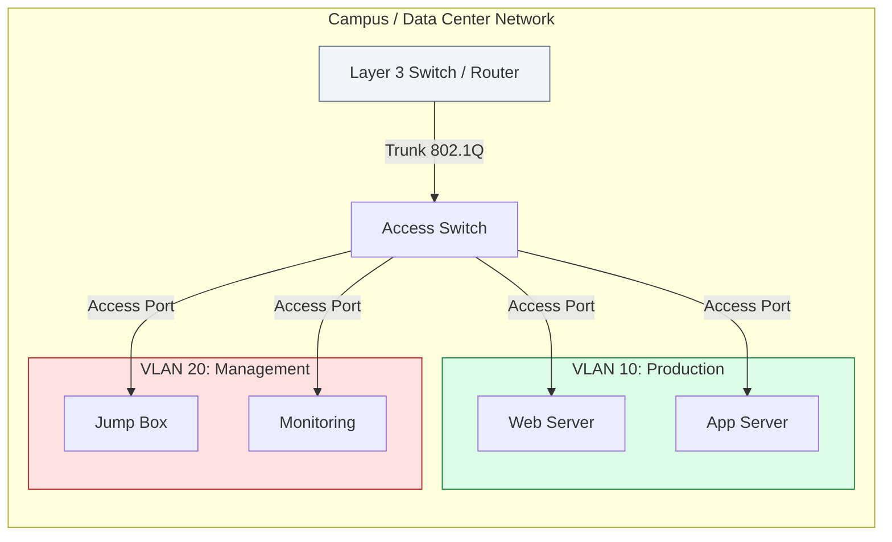

# 🔀 Module 02: VLANs & Switching

> **"A network without VLANs is like a house without walls: one loud neighbor wakes everyone up. Segmentation isn't just about organization; it's the fundamental boundary of performance and security."**

## 📚 Overview

While modern DevOps relies heavily on Software Defined Networking (SDN) and VPCs, the underlying reality of the data center is built on **Switching and VLANs**. Understanding Layer 2 segmentation is critical for anyone managing bare-metal Kubernetes clusters, hybrid cloud connectivity, or high-performance storage networks. This module covers how to carve a physical wire into multiple logical segments and ensure they don't crash the network.

## 🎓 Learning Objectives

By the end of this module, you will:

- ✅ Configure and troubleshoot **VLANs** and **802.1Q Trunks**.
- ✅ Master **Spanning Tree Protocol (STP)** to prevent broadcast storms.
- ✅ Implement **Link Aggregation (LACP/Bonding)** for high throughput.
- ✅ Design **Inter-VLAN Routing** using Router-on-a-Stick or L3 Switches.
- ✅ Integrate physical VLANs with **Container Networking (Macvlan/Multus)**.

---

## 🏗️ Core Concepts

### 1. VLAN Fundamentals
Virtual Local Area Networks (VLANs) allow you to logically group devices on the same physical switch as if they were on separate networks.
- **Access Ports**: Used for end devices (Servers, PCs). They carry traffic for a single VLAN.
- **Trunk Ports (802.1Q)**: Used between switches or to routers. They "tag" packets with a VLAN ID to carry multiple segments over one wire.

### 2. Spanning Tree Protocol (STP)
If you connect two switches with two wires for redundancy without STP, you create a **Loop**. Packets will circle forever, creating a **Broadcast Storm** that will freeze the entire network. STP identifies these loops and shuts down the redundant path until the primary fails.

### 3. Link Aggregation (LACP/Bonding)
Combining multiple physical cables into one logical interface.
- **DevOps Use Case**: Bonding `eth0` and `eth1` on a Linux server to provide 20Gbps throughput and failover redundancy.

---

## 🚀 Professional Pattern: The "Native VLAN" Hardening

Standard switches use **VLAN 1** as the default "Native" VLAN for untagged management traffic. This is a massive security risk, as it allows for **VLAN Hopping** attacks.

**The Pro Standard**:
1. **Change the Native**: Always change the native VLAN on trunks to a dedicated, unused ID (e.g., `VLAN 999`).
2. **Prune Your Trunks**: Never allow "All VLANs" on a trunk. Manually specify only the IDs that need to traverse that link (`switchport trunk allowed vlan 10,20`).
3. **Shutdown Defaults**: All unused ports on a switch should be administratively down and assigned to a "Dead-End" VLAN.

---

## 🏆 Real-World DevOps Story: The Loop that Leveled the Lab

**The Scenario**: A growing tech company was setting up a new on-premise Kubernetes lab. To ensure redundancy, a junior engineer plugged two cables between the Core and Access switches.
**The Crisis**: Within 30 seconds, all monitoring alerts went red. The internal Git server, the VPN, and even the VoIP phones died. The switch CPUs hit 100% as they struggled to process millions of duplicate packets.
**The Discovery**: Spanning Tree had been disabled on those ports to "save startup time" (PortFast was misconfigured on an uplink). The resulting **Broadcast Storm** saturated the 10Gbps links instantly.
**The Fix**: Disconnecting one cable immediately restored the network. They then properly configured RSTP (Rapid STP) and BPDU Guard to prevent unauthorized loops.
**The Lesson**: **Redundancy without protocol is a bomb.** Never plug in a second cable without verifying your loop prevention strategy first.

---

## ❓ Interview Preparation (VLANs & Switching)

1. **Q: What is the difference between an Access port and a Trunk port?**
    *A: An **Access port** belongs to a single VLAN and doesn't use tagging; it connects to end-devices. A **Trunk port** carries multiple VLANs and adds an 802.1Q tag to each packet so the receiving switch knows where the packet belongs.*

2. **Q: What is a Broadcast Storm and how do you prevent it?**
    *A: It occurs when a network loop exists at Layer 2, causing broadcast packets to circulate endlessly. It's prevented using **Spanning Tree Protocol (STP)**, which blocks redundant paths.*

3. **Q: Why would you use 'Router-on-a-Stick' configuration?**
    *A: It's used when you have multiple VLANs but only one physical interface on your router. You create virtual sub-interfaces (e.g., `eth0.10`, `eth0.20`) to act as the default gateway for each VLAN.*

4. **Q: What is LACP (Link Aggregation Control Protocol)?**
    *A: LACP is the standard protocol (802.3ad) that allows multiple physical links to be bundled into a single logical channel (EtherChannel or Bonding). It provides both increased bandwidth and redundancy.*

5. **Q: If a Linux server needs to talk to two different VLANs over one physical NIC, what do you do?**
    *A: You configure the physical switch port as a Trunk and create **VLAN interfaces** in Linux (e.g., using `ip link add link eth0 name eth0.10 type vlan id 10`).*

---

## 📝 Knowledge Check

1. **Which 802.1 standard defines VLAN tagging on trunk ports?**
    - [ ] a) 802.3ad
    - [x] b) 802.1Q
    - [ ] c) 802.1w
    - [ ] d) 802.11ac

2. **What happens to a broadcast frame in a network loop without STP?**
    - [ ] a) It is dropped by the router
    - [ ] b) It is returned to the original sender
    - [x] c) It circulates forever, consuming all bandwidth
    - [ ] d) It is automatically encrypted

3. **Which Linux bonding mode is most commonly used for LACP integration with a switch?**
    - [ ] a) Mode 0 (Balance-RR)
    - [ ] b) Mode 1 (Active-Backup)
    - [x] c) Mode 4 (802.3ad)
    - [ ] d) Mode 6 (Adaptive Load Balancing)

4. **In a 'Router-on-a-Stick' setup, the router's physical interface is connected to what kind of switch port?**
    - [ ] a) Access Port
    - [x] b) Trunk Port
    - [ ] c) Console Port
    - [ ] d) Management Port

5. **True or False: VLANs can reduce the size of broadcast domains.**
    - [x] True 
    - [ ] False

---

## 🔗 Next Steps

You've mastered Layer 2. Now let's jump to Layer 3 and see how routers make the world's most complex decisions.

Proceed to: **[03. Advanced Routing](README.md)** →
Node: This link points to the next logical step in the curriculum.