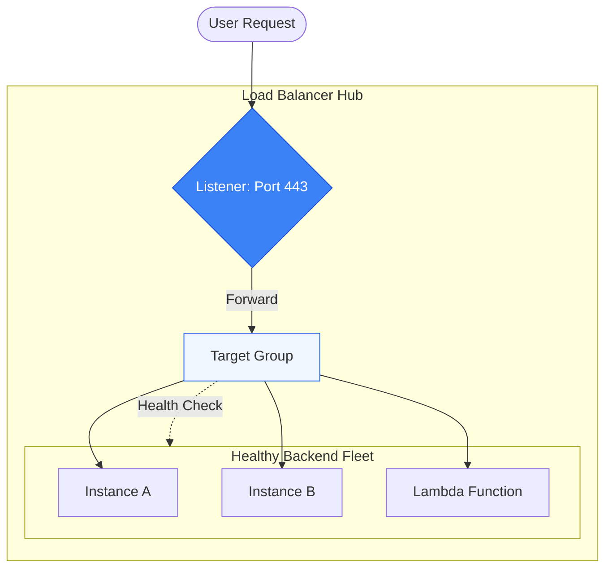

# ⚖️ Module 07.01: ELB Types & Fundamentals

> **"Elastic Load Balancing (ELB) is the 'Traffic Cop' of the cloud. It doesn't just route packets; it manages the health, capacity, and security of your entire application stack, ensuring that every user request finds a capable home."**

## 📚 Overview

**Elastic Load Balancing (ELB)** is a managed service that automatically distributes incoming traffic across multiple targets. Instead of pointing your DNS to a single server (a single point of failure), you point it to the Load Balancer. The LB then handles the "Heavy Lifting" of checking server health, terminating SSL certificates, and scaling to meet demand. This module covers the family of AWS load balancers: **ALB** for applications, **NLB** for raw performance, and **GLB** for security appliances.

## 🎓 Learning Objectives

By the end of this module, you will:

- ✅ Differentiate between **ALB**, **NLB**, and **GLB** using the OSI model.
- ✅ Understand the relationship between **Listeners**, **Target Groups**, and **Targets**.
- ✅ Identify the "Flash Sale" scenario where NLB outperforms ALB.
- ✅ Master the concept of **SSL/TLS Offloading**.
- ✅ Design for **High Availability** across multiple Availability Zones.

---

## 🏗️ The Cloud LB Family

| Type | Best For | OSI Layer | Key Strength |
| :--- | :--- | :--- | :--- |
| **ALB** | Web Apps / APIs | Layer 7 | Path and Host-based routing. |
| **NLB** | Ultra-Performance / Gaming | Layer 4 | Static IPs and sub-millisecond latency. |
| **GLB** | Firewalls / Deep Inspection | Layer 3 | Transparent inspection via GENEVE. |

### Core Components
1. **Listener**: The "Ear." It listens on a specific port (e.g., 443) for incoming requests.
2. **Target Group**: The "Brain." It holds the list of healthy servers and knows how to check them.
3. **Target**: The "Muscle." The actual EC2 instances, containers, or Lambda functions doing the work.

---

## 🚀 Professional Pattern: The "Fixed IP" Whitelist

Many legacy partners or financial institutions require you to provide a **Static IP address** for whitelisting. A standard ALB has dynamic IPs that change constantly.

**The Pro Standard**:
1. **The Choice**: Use a **Network Load Balancer (NLB)**.
2. **The Config**: Assign an **Elastic IP (EIP)** to the NLB in each Availability Zone.
3. **The Result**: You now have 2 or 3 permanent IPs that will NEVER change, even as you scale your backend from 10 to 1,000 servers.
4. **Hybrid Solution**: You can even put an ALB *behind* an NLB if you need both static IPs and Layer 7 smart routing.

---

## 🏆 Real-World DevOps Story: The Black Friday Bottleneck

**The Scenario**: A major retailer used an ALB for their mobile app. During their Black Friday "Door Buster" sale, traffic went from 10,000 to 1,000,000 requests in 30 seconds.
**The Crisis**: The ALB "browned out." Users saw **503 Service Unavailable** errors.
**The Discovery**: ALBs take time to "Pre-Warm" (scale up their internal instances). The spike was too fast for the ALB's own internal scaling logic to keep up.
**The Fix**: They migrated the core API to a **Network Load Balancer (NLB)**.
**The Result**: Because NLBs use a different architectural design (bypassing content inspection), they can handle millions of requests per second with **Instant Scaling**. The next sale was 100% error-free.
**The Lesson**: **Speed needs Layer 4; Intelligence needs Layer 7.** Choose accordingly.

---

## ❓ Interview Preparation (ELB Fundamentals)

1. **Q: Can an ALB route traffic to a Lambda function?**
    *A: **Yes.** Modern Target Groups support EC2 instances, IP segments, Containers (ECS/Fargate), and even AWS Lambda functions as targets.*

2. **Q: What is 'Connection Draining' (Deregistration Delay)?**
    *A: It is a setting that keeps it from "killing" the connection of a user who is currently on a server being decommissioned. It allows 300 seconds (by default) for the user to finish their task before removing the server.*

3. **Q: How does the server know the user's real IP if it's behind a Load Balancer?**
    *A: The ALB adds an HTTP header called `X-Forwarded-For` which contains the client's public IP address. Your application logs must be configured to look for this header.*

4. **Q: What is the primary difference between ALB and NLB health checks?**
    *A: ALB health checks are usually Layer 7 (HTTP) - it checks if your code returns a `200 OK`. NLB health checks are Layer 4 (TCP) - it only checks if the port is open.*

5. **Q: Is the 'Classic Load Balancer' (CLB) still recommended?**
    *A: **No.** The CLB is a legacy service. It is slower, more expensive for the features provided, and lacks modern capabilities like Path-based routing and Lambda integration.*

---

## 📝 Knowledge Check

1. **At which OSI layer does the Application Load Balancer (ALB) operate?**
    - [ ] a) Layer 3
    - [ ] b) Layer 4
    - [x] c) Layer 7
    - [ ] d) Layer 2

2. **Which ELB type is best for static IP whitelisting?**
    - [ ] a) ALB
    - [x] b) NLB
    - [ ] c) GLB
    - [ ] d) CLB

3. **What is the default ID prefix for a Load Balancer in AWS?**
    - [ ] a) igw-
    - [ ] b) vpc-
    - [x] c) elb- (or app/net for modern types)
    - [ ] d) tgw-

4. **True/False: You must install an SSL certificate on every individual EC2 instance if you use SSL Termination.**
    - [ ] True 
    - [x] False (You only need it on the Load Balancer)

5. **Which component stores the health check settings?**
    - [ ] a) Listener
    - [x] b) Target Group
    - [ ] c) Security Group
    - [ ] d) VPC Route Table

---

## 🔗 Next Steps

You've mastered the basics. Now let's dive into the "Brain" of the ALB: Content-Based Routing.

Proceed to: **[02. ALB Deep Dive (L7 Routing)](../02-ALB-Deep-Dive-L7-Routing/README.md)** →
Node: This link points to the next lesson.