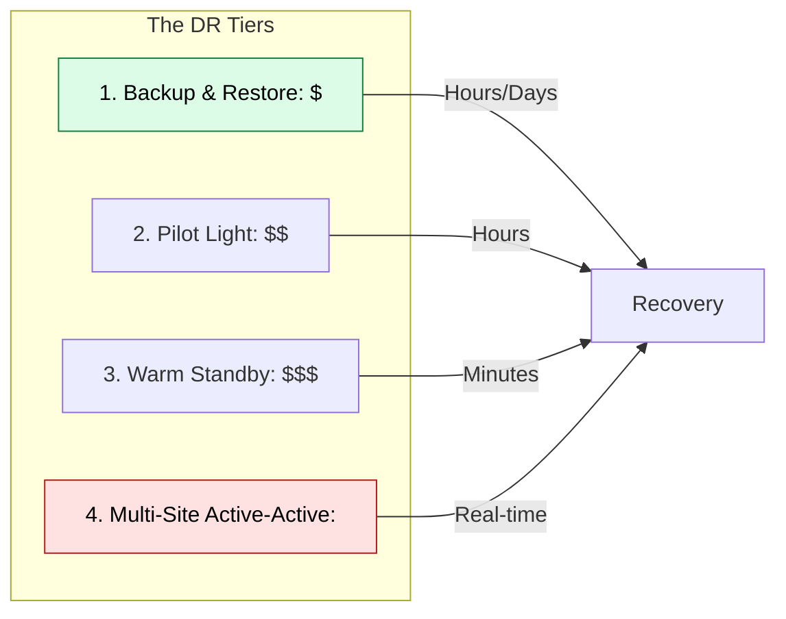

# 🚑 Module 08.02: Disaster Recovery Strategies

> **"High Availability (HA) protects you from a power outage in a single building. Disaster Recovery (DR) protects you from a tsunami, a massive regional grid failure, or the literal destruction of a whole city of data centers."**

## 📚 Overview

While HA keeps you running through routine failures, **Disaster Recovery (DR)** is your emergency plan for catastrophic events. A true disaster is when an entire AWS Region (and all its Availability Zones) goes offline. To survive this, your data and your compute capacity must exist in a completely different part of the world. This module covers the four standard DR patterns, defined by their **RTO** (How fast can we be back up?) and **RPO** (How much data did we lose?).

## 🎓 Learning Objectives

By the end of this module, you will:

- ✅ Define and identify **RTO (Recovery Time)** and **RPO (Recovery Point)** targets.
- ✅ Implement a **Pilot Light** strategy with low idle costs.
- ✅ Design a **Warm Standby** architecture for sub-15-minute recovery.
- ✅ Master **Cross-Region Replication (CRR)** for S3 and RDS.
- ✅ Orchestrate **Failover Workflows** using Route 53 or Global Accelerator.

---

## 🏗️ The Four DR Patterns

### 1. Backup & Restore (The "Safe")
- **Concept**: Data is backed up to S3 in another region. In a disaster, you build everything from scratch.
- **RTO**: Days. **RPO**: 24h.

### 2. Pilot Light (The "Matches")
- **Concept**: Database is live and replicated. Application servers are stored as AMIs (off).
- **RTO**: Hours. **RPO**: Minutes.

### 3. Warm Standby (The "Generator")
- **Concept**: A scaled-down but fully functional version of the app is always running.
- **RTO**: Minutes. **RPO**: Seconds.

### 4. Multi-Site Active-Active (The "Twin")
- **Concept**: The app serves live traffic from two different regions simultaneously.
- **RTO**: Zero. **RPO**: Zero (if sync).

---

## 🚀 Professional Pattern: The "Read-Replica" Promotion

The database is the hardest part of DR because data has "gravity" and "integrity."

**The Pro Standard**:
1. **The Link**: Create an RDS **Cross-Region Read Replica** in your DR region.
2. **The Sync**: Data is asynchronously streamed from the primary region to the DR region.
3. **The Disaster**: If the primary region fails, your failover script issues a `Promote-Read-Replica` command.
4. **The Result**: The replica becomes a standalone primary database. You point your DR application servers to this new endpoint.
5. **The Benefit**: Your data loss (RPO) is restricted to the few seconds it took for the last packet to cross the country.

---

## 🏆 Real-World DevOps Story: The DNS TTL Trap

**The Scenario**: A company had a perfect "Pilot Light" strategy. During a real regional outage, they spun up their backup servers in 20 minutes.
**The Crisis**: Even though the new servers were ready, 40% of their customers couldn't reach the site for 2 hours.
**The Discovery**: They used standard DNS records with a Time-to-Live (TTL) of 24 hours. Their customers' ISPs were still trying to send traffic to the "Old" IP address in the dead region.
**The Fix**: They migrated to **AWS Global Accelerator**. This provides **Static Anycast IPs** that never change. When the failover happened, AWS redirected the *same IPs* to the new region internally.
**The Result**: Failover time dropped from 2 hours to under 30 seconds.
**The Lesson**: **Infrastructure is useless if the traffic can't find it.** Trust the network layer (Anycast), not the cache layer (DNS).

---

## ❓ Interview Preparation (DR Strategies)

1. **Q: What is the difference between RTO and RPO?**
    *A: **RTO (Recovery Time Objective)** is the maximum acceptable amount of time to restore service (downtime). **RPO (Recovery Point Objective)** is the maximum acceptable amount of data loss, measured in time (e.g., losing 5 minutes of data).*

2. **Q: Which DR strategy would you recommend for a retail site that can afford 1 hour of downtime but zero data loss?**
    *A: I would recommend **Warm Standby** with synchronous data replication if possible, or a highly tuned **Pilot Light**. The key is having the database already live in the DR region.*

3. **Q: What is a 'Pilot Light' strategy exactly?**
    *A: It is like the pilot light in a gas heater. The database is alive and being replicated (the light is on), but the application servers are turned off to save money. They are only "flamed up" (auto-scaled) when a disaster occurs.*

4. **Q: How does S3 Cross-Region Replication (CRR) work?**
    *A: When you upload a file to a bucket in `us-east-1`, S3 automatically copies it to a bucket in another region (e.g., `us-west-2`) over the private AWS backbone. This ensures your static assets and logs are always safe from a regional failure.*

5. **Q: Why is 'Multi-Site Active-Active' so much more expensive?**
    *A: You are paying for double the infrastructure, double the database costs, and significant data transfer fees to keep the regions in sync. It also adds massive complexity to the application code to handle 'Split-Brain' database scenarios.*

---

## 📝 Knowledge Check

1. **Which DR strategy has the SHORTEST (best) RTO?**
    - [ ] a) Backup & Restore
    - [ ] b) Pilot Light
    - [ ] c) Warm Standby
    - [x] d) Multi-Site Active-Active

2. **What does 'RPO' measure?**
    - [ ] a) How long the site was down
    - [x] b) How much data was lost (measured in time)
    - [ ] c) The cost of the recovery
    - [ ] d) The number of healthy instances

3. **In a 'Pilot Light' strategy, which part of the infrastructure is usually already 'Live' and 'Replicated'?**
    - [ ] a) Web Servers
    - [ ] b) Load Balancers
    - [x] c) Database / Storage
    - [ ] d) NAT Gateways

4. **Which AWS service allows you to failover between regions using static IP addresses?**
    - [ ] a) Route 53
    - [x] b) AWS Global Accelerator
    - [ ] c) CloudFront
    - [ ] d) VPC Peering

5. **True or False: Using a 'Backup & Restore' strategy usually results in zero data loss.**
    - [ ] True 
    - [x] False (You lose all data since the last backup)

---

## 🔗 Next Steps

You've planned for the worst. Now let's explore the tools that help users find your application across the globe: Route 53 and Global Accelerator.

Proceed to: **[03. Global Accelerator & Route 53](../03-Global-Accelerator-and-Route53/README.md)** →
Node: This link points to the next lesson.