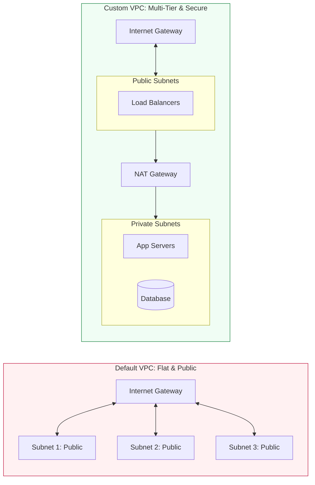

# 🏢 Module 05: Default vs. Custom VPC

> **"AWS gives you a Default VPC to get you started, but a Custom VPC is where you build for production. Using a Default VPC for production is like leaving your front door unlocked in a busy city—it's convenient, but dangerous."**

## 📚 Overview

Every AWS account comes with a **Default VPC** in every region. While this allows you to launch instances immediately, it lacks the security and segmentation required for professional workloads. This module explains the critical differences between the two and why mastering **Custom VPC** design is a non-negotiable skill for DevOps engineers.

## 🎓 Learning Objectives

By the end of this module, you will:

- ✅ Identify the "Public-by-Default" nature of the **Default VPC**.
- ✅ Understand the **Security Risks** associated with using default configurations.
- ✅ Design a **Custom VPC** with tiered public and private subnets.
- ✅ Learn the manual steps to convert a blank VPC into a functional environment.
- ✅ Master the **Lifecycle** of a Default VPC (Deletion and Recreation).

---

## ⚖️ Comparison Table: Default vs. Custom

| Feature | Default VPC | Custom VPC (Pro Choice) |
| :--- | :--- | :--- |
| **Creation** | Automatic by AWS | Manual (Console/IaC) |
| **IP Range (CIDR)** | Fixed: `172.31.0.0/16` | Flexible (e.g., `10.0.0.0/16`) |
| **Subnets** | All are **Public** (Routes to IGW) | Mix of **Public** and **Private** |
| **Public IPs** | Auto-assigned to instances | You control allocation |
| **Internet Gateway** | Pre-attached | You attach |
| **NAT Gateway** | None (instances must be public) | You deploy for private security |
| **Production Ready?** | ❌ No | ✅ Yes |

---

## 🛠️ The Custom VPC Roadmap

If you were to build a VPC from scratch right now, here is the "Order of Operations":

1.  **VPC**: Define your CIDR block (e.g., `10.0.0.0/16`).
2.  **Subnets**: Create at least two—one for the internet (Public) and one for your data (Private).
3.  **Internet Gateway (IGW)**: Create and attach it to the VPC.
4.  **Route Tables**: Create two—a **Public RT** (pointing to IGW) and a **Private RT** (internal only).
5.  **Subnet Association**: Assign each subnet to its respective Route Table.
6.  **Security**: Define Security Groups for each layer (Instance-level firewalls).

---

## 🚀 Professional Pattern: The "Custom Foundation"

In enterprise environments, the first thing many teams do is delete the Default VPC to prevent accidental deployments in an insecure network.

**The Pro Standard**:
1. **Delete the Default**: In sensitive accounts (e.g., Production), remove the default VPC entirely using the CLI or Service Quotas.
2. **IaC Only**: Never create VPCs manually. Use **Terraform** or **CloudFormation** to ensure the tags, subnets, and routes are identical across Dev, Staging, and Prod.
3. **Multi-Account over Multi-VPC**: Instead of putting everything in one massive VPC, use separate AWS Accounts (via AWS Organizations) to provide the ultimate "Blast Radius" protection.

---

## 🏆 Real-World DevOps Story: The Default VPC Breach

**The Scenario**: A startup used the Default VPC for their production database to "save time" during their launch week.
**The Crisis**: Because the Default VPC assigns public IPs to every instance, their database server was reachable from the entire internet. A script-kiddy running a port scanner found port `3306` (MySQL) open. Within an hour, they brute-forced the weak admin password.
**The Impact**: The database was encrypted by ransomware. The startup had to pay $10,000 in Bitcoin to recover their customer records, and their reputation was permanently damaged by the mandatory data breach notification.
**The Lesson**: **Convenience is the enemy of security.** A Custom VPC with a Private Subnet would have made this attack physically impossible, as the database would have had no public IP and no path from the internet.

---

## ❓ Interview Preparation (Default vs. Custom)

1. **Q: How can you tell if an instance is in a Public Subnet or a Private Subnet?**
    *A: Look at the Subnet's Route Table. If there is a route (0.0.0.0/0) pointing to an **Internet Gateway (igw-xxxxx)**, it is a Public Subnet. If the route points to a NAT Gateway or doesn't exist, it is Private.*

2. **Q: If you delete your Default VPC, can you get it back?**
    *A: Yes. You can use the AWS CLI (`aws ec2 create-default-vpc`) or the AWS Console to recreate it. However, it will not restore any resources that were inside it.*

3. **Q: Why would I choose a CIDR like 10.0.0.0/16 for my custom VPC instead of 192.168.0.0/24?**
    *A: A `/16` provides 65,531 usable IPs, whereas a `/24` only provides 251. For a production environment, you want the largest possible space (/16) so you can create many subnets across multiple Availability Zones without running out of room.*

4. **Q: Does a Custom VPC cost more than a Default VPC?**
    *A: No. Creating the VPC, Subnets, IGWs, and Route Tables is free. You only pay for the resources you put inside them (like EC2) or for specific components like **NAT Gateways** or **VPC Endpoints**.*

5. **Q: If I launch an EC2 in the Default VPC, do I need to create a Route Table manually?**
    *A: No. The Default VPC comes with a "Main Route Table" that already has a rule to send all internet traffic to the pre-attached Internet Gateway.*

---

## 📝 Knowledge Check

1. **What is the CIDR block fixed to in an AWS Default VPC?**
    - [ ] a) 10.0.0.0/16
    - [x] b) 172.31.0.0/16
    - [ ] c) 192.168.1.0/24

2. **In a Custom VPC, which component is required to give resources in a Private Subnet internet access for updates?**
    - [ ] a) Internet Gateway
    - [x] b) NAT Gateway
    - [ ] c) Virtual Private Gateway

3. **True or False: A Default VPC's subnets are private by default.**
    - [ ] True
    - [x] False (They are all public)

4. **Which tool is recommended for recreating a deleted Default VPC?**
    - [ ] a) AWS SDK
    - [x] b) AWS CLI / Console
    - [ ] c) AWS Support Ticket

5. **What is the primary reason to use a Custom VPC for production?**
    - [ ] a) It is faster
    - [x] b) It allows for network segmentation and better security
    - [ ] c) It is required by AWS

---

## 🔗 Next Steps

Design is one thing; scaling is another. Every cloud environment has "speed limits." Let's look at the quotas you need to know to avoid a production outage.

Proceed to: **[06. VPC Limits & Quotas](../06-VPC-Limits-and-Quotas/README.md)** →
