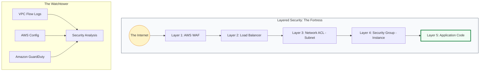

# ⭐ Module 08: VPC Best Practices

> **"A perfect VPC is not one where nothing can be added, but one where nothing can be removed without compromising security or reliability. Build your network like a fortress, not just a folder."**

## 📚 Overview

Building a VPC is easy; building a **Well-Architected** VPC requires discipline. This module distills years of cloud engineering experience into a set of "Golden Rules" for security, reliability, performance, and cost. Following these best practices ensures your network is ready for an audit, a massive traffic spike, or a security incident.

## 🎓 Learning Objectives

By the end of this module, you will:

- ✅ Implement **Defense in Depth** across 5 distinct layers.
- ✅ Design for **High Availability** across multiple Availability Zones.
- ✅ Optimize **Network Performance** using Endpoints and Enhanced Networking.
- ✅ Reduce **Cloud Costs** by right-sizing subnets and gateways.
- ✅ Adopt **Infrastructure as Code (IaC)** for immutable networking.

---

## 🛡️ Security Best Practices

1.  **Private by Default**: Never place an instance in a Public Subnet unless it absolutely needs to be reached from the internet (e.g., Load Balancer).
2.  **Security Group logic**: Always reference other Security Groups as the source/destination rather than hard-coding IP addresses. This makes your network "identity-aware."
3.  **Flow Logging**: Enable **VPC Flow Logs** for every production VPC. You cannot defend against traffic you cannot see.
4.  **Least Privilege**: Start with "Deny All" and only open the specific ports (e.g., 443) required for the application to function.

---

## 🏗️ Reliability & HA Best Practices

- **The Power of Two**: Always deploy subnets and resources across at least **two Availability Zones**. One AZ is a gamble; two is a strategy.
- **Independent NAT**: Deploy **one NAT Gateway per AZ**. If AZ-1 fails, your instances in AZ-2 should have their own path to the internet.
- **Standardized subnets**: Use the same CIDR size (e.g., /24) for the same tier in every AZ to keep routing tables symmetrical and easy to troubleshoot.

---

## 💰 Cost & Performance Optimization

- **VPC Endpoints are King**: Use Gateway Endpoints for **S3** and **DynamoDB**. They are free, faster than NAT, and don't consume NAT bandwidth.
- **Enhanced Networking**: Choose instance types that support **ENA (Elastic Network Adapter)** for 100Gbps+ throughput and lower latency.
- **Sparse IP Allocation**: In the cloud, IP addresses are abundant. Don't use `/28` or `/27` for standard application tiers; use `/24` to ensure you never have to perform an emergency subnet migration.

---

## 🚀 Professional Pattern: The Immutable Network

Senior DevOps engineers don't "fix" network configurations in the AWS console. They treat the network as **Versioned Code**.

**The Pro Standard**:
1. **No Manual Changes**: If a port needs to be opened, update the **Terraform** or **CDK** code, submit a Pull Request, and let the CI/CD pipeline apply the change.
2. **Standardized Tags**: Every resource should have `Environment`, `Project`, and `Owner` tags. This allows you to generate instantly accurate cost reports.
3. **Automated Audits**: Use **AWS Config** rules to automatically kill any Security Group that opens Port 22 (SSH) or Port 3389 (RDP) to `0.0.0.0/0`.

---

## 🏆 Real-World DevOps Story: The Single NAT Gateway Outage

**The Scenario**: A growing e-commerce company shared a single NAT Gateway across three Availability Zones to save $90/month.
**The Crisis**: An AWS technician accidentally cut a fiber line in "Availability Zone A." The NAT Gateway living in that zone went dark instantly.
**The Impact**: Because all subnets in AZ-B and AZ-C were routing their internet traffic through the NAT Gateway in AZ-A, the **entire** private network lost internet connectivity. Payment processing failed, and the site effectively went offline.
**The Loss**: They saved $90 in infrastructure costs but lost **$150,000 in revenue** during the 4-hour outage.
**The Lesson**: **Redundancy is not an expense; it's insurance.** Never share a critical gateway across AZ boundaries in production.

---

## ❓ Interview Preparation (Best Practices)

1. **Q: What is the most common VPC security mistake you see in production?**
    *A: Placing databases or application servers in Public Subnets. Even if they have Security Groups, they are still "visible" to the internet. The gold standard is keeping them in Private Subnets with no public IP.*

2. **Q: Why should you use Security Group IDs as sources in rules instead of IP ranges?**
    *A: It makes the rule dynamic. If you allow 'SG-Web' to talk to 'SG-DB' on port 5432, you can add or remove 100 web servers, and the database will automatically trust them without you ever updating an IP address.*

3. **Q: How can you reduce the cost associated with NAT Gateway data processing?**
    *A: The most effective way is to implement **VPC Endpoints** for high-traffic services like S3 or DynamoDB. This keeps the traffic internal to the AWS network, which is free and significantly faster.*

4. **Q: What is the benefit of VPC Flow Logs?**
    *A: They provide a record of all IP traffic going to and from network interfaces in your VPC. This is critical for security audits, troubleshooting connectivity issues, and identifying unauthorized access attempts.*

5. **Q: Is it better to have one large VPC or several smaller ones?**
    *A: For most enterprises, several smaller VPCs grouped by account (e.g., Prod Account, Dev Account) is better. This provides the best "Blast Radius" protection and prevents a single resource limit from affecting the entire company.*

---

## 📝 Knowledge Check

1. **What is the minimum number of AZs recommended for a production VPC?**
    - [ ] a) 1
    - [x] b) 2
    - [ ] c) 5

2. **Which service allows you to capture metadata about network traffic?**
    - [ ] a) CloudTrail
    - [x] b) VPC Flow Logs
    - [ ] c) Route 53

3. **In the 'Defense in Depth' model, which layer acts as a bouncer at the instance level?**
    - [ ] a) NACL
    - [x] b) Security Group
    - [ ] c) NAT Gateway

4. **Which VPC component is provided for free and reduces NAT data charges?**
    - [ ] a) Transit Gateway
    - [x] b) Gateway Endpoint (S3/DynamoDB)
    - [ ] c) Elastic IP

5. **True or False: Using Infrastructure as Code (IaC) is only for large companies.**
    - [ ] True
    - [x] False (It is a best practice for all professional DevOps work)

---

## 🔗 Next Steps

You've mastered the AWS way. But the cloud is a big place. Let's see how these concepts translate to Azure and Google Cloud.

Proceed to: **[09. Cloud Provider Comparison](../09-Cloud-Provider-Comparison/README.md)** →
